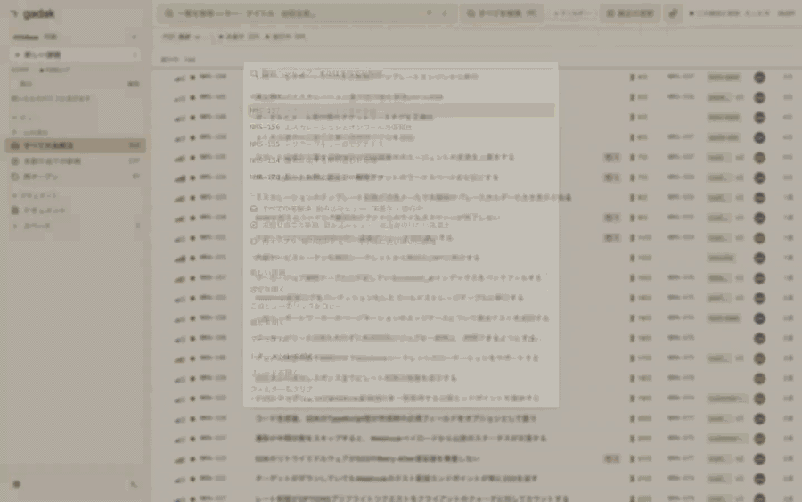

<p align="center">
  
  
</p>

<p align="center">
  <a href="https://github.com/midagedev/gadak/releases"></a>
  <a href="https://github.com/midagedev/gadak/actions/workflows/ci.yml"></a>
  <a href="LICENSE"></a>
</p>

<p align="center"><b>Find the thread in your backlog.</b></p>

<p align="center"><sub><a href="README.md">English</a> · <a href="README.ko.md">한국어</a> · 日本語</sub></p>

JQL に `GROUP BY` はありません。「未完了の課題が多いエピックはどれか」を Jira で数えようとすると、
検索 API が返す行を自分のコードで集計することになります。2026-08-26 の計測 (課題 3,296 件のサイト)
では、REST API の結果 8 ページを取得して集計するのに 4,761 ms かかりました。その Jira を手元に
キャッシュしておけば、同じ答えが SQL 1 本、22 ms で返ります。

gadak は、指定した範囲の Jira と Confluence をキャッシュし、検索や SQL 集計に使うツールです。
課題・コメント・変更履歴・wiki ページがまとめて入り、デスクトップアプリ、ブラウザー、CLI から
同じキャッシュを使えます。書き込みは先に Jira へ届き、キャッシュはいつ消しても構いません。
バイナリは 1 つで、gadak のアカウントはありません。

**状態: 0.21、まだ 0.x です。** メンテナーは現在 1 人、ライセンスは Apache-2.0、対応している Jira は Cloud と Server / Data Center です。

## JQL では書けない集計を、まず試す

インストールもアカウントも要りません。[ライブデモ](https://gadak.dev/demo/)を開くと、
534 件の課題がブラウザーの中で動きます。

<details>
<summary>▶ 20 秒の GIF (収録は英語)</summary>

<p align="center">
  
  <br>
  <sub>デモのスナップショットから <a href="e2e/demo/web-demo.spec.ts">e2e/demo/web-demo.spec.ts</a> で生成した 20 秒です。この収録だけは英語で、3 つの言語版で共通です。</sub>
</p>

</details>

```bash
gadak sql "select epic_key, count(*) from issues_full where resolved_at is null
           and epic_key <> '' group by epic_key order by 2 desc"
```

エピックごとに未完了の課題を数えるだけの SQL です。同じことを REST API でやるなら、ページを
めくって自分で足すしかありません。上の SQL は、何もインストールせずに
[Datasette Lite でデモのスナップショットに対して実行](<https://lite.datasette.io/?url=https%3A%2F%2Fraw.githubusercontent.com%2Fmidagedev%2Fgadak%2Fmain%2Fexamples%2Fdemo.db#/demo?sql=select+epic_key%2C+count(*)+from+issues_full+where+resolved_at+is+null+and+epic_key+%3C%3E+''+group+by+epic_key+order+by+2+desc>)できます。
SQL を書き換えて、そのまま試せます。続きのクエリは [docs/RECIPES.md](docs/RECIPES.md) にあります。

### 計測値

2026-08-26 に、実際に業務で使っている Atlassian Cloud のサイト (課題 3,296 件) に対して
測りました。数値は中央値で、gadak 側は CLI プロセスの起動時間を含みます。

| 質問 | REST API | `gadak` | 倍率 |
| --- | ---: | ---: | ---: |
| 単純なフィルター、課題 100 件 | 583 ms | 19 ms | 31× |
| 課題 1 件と、その全変更履歴 | 710 ms | 28 ms | 25× |
| 全文検索 | 543 ms | 41 ms | 13× |
| **エピックごとの未完了件数 (`GROUP BY`)** | 4,761 ms (この計測では API 8 ページをクライアント側で集計) | 22 ms (クエリ 1 本) | **214×** |
| 変更履歴に対するカウント | JQL では表現できない (クロールで約 28 分) | 14 ms | ― |
| レート制限 (キャッシュの読み取り) | 429 と Retry-After | なし | ― |

gadak が負ける行もあります。最初のフル同期には時間がかかり、キャッシュは同期間隔 1 回ぶん
遅れます。更新のないサイトを監視する場合の計測値も、測定方法や再測定の履歴とあわせて
[docs/BENCHMARKS.md](docs/BENCHMARKS.md) に載せています。

## 導入前に確認すること

社内の課題データを手元に写すツールなので、導入前に確認したい点をここにまとめます。各説明の
根拠となるソースファイルのパスは [SECURITY.md](SECURITY.md) で確認できます。接続先ごとの
条件とオフにする方法は [docs/NETWORK.md](docs/NETWORK.md) に 1 つずつ、自分のマシンで確かめられる
ことは確認用のコマンドと一緒に [docs/PROMISES.md](docs/PROMISES.md) に 11 項目まとめてあります。

### 接続先は Jira Cloud です

Jira Cloud と、Jira Server / Data Center の両方に対応しています。Cloud で必要なのは
Jira サイトの API トークン 1 つで、同じサイトの Jira と Confluence の両方に使えます。
Server / Data Center は `gadak init --server` と Personal Access Token で接続します
(11.x では基本認証が既定で無効です)。Confluence Server のクライアントはないため、
そちらでは wiki は使えません。トークンはそのアカウントと同じ権限で動き、gadak が権限を足すことはありません。
キャッシュに入るのは、そのアカウントに見えるものだけです。

### 写す範囲は自分で決めます

Jira は `--projects`、wiki は `--spaces` で絞ります。スペースを指定するまで wiki は同期されません。

```bash
gadak init --projects ENG,PROD --spaces ENG
```

### 手元に残るものと、その鮮度

キャッシュの実体は、使っているマシンの中の SQLite ファイル 1 つです。ディレクトリごと消しても
失うものはなく、`gadak sync` で作り直せます。

使い始める前に、初回のフル同期が要ります。上の計測に使ったサイトで 3.7 分かかりました。
そのあとは `gadak serve` が差分同期を既定で 60 秒ごとに回し、1 時間ごとの照合で、削除された
課題やアカウントから見えなくなった課題をキャッシュから外します。`serve` を使わない場合は
`gadak sync --watch` が同じ役目をします。読み取りは直近の同期時点の内容なので、最新の変更が
届くまでに同期間隔 1 回ぶんの遅れがあります。

### API トークンの置き場所

トークンは `~/.gadak/config.json` (ワークスペースごとなら `~/.gadak/profiles/<name>/config.json`)
に置かれます。パスはどの OS でも同じで、Windows では `%USERPROFILE%\.gadak` です。パーミッション
0600 で書き込まれ、送られる先は自分のサイトへの `Authorization` ヘッダーだけです。
**キャッシュ・ログ・スナップショットの 3 か所のどこにも書き込まれません。**
デスクトップでは OS のキーチェーンは使いません。

### 外に出る通信

テレメトリはありません。外に出る通信は、[SECURITY.md](SECURITY.md) に挙げた 5 か所だけです。
1 番以外は、自分で設定するか、自分でそのコマンドを打ったときにだけ起きます。

1. 自分の Atlassian サイト (同期のため)
2. Linear (ワークスペースに Linear のソースがあるとき)
3. ペアリングした home 側の `gadak serve` (ペアリングしたときだけ)
4. `gh` (`gadak dev scan` を実行したときだけ)
5. ライブラリのダウンロード (自分で要求したときだけ)

ループバックはこの一覧には入りません。外に出る接続ではなく、自分のマシンの中で待ち受ける
バインドだからです。インストール時、エラー時、定期実行のどこにも、開発元へ何かを送る経路は
ありません。gadak のサーバーというものが存在しないためです。

### 読み取りと書き込み

`gadak sql`、`gadak search`、`gadak issue`、MCP のツール、web UI の一覧と詳細は、キャッシュ
だけを読みます。接続を開かないので、レート制限に当たることも、機内でつながらないことも
ありません。例外は接続先に訊く必要がある動詞で、`gadak issue --editmeta` と `gadak fields`
(編集できる項目の問い合わせ)、`gadak api` (素通しのリクエスト)、添付ファイルの表示 (その場で
取得) の 4 つです。

書き込みは先に Jira へ届き、受け付けられてからキャッシュに反映されます。書き込みは手元に
溜めません。接続先に届かなかった書き込みは、その場で失敗として返ります。

### エージェントと外部モデル

**コーディングエージェントにキャッシュを読ませると、読んだ内容はそのエージェントの背後にある
モデルへ送られます。** gadak 自体が課題データを外部へ送信することはありません。エージェントに
見せてよい範囲だけを写すように、`--projects` と `--spaces` で絞ってください。

## インストールと Jira への接続

### macOS

デスクトップアプリ (CLI 同梱):

```bash
brew install --cask midagedev/tap/gadak
```

CLI だけ入れる場合:

```bash
brew install midagedev/tap/gadak-cli
```

### Windows

デスクトップアプリは [Microsoft Store](https://apps.microsoft.com/detail/9NZW91TXH36G) から
入れてください。Store 側で署名されるので、SmartScreen も Smart App Control も警告を出しません。
Store からインストールすると、`gadak` コマンドも `PATH` に入ります (0.20.2 以降)。

Store を使わず CLI だけ欲しい場合は、[最新リリース](https://github.com/midagedev/gadak/releases/latest)
の `gadak_<version>_windows_amd64.zip` (Arm なら `gadak_<version>_windows_arm64.zip`) を展開し、
`gadak.exe` を `PATH` に置きます。

リリースページのデスクトップ zip (`Gadak-<version>-windows-x64.zip`) には署名がありません。
SmartScreen に止められた場合、それは署名がないという意味で、ウイルスが見つかったという意味では
ありません ([docs/WINDOWS-SIGNING.md](docs/WINDOWS-SIGNING.md))。止められたら Store から
入れ直してください。Smart App Control をオフにする必要はなく、オフにしないでください。

### Jira Cloud に接続する

Cloud は [API トークン](https://id.atlassian.com/manage-profile/security/api-tokens)
を用意し、接続して `gadak serve` が表示するアドレス (`http://gadak.localhost:7777`) を開きます。初回の同期は `serve` の中で新しい課題から進み、待たずに一覧が埋まっていきます:

```bash
gadak init && gadak serve
```

`gadak init` は、サイト、メールアドレス、API トークン、写すプロジェクトを順に聞きます。dmg、Linux、
コンテナでの実行、アップグレードの手順は [docs/INSTALL.md](docs/INSTALL.md) にあります。

## デスクトップ・ブラウザー・CLI で使う

同じキャッシュを 3 つの入口から使えます。

- **デスクトップアプリ** ([docs/DESKTOP.md](docs/DESKTOP.md))
- **ブラウザーのタブ**。CLI だけ入れて `gadak serve` を実行すると、同じ UI が
  `http://gadak.localhost:7777` に開きます。
- **CLI**。`gadak sql` の結果をパイプで次のコマンドにつなげます。

シェルのないホスト (Claude Desktop など) からは MCP サーバーとして使えます。画面の表示言語は
日本語・英語・韓国語で、ブラウザーか OS の設定に従い、設定画面で切り替えられます。

## コーディングエージェントから使う

コーディングエージェントからも、同じキャッシュを検索・集計できます。リファレンスは
[docs/MIRROR.md](docs/MIRROR.md)、ホストごとに 1 つ貼り付ければ済む設定は
[docs/AGENT_SETUP.md](docs/AGENT_SETUP.md) にあります。エージェントがこの上に作ったもの
(ダッシュボード、チーム用のテーマ、ランチャー、ライブの MCP セッション) の録画は
[docs/SHOWCASE.md](docs/SHOWCASE.md) に集めています。

### スキルを入れる

```bash
gadak skill install
```

Claude Code にスキーマとクエリのパターンが入ります。追加のプロセスは動きません。別のホストには
名前を付けて同じファイルを入れられます: `gadak skill install codex`、同様に `agents`、`cursor`、
`gemini`、`opencode`、`grok`。

### MCP で使う

Claude Desktop では、次のコマンドで gadak の MCP サーバーを登録します:

```bash
gadak mcp install claude-desktop
```

<p align="center">
  
  <br>
  <sub>シェルはウィンドウの中にあります (⌘K → ターミナル、または Ctrl+`)。<code>gadak claim</code> でシェルと課題が結び付き、タブの名前が課題キーになります。その中で始めたライブの Claude Code セッションが、隣のボードを動かします。1 文目でリストが変わり、2 文目でダッシュボードが開きます。画面もプロンプトも、すべて日本語で収録しています。プロンプト 2 行のほかに台本はありません。エージェントが作業している区間は早送りです。<a href="e2e/demo/terminal-claude-demo.spec.ts">e2e/demo/terminal-claude-demo.spec.ts</a> を <a href="e2e/demo/record-terminal-claude.sh">record-terminal-claude.sh</a> で収録しました。</sub>
</p>

### 特に大事な 2 つのルール

1. **フィルターは `status_category` と `priority_rank` にかけ、表示名にはかけない。** ステータスと
   優先度の表示名は、Jira がアカウントの言語ごとに翻訳します。日本語のアカウントで
   `priority = High` と書くと、エラーも出ないまま 0 行が返ります。
2. **SQL の結果を課題一覧で確認する。** `gadak sql --no-header "…" | gadak views open --keys -`
   で、エージェントが出した答えをそのまま自分の画面に並べられます。`gadak views open --jql '…'`
   なら、貼り付けた JQL がチップになって並びます。

### 書き込み

`create`、`edit`、`comment`、`transition`、`claim`、`link`、wiki の `page` 系の動詞は、先に
接続先へ届き、受け付けられてからキャッシュに反映されます。Jira と Linear では、エージェントが
書いたコメントと作成した課題に、そのエージェントの名前が本文の末尾 1 行として付きます
(`gadak config set actor.trailer false` でオフ)。内蔵トラッカーでは、エージェントが書き込みの
作成者として記録されます。

## その他の接続先と移行

Atlassian Cloud、Jira Server / Data Center、Linear、アプリに同梱の内蔵トラッカーを、共通の
コマンドで操作できます。読み取り、書き込み、階層、添付、履歴、ボードのレイアウトは 4 つすべてで
動き (wiki は Confluence Cloud と内蔵 wiki)、接続先ごとに拒まれる操作は、セルごとにコードの
参照を付けた [docs/SUPPORT_MATRIX.md](docs/SUPPORT_MATRIX.md) にあります。

- **Linear**: ワークスペース設定の `"linear"` ブロックと `gadak sync --source linear`。
- **Atlassian のアカウントがない場合**: `gadak init --local` で内蔵トラッカーのワークスペースが作られます。
- **ワークスペースの移行**: `gadak --workspace <new> migrate --from <old>` で同期済みのデータを
  運べます。移行先を Linear のチームにするなら `--to linear` です。
- **2 台目のマシン**: `gadak --workspace laptop init --pairing-code-stdin` でペアリングします。

## 対応しない用途

どの接続先にもないものが 3 つあります。UI としてのスプリント、Jira のダッシュボード、Jira の
通知受信箱で、これらは Jira 側で使い続けることになります。

向いているのは、毎日の検索、トラッカーと wiki の両方をエージェントに読ませる用途、
オフラインでの読み取りです。向かないのは、スプリント計画と管理作業、UI の中でのページ編集、
1 分の遅れが問題になる作業です。詳しくは [docs/CONCEPT.md](docs/CONCEPT.md#good-fit--bad-fit)、
他のツールとの比較は [docs/FAQ.md](docs/FAQ.md#how-it-compares) にあります。

## 互換性とメンテナンス

同期、読み取り API、書き込み、デスクトップアプリ、ウェブ、CLI、MCP は、実際のサイトで検証
しています。変更履歴は [CHANGELOG.ja.md](CHANGELOG.ja.md) にあります。

0.x の間に互換性を約束している範囲は、次の 3 つです。大もとの定義は
[specs/000-product/data-model.md](specs/000-product/data-model.md) にあります。

1. `issues_full` と [docs/RECIPES.md](docs/RECIPES.md) のクエリ
2. `gadak sql` の標準出力の形式
3. `gadak views open --keys -` の意味

開発が止まったとしても、キャッシュは gadak なしで読める形式のまま手元に残り、Apache-2.0 の
コードも残ります。Jira 側のデータには何も起きません。名前は、絡まった糸の一本を表す韓国語
「가닥」に由来します。リリースと issue の扱いは
[docs/MAINTENANCE.md](docs/MAINTENANCE.md)、難しい質問への答えは [docs/FAQ.md](docs/FAQ.md) にあります。

## 試用結果とバグ報告

何に使って、その後も使っているかを [GitHub issue](https://github.com/midagedev/gadak/issues)
か、メール [midagedev@gmail.com](mailto:midagedev@gmail.com) で教えてください。うまくいかなかった話や、
導入を見送った理由も歓迎します。メンテナーが[公開バックログ](https://gadak.dev/backlog/)へ写し、
コミットメッセージの `GDK-nnn` はそこで開けます。

公開の issue には、実際の課題データ、API トークン、サイトの URL を載せないでください。バグ報告には
Jira のデプロイ種別 (Cloud か Server か)、gadak のコミット、実行したコマンドの 3 つがあれば十分です。
コードで参加するなら [.github/CONTRIBUTING.md](.github/CONTRIBUTING.md) と
[docs/project/GOOD_FIRST_ISSUES.md](docs/project/GOOD_FIRST_ISSUES.md) から。次に作る機能が
なぜそれなのかは、出典付きで [docs/project/THEORY.md](docs/project/THEORY.md) にあります。

## ドキュメント

- [CHANGELOG.ja.md](CHANGELOG.ja.md): 何が出たか
- [docs/INSTALL.md](docs/INSTALL.md) · [docs/DESKTOP.md](docs/DESKTOP.md): インストール、初回起動、デスクトップアプリ
- [docs/MIRROR.md](docs/MIRROR.md) · [docs/MCP.md](docs/MCP.md) · [docs/AGENT_SETUP.md](docs/AGENT_SETUP.md): SQL、CLI、REST、MCP と、ホスト別の設定
- [docs/RECIPES.md](docs/RECIPES.md) · [docs/DASHBOARDS.md](docs/DASHBOARDS.md): JQL では書けない質問の SQL と、エージェントが書いたダッシュボード
- [docs/SHOWCASE.md](docs/SHOWCASE.md): ウィンドウ、ランチャー、エージェントの録画
- [SECURITY.md](SECURITY.md) · [docs/NETWORK.md](docs/NETWORK.md) · [docs/PROMISES.md](docs/PROMISES.md): 脅威モデル、すべての接続先、確認用のコマンド
- [docs/BENCHMARKS.md](docs/BENCHMARKS.md) · [docs/SUPPORT_MATRIX.md](docs/SUPPORT_MATRIX.md): 計測方法と、接続先ごとの対応表
- [docs/FAQ.md](docs/FAQ.md) · [docs/MAINTENANCE.md](docs/MAINTENANCE.md): よくある質問、リリースと issue の扱い、誰が保守しているか
- [docs/ARCHITECTURE.md](docs/ARCHITECTURE.md) · [docs/decisions/0003-local-process.md](docs/decisions/0003-local-process.md): 仕組みと、ローカルプロセスが必要な理由
- [docs/EXTENDING.md](docs/EXTENDING.md): フォークせずに自分の環境に合わせる方法
- [docs/WINDOWS-SIGNING.md](docs/WINDOWS-SIGNING.md): Windows の署名について
- [docs/README.md](docs/README.md): そのほかのドキュメント

## ライセンス

Apache-2.0 です。`LICENSE` と `NOTICE` を参照してください。
