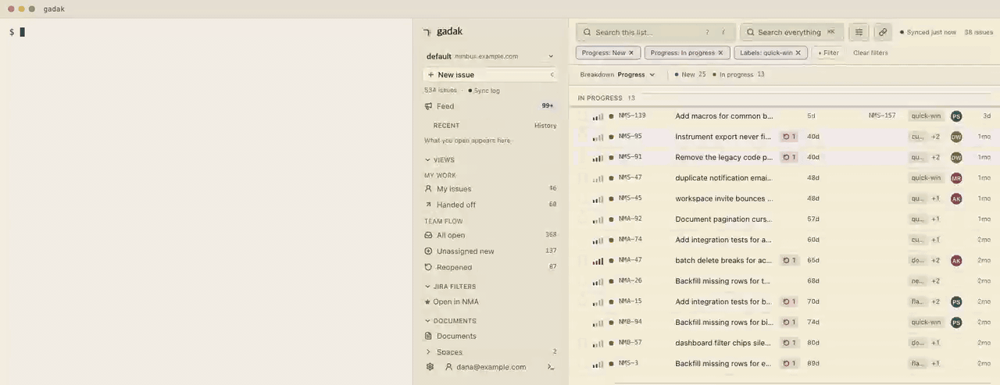
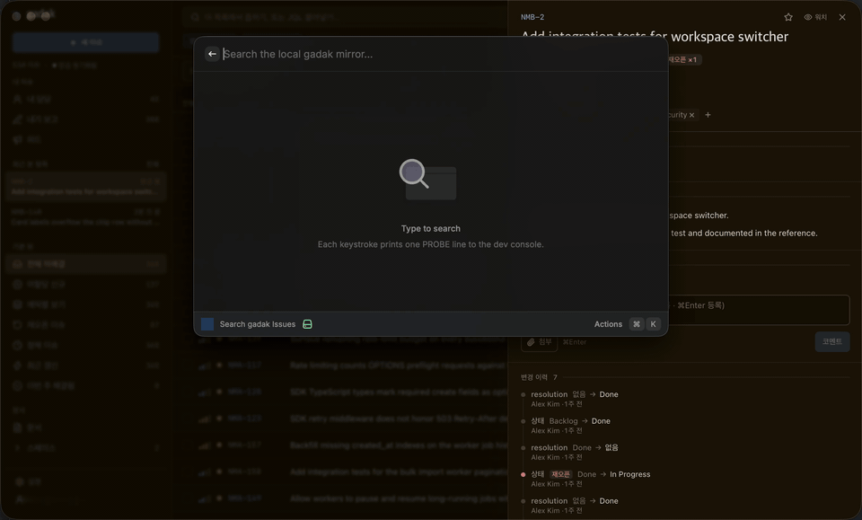
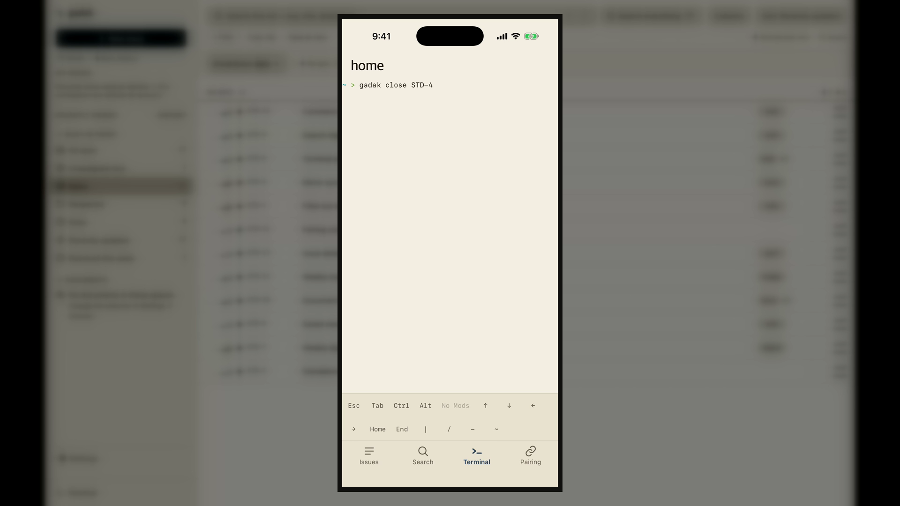
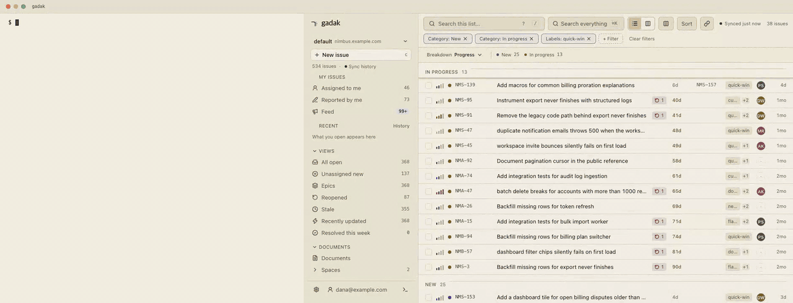
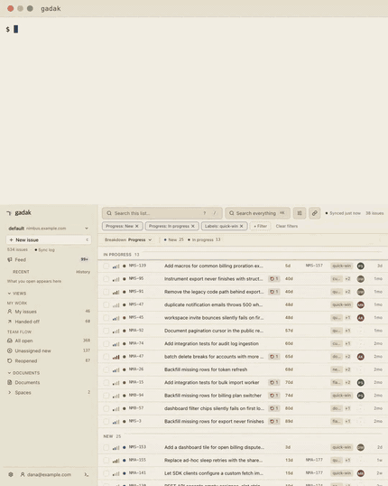
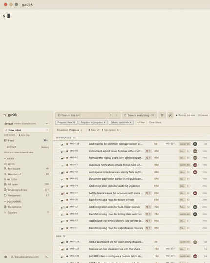
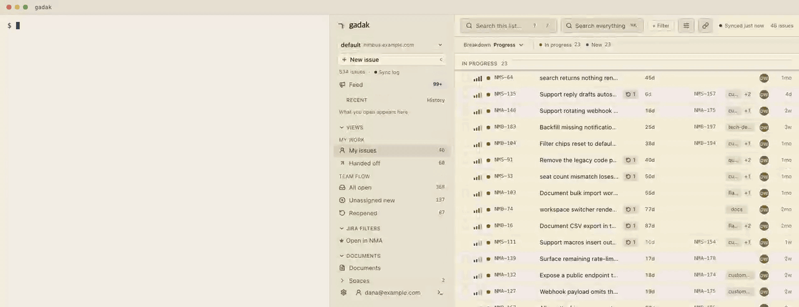

<p align="center">
  
  
</p>

<p align="center">
  <a href="https://github.com/midagedev/gadak/releases"></a>
  <a href="https://github.com/midagedev/gadak/actions/workflows/ci.yml"></a>
  <a href="LICENSE"></a>
</p>

<p align="center"><b>Follow the thread.</b></p>

<p align="center"><sub><a href="README.md">English</a> · 한국어 — 영문이 원본이며, 이 문서는 영문과 함께 갱신됩니다.</sub></p>

내 Jira를 로컬 SQLite 파일 하나로 만듭니다. "어느 에픽이 막혀 있지?"가
물을 수 없는 질문이 아니라 쿼리 한 줄이 됩니다.

gadak은 Jira *그리고* Confluence를 로컬 SQLite 파일 하나로 미러링합니다.
이슈, 코멘트, 히스토리, 위키 문서가 한 인덱스에 들어가고, 검색은 네트워크
없이 로컬에서 끝납니다. 그 데이터가 내 머신에서 사는 자리가 이 창입니다:
[데스크톱 앱](docs/DESKTOP.md)이나 브라우저 탭에서 트리아지하고, 코딩
에이전트가 SQL로 묻고 같은 창에 답을 띄우게 하세요. 바이너리 하나,
앱 하나, gadak 계정은 없습니다.

**미러는 버려도 되는 캐시입니다.** Jira 워크스페이스에서는,
이 프로젝트가 내일 멈춰도 디렉터리 하나를 지우면 끝이고, 잃는 것이
없습니다. 원본은 Jira입니다.

<p align="center">
  <a href="https://gadak.dev/demo/"><b>▶&nbsp; 라이브 데모 열기</b></a>
  &nbsp;—&nbsp; 이슈 534개, 지금 바로 브라우저에서.
  <br>
  <a href="CHANGELOG.ko.md">체인지로그</a>
  &nbsp;—&nbsp; 무엇이 나왔는지.
</p>

Jira 사이트에는 [API 토큰](https://id.atlassian.com/manage-profile/security/api-tokens)
하나가 필요합니다. 토큰 하나가 같은 사이트의 Jira와 Confluence를 모두
커버합니다. 내장 트래커 워크스페이스는 Atlassian 계정이
아예 필요 없습니다.

**무엇을 미러링할지는 직접 고릅니다.** 위키는 요청하기 전까지 꺼져 있고,
켤 때는 스페이스를 지정합니다(`gadak init --spaces ENG,PROD`, 또는
설정 → 소스). Jira도 `--projects`로 같은 방식으로 좁힙니다. 설치했다는
이유만으로 사이트 전체를 내려받는 일은 없습니다.

macOS 앱, CLI 포함:

```bash
brew install --cask midagedev/tap/gadak
```

CLI만 설치하려면 아래 한 줄입니다. 같은 UI를 브라우저 탭에서
`gadak serve`로 엽니다:

```bash
brew install midagedev/tap/gadak-cli
```

Windows: [최신 릴리스](https://github.com/midagedev/gadak/releases/latest)에서
`gadak_<version>_windows_amd64.zip`(또는 `windows_arm64`)을 받아 풀고
`gadak.exe`를 `PATH`에 두세요. 데스크톱 zip(`Gadak-<version>-windows-x64.zip`)은
서명되어 있지 않습니다. SmartScreen이나 Smart App Control이 막는다면
바이러스 검출이 아니라 서명 부재가 원인이니, CLI zip을 쓰세요. Smart App
Control을 끄지 마세요.

Jira에 연결:

```bash
gadak init && gadak sync && gadak serve
```

또는 계정 없이 내장 트래커에서 시작:

```bash
gadak init --local
gadak create "the thing I just noticed"
gadak serve
```

트래커를 떠날 때는 데이터를 들고 나옵니다 — 이슈·코멘트·전체 이력·첨부·
위키 페이지가 동기화된 워크스페이스에서 내장 트래커 워크스페이스로
옮겨지고,
끝에 원본 대 이전본 건수 대조표가 출력됩니다:

```bash
gadak --workspace local migrate --from work
```

`gadak serve`가 주소를 출력합니다. `http://gadak.localhost:7777`을 열어
이슈가 보이면 됩니다. 리눅스 타볼, 페어링, 서명된 macOS dmg:
[설치](#설치).

```bash
gadak sql "select epic_key, count(*) from issues_full where resolved_at is null
           and epic_key <> '' group by epic_key order by 2 desc"
```

위 쿼리가 핵심입니다: JQL에는 `GROUP BY`가 없습니다. 데이터가 파일이
되기 전까지, "어느 에픽이 실제로 막혀 있나"는 어려운 질문이 아니라
**물을 수 없는** 질문입니다. 나머지 레시피는
[`docs/RECIPES.md`](docs/RECIPES.md)에 있습니다.

설치 없이 지금 바로 이 쿼리를 실행해 보세요: [Datasette Lite가 이 탭에 데모
스냅샷을
불러오고](<https://lite.datasette.io/?url=https%3A%2F%2Fraw.githubusercontent.com%2Fmidagedev%2Fgadak%2Fmain%2Fexamples%2Fdemo.db#/demo?sql=select+epic_key%2C+count(*)+from+issues_full+where+resolved_at+is+null+and+epic_key+%3C%3E+''+group+by+epic_key+order+by+2+desc>)
SQL은 브라우저 안에서 돌아갑니다.

2026-08-26에 실제 Cloud 사이트(이슈 3,296개)에서 실측한 값입니다 (중앙값,
CLI 기동 포함, [방법론과 재측정 이력, gadak이 지는 행](docs/BENCHMARKS.md)):

| 질문 | REST API | `gadak` | |
| --- | ---: | ---: | ---: |
| 단순 필터 100건 | 583 ms | 19 ms | 31× |
| 이슈 하나 + 전체 히스토리 | 710 ms | 28 ms | 25× |
| 자유 텍스트 검색 | 543 ms | 41 ms | 13× |
| **에픽별 열린 이슈 (`GROUP BY`)** | 4,761 ms — API 8페이지를 받아 클라이언트에서 집계 | 22 ms — 쿼리 하나 | **214×** |
| 변경 이력을 걸치는 집계 | 표현 불가 — 순회로 약 28분 | 14 ms | — |

마지막 두 행이 핵심입니다. 페이지 크기를 넘어서면 JQL의 답은 느린 것을 지나
아예 물을 수 없는 것이 됩니다. API는 행은 주지만 집계는 주지 않으므로,
`GROUP BY`는 전부 당신 코드의 페이징 루프가 됩니다.

코퍼스는 이전 표와 같은 것이 아닙니다. 측정 대상 프로젝트가 그 사이
재조정됐습니다(이슈 7,166 → 3,296). 두 측정은 각각 자기 안에서만 비교
가능하고, 행 단위로 맞대면 안 됩니다.

반대편도: 첫 full sync는 실측 534이슈 26.4초 · 2,865이슈 7.2분
([방법론과 gadak이 지는 행](docs/BENCHMARKS.md)), 조용한 사이트의 watch
틱은 바뀐 것이 없어도 ~4.7초를 쓰고, 미러는 동기화 주기만큼 Jira보다
늦습니다.

<details>
<summary>▶ 종이 리스트 90초 투어 (GIF, 7 MB)</summary>

<p align="center">
  
  <br>
  <sub>창의 90초. <a href="e2e/demo/web-demo.spec.ts">e2e/demo/web-demo.spec.ts</a>가 데모 스냅샷에 대해 생성.</sub>
</p>

</details>

> **상태: 0.19, 아직 0.x입니다.** 동기화, 읽기 API, 쓰기 통과(write-through),
> 데스크톱, 웹, CLI, MCP가 실제 사이트에 대해 검증되어 있습니다.
> [`CHANGELOG.ko.md`](CHANGELOG.ko.md).

## 왜 만들었나

Jira 검색은 네트워크 왕복이고, 위키는 두 번째 검색입니다. "우리가 무엇을
이미 고쳤고, 무엇을 결정했지?"라고 묻는 에이전트는 REST API 두 개를
페이징합니다. 원인은 같습니다: 데이터가 파일이 아니기 때문입니다.
[`docs/CONCEPT.md`](docs/CONCEPT.md) · [`docs/PAIN_POINTS.md`](docs/PAIN_POINTS.md).

인덱스는 ⌘K 하나입니다. 제목, 본문, 코멘트가, 이슈와 문서 구분 없이 전부
거기 들어갑니다. 리스트에 걸린 칩은 여기 적용되지 않습니다. 코멘트에만
나온 단어로도 그 행이 잡히는 이유입니다.

<p align="center">
  
  <br>
  <sub><a href="e2e/demo/search-demo.spec.ts">e2e/demo/search-demo.spec.ts</a>가 데모 스냅샷에 대해 생성.</sub>
</p>

## 표면은 둘, 저장소는 하나

| | 용도 | 모습 |
| --- | --- | --- |
| **앱 + 웹 UI** | 종일 트리아지 | [데스크톱 앱](docs/DESKTOP.md)(포트 없음) 또는 `gadak serve`. `j`/`k`로 이동, `x`로 선택, `s`/`a`/`l`/`c`로 리스트에서 바로 상태·담당자·라벨·코멘트 변경 |
| **CLI + SQL** | 에이전트, 스크립트 | `gadak issue`, `gadak search`(FTS, `--jql`, Jira URL, `--explain`), `gadak sql`, 그리고 파일 그 자체 |

쓰기는 origin을 통과한 뒤 미러가 갱신됩니다. 앱·웹: 코멘트, 상태 전이,
담당자, 라벨, 우선순위, 제목. CLI: `create`(단건 또는 `--batch`),
`attach`, `edit`, `comment`, `transition`(`--resolution`),
`assign`, `link`, `dev link` / `dev scan`, `fields --apply`,
`issue --editmeta`, `project create`, 그리고 위키의 `page create` /
`page edit` / `page comment`(페이지, 제목, 본문, 코멘트 모두 origin을
통과). 계층 구조, `item_refs`, 첨부:
[`docs/CONCEPT.md`](docs/CONCEPT.md#two-surfaces).
창은 네 팔레트에서 같은 종이 메타포를 유지합니다: `light`, 중립-쿨
`dark`, 블루-블랙 `ink`, 웜 `ember`. 테마는 고르지 않으면 시스템을 따르고,
브라우저가 아니라 **워크스페이스**에 속합니다:
`gadak config set appearance.theme ink`.

<p align="center">
  
  <br>
  <sub>색도 설정입니다: <code>ui.tokens</code> / <code>ui.dataColors</code>가 CLI에서 열린 탭으로 리로드 없이 흘러가고, 팔레트가 소유한 키는 종이를 조용히 깨는 대신 오버라이드를 거절합니다. <a href="e2e/demo/tokens-demo.spec.ts">e2e/demo/tokens-demo.spec.ts</a>가 생성.</sub>
</p>

그리고 두 표면은 닫힌 목록이 아닙니다. 미러를 읽는 것은 바이너리 호출
하나(`gadak search --json`, ~20ms)이고, 앱에서 무언가를 여는 것은 URL
하나(`gadak://view?issue=…`, [스킴](docs/DESKTOP.md))입니다. 그 둘을 할
수 있는 것이면 무엇이든 표면이 됩니다. 예컨대 런처:

<p align="center">
  
  <br>
  <sub>키스트로크 하나가 <code>gadak search --json</code> 한 번이고, Enter가 딥링크입니다. 저장된 뷰도 같은 길로 갑니다. <code>gadak views open</code>이 링크를 출력합니다.</sub>
</p>

그 런처는 이미 있습니다: 타이핑마다 이슈와 위키 문서를 검색하는 Raycast
확장이고, [Raycast Store에 제출되어](https://github.com/raycast/extensions/pull/30297)
심사 중입니다. 심사가 끝나기 전에도, 이미 설치된 바이너리에서 한 줄로
설치됩니다(확장이 내장되어 있어 체크아웃이 필요 없습니다):

```sh
gadak raycast install
```

macOS 앱에서는 같은 설치가 버튼이기도 합니다. **설정 → 연동**이 Raycast·
에이전트 스킬·MCP를 한 목록으로 보여주고, 무엇이 설치되어 있는지 표시하며,
화면에 적힌 바로 그 명령을 실행합니다. 확장 자체를 만지려면:
[`contrib/raycast/`](contrib/raycast/). 확장 없이 쓰려면, 키로 이슈를 여는
쪽 절반은 `gadak://view?issue={argument}`를 넣은 Raycast Quicklink로도
됩니다.

## 무엇을 커버하나

Jira 워크스페이스는 Atlassian Cloud와 대화합니다. 내장 트래커(0.16부터)는 Atlassian
계정이 없는 워크스페이스입니다. 그 origin은 앱과 함께 다니는 미니멀한
Jira입니다. 어느 쪽이든 미러는 캐시이고, 모든 쓰기는 origin을 통과합니다.
내장 트래커에서 영속 파일은 origin의 persist 파일, 즉 워크스페이스 origin
폴더의 `issuetap.db`(SQLite, WAL)입니다. gadak이 꺼져 있을 때 복사하거나
(`-wal`/`-shm` 사이드카 포함), `sqlite3 origin/issuetap.db ".backup
dest.db"`를 쓰세요. `gadak backup`은 serve가 켜진 채로 같은 일을 한 번에 합니다
([`docs/runbooks/backup-restore.md`](docs/runbooks/backup-restore.md)).

읽기·쓰기·계층·위키·첨부·히스토리는 양쪽 모두 되고, 0.19부터는 리스트를
보드 레이아웃으로 펼칠 수 있습니다. UI로서의 스프린트, Jira 대시보드,
Jira 알림함은 안 됩니다. 그 일은 Jira에 남습니다.

<details>
<summary>▶ 전체 매트릭스와 ✅마다 붙은 각주</summary>

| | Jira (Atlassian Cloud) | 내장 트래커 (0.16부터) |
| --- | :---: | :---: |
| 이슈 읽기·검색 (FTS, JQL, SQL) | ✅¹ | ✅¹ |
| 생성, 코멘트, 상태 전이, 담당자, 라벨, 우선순위 | ✅ | ✅ |
| 마감일·설명·커스텀 필드 편집 (0.16부터) | ✅² | ✅² |
| 계층 구조 | ✅³ | ✅³ |
| 위키 문서 | ✅⁴ | ✅⁵ |
| 첨부 | ✅ | ✅ |
| 히스토리 / 상태 체류 시간 | ✅⁶ | ✅⁶ |
| 에이전트 표면 (스킬, MCP, SQL) | ✅ | ✅ |
| 보드 (0.19부터) | ✅⁸ | ✅⁸ |
| UI로서의 스프린트 | —⁸ | —⁸ |
| 대시보드 | — | — |
| Jira 알림 | —⁷ | —⁷ |

1. SQL과 FTS는 로컬입니다. `--jql` / Jira URL은 문서화된 부분집합을 인메모리 필터로 매핑하고, gadak이 표현하지 못하는 절은 조용히 버려지지 않고 나열됩니다. 스프린트 이름 비교, `WAS`, 필드를 가로지르는 `OR`, 커스텀 필드가 거절 목록에 있습니다. 숫자 `sprint =` / `sprint in`과 `sprint in openSprints()`는 부분집합입니다 ([decision 0007](docs/decisions/0007-jql-subset.md)).
2. 마감일과 설명은 전용 엔드포인트입니다. 커스텀 필드는 `text`, `number`, `date`, `option`, `user`, `multi_option` / `version_array` kind이며, 이슈의 editmeta와 설정된 필드 allowlist로 게이트됩니다. 캐스케이딩 셀렉트와 textarea 커스텀 필드는 편집기가 없습니다.
3. 에픽 그룹핑(`epic_key`, 가장 가까운 hierarchy-level-1 조상)은 일급입니다. 부모 지정은 CLI `create --parent` / `edit --parent`뿐입니다. REST `PUT {key}/parent`는 없습니다. 서브태스크 create-meta 플래그는 표면화되지 않아, create는 어떤 유형이 부모를 요구하는지 알지 못합니다.
4. Confluence Cloud를 미러링하고, 페이지 생성·수정(제목/본문)·페이지 코멘트가 origin을 통과해 쓰입니다: `gadak page create|edit|comment`, `POST pages/`, `PUT pages/{id}/edit`, `POST pages/{id}/comment`.
5. 페이지는 인프로세스 origin에서 동기화됩니다. `gadak page create|edit|comment`와 REST 동사가 여기서도 동작합니다. UI에는 페이지 코멘트 작성기가 있고 페이지 에디터는 아직 없습니다.
6. Changelog는 미러링됩니다. 상태 체류 시간은 저장 컬럼이 아니라 `status_changed_at`에서 계산합니다.
7. Jira의 알림함, 알림 규칙, 이메일은 미러링하지 않습니다. gadak은 macOS·Linux에서 자체 watch-피드 OS 알림을 갖고 있습니다.
8. 보드(0.19)는 같은 필터된 리스트를 컬럼으로 펼친 레이아웃입니다. 필터도 그룹 축도 리스트와 같고, 상태 축에서는 드래그가 실제 상태 전환이며, `--layout board`로 저장한 뷰는 보드로 다시 열립니다. Jira의 스프린트·보드 관리는 여기에 포함되지 않습니다. 리스트의 스프린트 컬럼도 여전히 없습니다. 스프린트 필드(`sprint_id` / `sprint_name` / `sprint_state`)는 미러에 있고, SQL과 JQL(`sprint =` / `sprint in openSprints()`)로 질의할 수 있습니다. `versions` 카탈로그와 `fix_version_ids`도 같은 방식으로 조인합니다.

</details>


**Linear.** Linear 워크스페이스도 같은 동사로 미러링하고 write-through
합니다: 워크스페이스 `config.json`에 `"linear"` 블록(`apiKey`, 선택 `teamIds`)을
넣고 `gadak sync --source linear`를 실행합니다. 쓰기는 키의 미러 source로
라우팅됩니다: 코멘트, 상태 전환(팀 워크플로 상태, id 기준),
요약/우선순위/마감일 편집, 담당자 지정/해제, 파일 첨부가 전부 Linear API를
통과한 뒤 미러 행을 갱신합니다. 라벨 편집, 마감일 해제, 상태 이력
(`status_changed_at`은 NULL 유지)은 아직 안 되며, 반쯤 적용하는 대신
정직하게 거절합니다. 인라인 코멘트 미디어는 파일은 붙고 본문 embed만
빠집니다. 필드 매핑:
[`internal/linear/MAPPING.md`](internal/linear/MAPPING.md).

### CLI가 하지 않는 것

쓰기 쪽의 의도적인 공백입니다. 프로덕션에서 발견하는 대신 여기서
미리 적어 둡니다:

- **`edit -m`은 서식 있는 description을 지우지 않습니다.** `-m`은 평문을
  씁니다. origin의 현재 description에 평문 교체로는 사라지는 서식(표,
  제목, 리스트, 링크, 멘션)이 있으면 편집은 멈추고 무엇을 찾았는지
  알려 줍니다. `gadak edit KEY -m … --force-plain`으로 그래도 교체할 수
  있습니다. (`page edit -m`도 같은 가드를 `--force` 뒤에 두고 있습니다.)
- **스프린트 동사는 없습니다.** 스프린트 필드는 미러에 있습니다
  (`sprint_id`, `sprint_name`, `sprint_state`; SQL과 JQL로 질의), 하지만
  이슈를 스프린트 사이에서 옮기거나 스프린트를 편집하는 일은 Jira에서
  합니다.
- **worklog 동사는 없습니다.** 패스스루로 남깁니다:
  `gadak api POST /rest/api/3/issue/KEY/worklog --data @wl.json --write`.

## 에이전트를 위해

gadak이 존재하는 이유의 절반입니다. 레퍼런스: **[docs/MIRROR.md](docs/MIRROR.md)**.
호스트별 붙여넣기 한 번: [`docs/AGENT_SETUP.md`](docs/AGENT_SETUP.md).

```bash
gadak skill install
```

스키마와 쿼리 패턴, 별도 프로세스 없음. 셸이 없는 호스트(Claude Desktop)라면:

```bash
gadak mcp install claude
```

이 바이너리와 워크스페이스를 등록에 고정합니다.

`gadak init`과 `gadak install-cli`는 `~/.claude`가 이미 있으면 그 스킬을
자동으로 설치합니다. gadak이 쓰지 않은 파일은 그대로 둡니다.

<p align="center">
  <a href="docs/media/hero.mp4"></a>
  <br>
  <sub><b>26초, serve 하나, 터미널 세션 하나</b> (<a href="docs/media/hero.mp4">영상 재생 ▶</a>). 티켓을 에이전트에게 넘기고 패널을 닫습니다. 보는 사람이 없어도 일은 계속됩니다. 폰이 같은 보드에서 다른 이슈를 닫습니다. 자리로 돌아오면 두고 간 스크롤백이 그대로 있고, 카운트는 폰이 한 것까지 포함해 이미 움직여 있습니다. 두 대의 카메라가 같은 순간을 찍은 것이지, 두 테이크를 이어 붙인 것이 아닙니다: <a href="e2e/demo/record-hero.sh">e2e/demo/record-hero.sh</a>.</sub>
</p>

<p align="center">
  
  <br>
  <sub>스킬이 사 주는 것: 라이브 Claude Code 세션이 지금 보고 있는 그 워크스페이스를 직접 몰아서, 색과 차트 대시보드가 리로드 없이 열린 탭에 내려앉습니다. <a href="tools/tapes/claude-drive.tape">tools/tapes/claude-drive.tape</a>로 녹화.</sub>
</p>

두 설치(그리고 Raycast까지)는 macOS 앱에서는 버튼이기도 합니다. 설치
상태를 정직하게 보여주는 **설정 → 연동**이 그 자리입니다.

같은 리그에서 찍은 두 테이크입니다. 각각 한 가지 일을 끝까지 따라갑니다.
첫 문장을 빼면 각본은 없습니다. 명령도 HTML도 복구도 모델이 스스로 한
것입니다:

<table align="center">
<tr>
<td width="50%" align="center">
  
</td>
<td width="50%" align="center">
  
</td>
</tr>
<tr>
<td align="center"><sub><b>벽을 세우고, 그 벽이 앱으로 되돌아옵니다.</b> 대시보드는 HTML 문서 하나에 이름 붙은 쿼리들입니다. 에이전트가 벽에 올린 키는 진짜 링크라, 클릭하면 페이지를 떠나는 대신 그 이슈가 열립니다.</sub></td>
<td align="center"><sub><b>룩을 바꾸되, 요청한 값을 지킵니다.</b> 토큰 쓰기는 적용된 뒤 어떻게 보일지를 말해 주고, 기계가 지킬 수 없는 것만 거절합니다. 여기서는 경고가 타입 사다리 전체를 찍어 주고, 세션이 스스로 단을 복구합니다.</sub></td>
</tr>
</table>

<sub><a href="tools/tapes/claude-dashboards.tape">claude-dashboards.tape</a>와 <a href="tools/tapes/claude-tokens.tape">claude-tokens.tape</a>를 데모 스냅샷에 대해 녹화. 원본 해상도 MP4: <a href="docs/media/claude-dashboards-vertical.mp4">대시보드</a> · <a href="docs/media/claude-tokens-vertical.mp4">토큰</a>.</sub>

설정도 에이전트가 화면을 눌러야 하는 일이 아닙니다. 설정 다이얼로그가
편집하는 모든 필드가 같은 검증을 지나는 CLI 동사입니다:

```bash
gadak config list
```

편집 가능한 전체 경로와 현재값.

```bash
gadak config set appearance.theme ink
```

워크스페이스별, 즉시 적용.

SQL이 답하고, 창이 보여 줍니다. 필터는 `status_category` /
`priority_rank`(1 = 가장 긴급, 0 = 미설정)로 걸고, display name으로는
키하지 마세요. Jira는 계정 언어마다 그 이름을 번역하므로
`priority = High`는 한국어 계정에서 소리 없이 0행입니다. `--jql`은
Jira 자신의 언어라 입력한 문자 그대로 남습니다. 순위나 카테고리로
거를 때는 `gadak sql`을 쓰세요:

```bash
gadak sql --no-header "select key from issues_full where status_category = 'inprogress'
                       order by status_changed_at asc limit 5" | gadak views open --keys -
```

이미 JQL이 있다면 절이 그대로 칩이 됩니다. 아래는 프로젝트 키와
비어 있음만 걸고, 로케일 이름에는 키하지 않습니다:

```bash
gadak views open --jql 'project = NMA AND resolution is EMPTY'
```

<p align="center">
  
  <br>
  <sub><code>gadak views open</code>은 일회성 해시를 쓰고, 실행 중인 앱 또는 serve 탭이 그것을 적용합니다. 녹화본에는 우선순위 절이 하나 더 있습니다. <code>--jql</code>에서 우선순위·상태 이름은 내 Jira가 저장한 문자열 그대로 매칭되고 그 이름은 로케일마다 다르므로, 위 예시에서는 뺐습니다. <a href="e2e/demo/agent-demo.spec.ts">e2e/demo/agent-demo.spec.ts</a>가 생성.</sub>
</p>

답이 목록이 아니라 벽이라면 대시보드를 저작하세요. HTML 문서 한 장과
등록된 데이터소스가 웹 탭 안에서 샌드박스로 렌더됩니다:
**[docs/DASHBOARDS.md](docs/DASHBOARDS.md)**.

<p align="center">
  
  <br>
  <sub><code>gadak dashboards save</code>가 문서와 데이터소스를 등록하면 호스트가 쿼리를 실행해 행을 밀어 넣고, 재저장은 열린 프레임을 1초 안에 교체합니다. 차트는 로컬에서 서빙되는 uPlot이라 CDN도 CSP 확장도 필요 없습니다. <a href="e2e/demo/dashboards-demo.spec.ts">e2e/demo/dashboards-demo.spec.ts</a>가 생성.</sub>
</p>

셸이 없는 호스트(Claude Desktop)에서는 같은 미러가 MCP 서버가 됩니다.
Jira가 아예 답할 수 없는 것을 물어보세요. 위키는 두 번째 검색이니까요.
"X에 대해 우리가 아는 게 뭐지?" 한 인덱스가 둘을 다 담고 있으므로, 답은
티켓과 그 티켓을 만든 설계 문서를 한 문장에 담을 수 있습니다.

<p align="center">
  
  <br>
  <sub>도구 다섯 개. 미러에도 Jira에도 쓰지 않습니다. 셸이 있는 호스트는 <code>gadak sql</code>을 쓰면 됩니다. 설정: <a href="docs/MCP.md">docs/MCP.md</a>.</sub>
</p>

`gadak views open`은 "gadak에서 열기" 동사이고, `gadak open KEY`는 Jira로
나가는 문입니다. 리스트 박스는 `gadak search --jql`과 같은 JQL 붙여넣기를
받습니다. gadak이 표현하지 못하는 절은 조용히 버려지지 않고 나열됩니다.
JQL로 여전히 물을 수 없는 것은 `gadak sql`과
[`docs/RECIPES.md`](docs/RECIPES.md)의 몫입니다. `gadak sql`은 파일을
`mode=ro`로 열고, MCP의 `gadak_query`는 SELECT가 아닌 것을 전부
거부합니다. [`gadak api`](docs/AGENT_ACCESS.md)는 미러가 모델링하지 않는
엔드포인트로의 통로입니다. `--write` 없이는 읽기 전용이고, MCP에는 절대
없습니다.

**미러를 읽는 에이전트는 읽은 것을 자기가 쓰는 모델로 보냅니다.** gadak
자신은 아무것도 보내지 않습니다([`SECURITY.md`](SECURITY.md)). 에이전트가
봐도 되는 범위로 미러를 좁히세요. gadak이 네트워크를 *실제로* 쓰는
지점(싱크, 쓰기, 그리고 테일넷이나 팀 전체가 워크스페이스 하나를 공유하게
하는 페어링 모델)은 [`docs/NETWORK.md`](docs/NETWORK.md)가 연결 하나하나와
끄는 방법까지 짚습니다.

## 설치

brew 두 줄은 이 페이지 맨 위에 있습니다. Atlassian Cloud에 연결하거나,
(0.16부터) Atlassian 계정이 필요 없는 내장 트래커 워크스페이스로 시작합니다.
Jira 사이트는
[API 토큰](https://id.atlassian.com/manage-profile/security/api-tokens) 하나면
되고, 그 토큰이 같은 사이트의 Jira와 Confluence를 함께 커버합니다.

**Windows:** [최신 릴리스](https://github.com/midagedev/gadak/releases/latest)에서
`gadak_<version>_windows_amd64.zip`(또는 `arm64`)을 받아 압축을 풀고
`gadak.exe`를 `PATH`에 둡니다. 데스크톱 zip은 서명되어 있지 않습니다.
SmartScreen 차단은 바이러스 판정이 아니라 서명 부재입니다
([이유와 sha256 확인법](docs/WINDOWS-SIGNING.md)). Smart App Control을 끄지
마십시오.

<details>
<summary>▶ dmg, 리눅스 tarball, 두 번째 머신 페어링</summary>

macOS dmg: [최신 릴리스](https://github.com/midagedev/gadak/releases/latest)의
`Gadak-<version>-arm64.dmg`를 받아 Applications로 끌어다 놓습니다. 서명·공증
완료. 첫 실행이 사이트·이메일·토큰·프로젝트를 안내합니다. CLI는 번들 안에
들어 있고, macOS는 앱을 `PATH`에 올려 주지 않습니다:

```bash
/Applications/Gadak.app/Contents/Resources/bin/gadak install-cli
```

**다른 머신과 페어링.** 홈의 `gadak serve`가 origin입니다. 홈에서 오퍼를
만듭니다(stdout이 오퍼 한 줄):

```bash
gadak pairing mint --label laptop
```

원격에서 오퍼를 붙여넣습니다:

```bash
gadak --workspace laptop init --pairing-code-stdin
```

확인은 `gadak --workspace laptop status`(paired with "laptop").
`gadak pairing list`는 홈에서 토큰 표, 원격에서 상태 한 줄입니다.
`gadak pairing revoke laptop`은 홈에서만.

`_home`은 이 머신의 라우팅 토큰이지 디바이스가 아닙니다(`revoke`는 거절하고, `mint --label _home`이 회전합니다). 원격에서도 동사는 같고, `pairing:`으로 시작하는 오류는 그 문장 전체가 메시지입니다. `--profile`은 `--workspace`의 별칭입니다. 게이트는 [`SECURITY.md`](SECURITY.md).

Scoop 매니페스트는 [`contrib/scoop`](contrib/scoop)에 있습니다. 버킷은
아직 게시되지 않았고, Windows 머신에서 `scoop install`을 돌린 적도 없습니다
([`docs/INSTALL.md`](docs/INSTALL.md#scoop-windows-cli)).

Homebrew 없이 리눅스에 설치하려면
[최신 릴리스](https://github.com/midagedev/gadak/releases/latest)에서
`gadak_<version>_linux_amd64.tar.gz`(또는 `linux_arm64`)와 `checksums.txt`를
받으세요. 아카이브 하나가 설치 전부입니다. 웹 UI는 바이너리 안에 있습니다.
`<version>`은 그 릴리스 태그에서 앞의 `v`를 뺀 값으로 바꾸세요.
검증하고 푼 뒤 `gadak`을 `PATH`에 두세요:

```bash
sha256sum --ignore-missing -c checksums.txt
tar -xzf gadak_<version>_linux_amd64.tar.gz
```

```bash
gadak serve
```

`gadak serve`가 주소를 출력합니다. `http://gadak.localhost:7777`을 열어
이슈가 보이면 됩니다.

선택 사항으로, 재부팅 후에도 유지하려면(`systemd --user`):

```bash
gadak install-service
```

Arch 리눅스: 검증된 `PKGBUILD`가
[`contrib/aur/gadak-bin`](contrib/aur/gadak-bin)에 있으니 거기서
`makepkg -si`를 실행하세요. 아직 AUR에는 없습니다. 업스트림 등록이 닫혀
있기 때문입니다 ([`docs/INSTALL.md`](docs/INSTALL.md#arch-linux)).

설치 스크립트, 릴리스 아카이브, 소스 빌드, Docker, 위키 미러링, 워크스페이스,
업그레이드: **[`docs/INSTALL.md`](docs/INSTALL.md)**.

</details>

## 나머지

**내 것으로 만들기.** 포크 없이 두 축으로: [`docs/EXTENDING.md`](docs/EXTENDING.md).
설정: [`docs/CONFIGURATION.md`](docs/CONFIGURATION.md). 확장 데이터:
[`docs/PLUGINS.md`](docs/PLUGINS.md).

**동작 원리.** 바이너리 하나, SQLite 파일 하나. 증분 동기화 + 정합성
보정 패스. [`docs/ARCHITECTURE.md`](docs/ARCHITECTURE.md). 왜 확장 프로그램이나
Forge 앱이 아닌가: [`docs/decisions/0003-local-process.md`](docs/decisions/0003-local-process.md).

**맞는 곳 / 안 맞는 곳.** 매일의 검색 지연, 트래커 *와* 위키를 함께 보는
에이전트, 오프라인 읽기에는 맞습니다. 스프린트 계획, 어드민, UI의 페이지
에디터, 그리고 1분의 지연도 안 되는 일은 Jira에 남기세요. CLI와 REST는 이미
위키 페이지를 씁니다.
[`docs/CONCEPT.md`](docs/CONCEPT.md#good-fit-bad-fit).

**비교.** jira-cli는 커맨드마다 라이브 API를 호출합니다. Linear는 다른
트래커이기도 하고, gadak 소스이기도 합니다(위 Linear 문단). Rovo MCP도 두
소스를 함께 검색하지만 호스팅형입니다: 집계가 안 되고, 오프라인이 안 되며,
호출마다 토큰이 나갑니다.
[`docs/FAQ.md`](docs/FAQ.md#how-it-compares).

**다음 소스.** Confluence가 뼈대가 소스 중립임을 증명했습니다. 다음
소스는 수요 순으로: [`docs/project/ROADMAP.md`](docs/project/ROADMAP.md#more-sources-later).

## 문서

- [`CHANGELOG.ko.md`](CHANGELOG.ko.md) — 무엇이 나왔는지
- [`docs/INSTALL.md`](docs/INSTALL.md) · [`docs/DESKTOP.md`](docs/DESKTOP.md) — 설치, 첫 실행, 데스크톱 앱
- [`docs/MIRROR.md`](docs/MIRROR.md) · [`docs/MCP.md`](docs/MCP.md) · [`docs/AGENT_SETUP.md`](docs/AGENT_SETUP.md) — SQL, CLI, REST, MCP, 호스트별 붙여넣기 한 번
- [`docs/RECIPES.md`](docs/RECIPES.md) — JQL이 못 묻는 질문들, SQL로
- [`SECURITY.md`](SECURITY.md) · [`docs/FAQ.md`](docs/FAQ.md) · [`MAINTENANCE.md`](docs/MAINTENANCE.md) — 위협 모델, 사이트 부하, 누가 유지하는가
- [`docs/EXTENDING.md`](docs/EXTENDING.md) · [`docs/PLUGINS.md`](docs/PLUGINS.md) — 팀에 맞추기
- [`docs/project/STATE_OF_PLAY.md`](docs/project/STATE_OF_PLAY.md) · [`docs/CONCEPT.md`](docs/CONCEPT.md) · [`docs/PAIN_POINTS.md`](docs/PAIN_POINTS.md)
- [`docs/ARCHITECTURE.md`](docs/ARCHITECTURE.md) · [`docs/project/UX_PRINCIPLES.md`](docs/project/UX_PRINCIPLES.md)
- [`docs/README.md`](docs/README.md) — 나머지 문서

## 누가 만드나

현재는 한 사람입니다. 그 사실을 저울에 올리되, 반대편도 함께 올리세요:
미러는 내 Jira의 버려도 되는 캐시이고, 0.x가 약속하는 것은
[data-model.md](specs/000-product/data-model.md)의 세 가지(`issues_full`과
RECIPES 쿼리들, `gadak sql`의 stdout, `gadak views open --keys -`)뿐이며,
라이선스는 Apache-2.0이고, 파일은 무엇으로든 읽히는 평범한 SQLite입니다.
어려운 질문들: [`docs/FAQ.md`](docs/FAQ.md). 믿지 않아도 되는 것들, 각
항목마다 확인 명령과 함께: [`PROMISES.md`](docs/PROMISES.md).

## 기여와 피드백

[`CONTRIBUTING.md`](.github/CONTRIBUTING.md)를 보세요. 시작은
[`docs/project/GOOD_FIRST_ISSUES.md`](docs/project/GOOD_FIRST_ISSUES.md)에서 하세요. 버그 리포트에는
Jira 배포 유형(Cloud), gadak 커밋, 실행한 명령이 필요합니다. 실제 이슈
데이터, 토큰, 사이트 URL은 공개 이슈에 절대 붙여넣지 마세요.

커밋의 `GDK-nnn` 키는 [공개 백로그](https://gadak.dev/backlog/)로
이어집니다. 등록은
[GitHub 이슈](https://github.com/midagedev/gadak/issues)로 하세요.
메인테이너가 백로그로 미러합니다.

에이전트와 함께 gadak을 쓰다 걸리는 게 있나요?
이슈를 열고 무엇을 물었고 에이전트가 무엇을 했는지 적어 주세요.

## 라이선스

Apache-2.0. `LICENSE`와 `NOTICE`를 보세요.

[GDK-211]: https://midagedev.github.io/gadak/backlog/#/?ks=GDK-211
