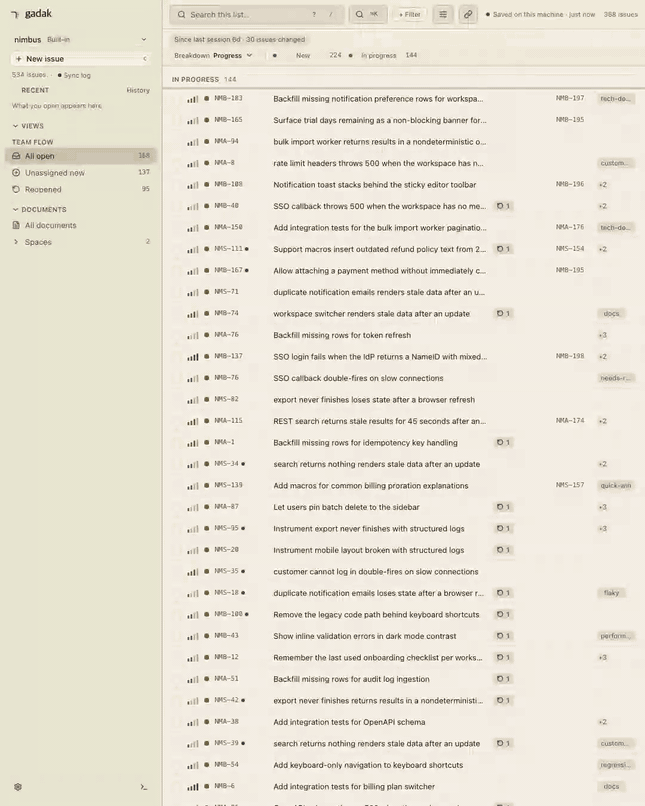

<p align="center">
  
  
</p>

<p align="center">
  <a href="https://github.com/midagedev/gadak/releases"></a>
  <a href="https://github.com/midagedev/gadak/actions/workflows/ci.yml"></a>
  <a href="LICENSE"></a>
</p>

<p align="center"><b>Follow the thread.</b></p>

<p align="center"><sub><a href="README.md">English</a> · 한국어 — 영문이 원본이며, 이 문서는 영문과 함께 갱신됩니다.</sub></p>

내 Jira를 로컬 SQLite 파일 하나로 만듭니다. "어느 에픽이 막혀 있지?"가
물을 수 없는 질문이 아니라 쿼리 한 줄이 됩니다.

gadak은 Jira *그리고* Confluence를 로컬 SQLite 파일 하나로 미러링합니다.
이슈, 코멘트, 히스토리, 위키 문서가 한 인덱스에 들어가고, 검색은 네트워크
없이 로컬에서 끝납니다. 그 데이터를 이 컴퓨터에서 보는 자리가 이 창입니다.
[데스크톱 앱](docs/DESKTOP.md)이나 브라우저 탭에서 트리아지하고, 코딩
에이전트에게는 SQL로 묻고 같은 창에 답을 띄우게 하세요. 바이너리 하나,
앱 하나면 되고, gadak 계정은 필요 없습니다.

**미러는 버려도 되는 캐시입니다.** Jira 워크스페이스라면 이 프로젝트가
내일 멈춰도 디렉터리 하나를 지우면 끝이고, 잃는 것은 없습니다. 원본은
Jira에 있습니다.

<p align="center">
  <a href="https://gadak.dev/demo/"><b>▶&nbsp; 라이브 데모 열기</b></a>
  &nbsp;—&nbsp; 이슈 534개, 지금 바로 브라우저에서.
  <br>
  <a href="CHANGELOG.ko.md">체인지로그</a>
  &nbsp;—&nbsp; 무엇이 나왔는지.
</p>

Jira 사이트에는 [API 토큰](https://id.atlassian.com/manage-profile/security/api-tokens)
하나가 필요합니다. 그 토큰 하나가 같은 사이트의 Jira와 Confluence에 함께
쓰입니다. 내장 트래커 워크스페이스는 Atlassian 계정이 아예 필요
없습니다.

**무엇을 미러링할지는 직접 고릅니다.** 위키는 켜기 전까지 꺼져 있고,
켤 때 스페이스를 지정합니다(`gadak init --spaces ENG,PROD`, 또는
설정 → 소스). Jira도 `--projects`로 같은 방식으로 좁힙니다. 설치했다고
사이트 전체를 내려받지는 않습니다.

macOS 앱, CLI 포함:

```bash
brew install --cask midagedev/tap/gadak
```

CLI만 설치하려면 아래 한 줄입니다. 같은 UI를 브라우저 탭에서
`gadak serve`로 엽니다:

```bash
brew install midagedev/tap/gadak-cli
```

Windows: [최신 릴리스](https://github.com/midagedev/gadak/releases/latest)에서
`gadak_<version>_windows_amd64.zip`(또는 `windows_arm64`)을 받아 풀고
`gadak.exe`를 `PATH`에 두세요. 데스크톱 zip(`Gadak-<version>-windows-x64.zip`)은
서명되어 있지 않습니다. SmartScreen이나 Smart App Control이 막는다면
바이러스가 검출된 것이 아니라 서명이 없어서입니다. 그럴 때는 CLI zip을
쓰세요. Smart App Control은 끄지 마세요.

Jira에 연결:

```bash
gadak init && gadak sync && gadak serve
```

또는 계정 없이 내장 트래커에서 시작:

```bash
gadak init --local
gadak create "the thing I just noticed"
gadak serve
```

트래커를 떠날 때는 데이터를 들고 나옵니다. 이슈, 코멘트, 전체 이력, 첨부,
위키 페이지가 동기화된 워크스페이스에서 내장 트래커 워크스페이스로
옮겨지고, 마지막에 원본과 이전본의 건수 대조표가 출력됩니다:

```bash
gadak --workspace local migrate --from work
```

같은 명령을 Linear 워크스페이스에서 `--to linear --team ENG`로 실행하면
이슈가 그 팀으로 들어갑니다. 이력과 위키 페이지는 따라가지 못하는데,
보고서가 그 사실을 그대로 적습니다.

`gadak serve`가 주소를 출력합니다. `http://gadak.localhost:7777`을 열어
이슈가 보이면 됩니다. 리눅스 타볼, 페어링, 서명된 macOS dmg:
[설치](#설치).

```bash
gadak sql "select epic_key, count(*) from issues_full where resolved_at is null
           and epic_key <> '' group by epic_key order by 2 desc"
```

위 쿼리가 핵심입니다. JQL에는 `GROUP BY`가 없습니다. 데이터가 파일이
되기 전까지 "어느 에픽이 실제로 막혀 있나"는 어려운 질문이 아니라
**물을 수 없는** 질문입니다. 나머지 레시피는
[`docs/RECIPES.md`](docs/RECIPES.md)에 있습니다.

설치 없이 지금 바로 이 쿼리를 실행해 볼 수도 있습니다. [Datasette Lite가 이
탭에 데모 스냅샷을
불러오고](<https://lite.datasette.io/?url=https%3A%2F%2Fraw.githubusercontent.com%2Fmidagedev%2Fgadak%2Fmain%2Fexamples%2Fdemo.db#/demo?sql=select+epic_key%2C+count(*)+from+issues_full+where+resolved_at+is+null+and+epic_key+%3C%3E+''+group+by+epic_key+order+by+2+desc>),
SQL은 브라우저 안에서 돌아갑니다.

2026-08-26에 실제 Cloud 사이트(이슈 3,296개)에서 측정한 값입니다. 중앙값이고
CLI 기동 시간을 포함합니다([측정 방법과 재측정 이력, gadak이 더 느린 행](docs/BENCHMARKS.md)):

| 질문 | REST API | `gadak` | |
| --- | ---: | ---: | ---: |
| 단순 필터 100건 | 583 ms | 19 ms | 31× |
| 이슈 하나 + 전체 히스토리 | 710 ms | 28 ms | 25× |
| 자유 텍스트 검색 | 543 ms | 41 ms | 13× |
| **에픽별 열린 이슈 (`GROUP BY`)** | 4,761 ms, API 8페이지를 받아 클라이언트에서 집계 | 22 ms, 쿼리 한 번 | **214×** |
| 변경 이력을 걸치는 집계 | JQL로는 표현 불가, 순회하면 약 28분 | 14 ms | — |

마지막 두 행이 핵심입니다. 페이지 크기를 넘어서면 JQL의 답은 느린 정도가
아니라 아예 물을 수 없는 것이 됩니다. API는 행은 주지만 집계는 주지
않으므로, `GROUP BY`는 전부 내 코드의 페이징 루프가 됩니다.

이 표의 코퍼스는 이전 표와 다릅니다. 측정 대상 프로젝트가 그 사이에
재조정됐습니다(이슈 7,166 → 3,296). 두 측정은 각각 자기 표 안에서만 비교할
수 있고, 행 단위로 맞대면 안 됩니다.

반대편 숫자도 있습니다. 첫 전체 동기화는 이슈 534건에 26.4초, 2,865건에
7.2분이 걸렸고([측정 방법과 gadak이 더 느린 행](docs/BENCHMARKS.md)), 조용한
사이트의 watch 틱은 바뀐 것이 없어도 약 4.7초를 쓰며, 미러는 동기화
주기만큼 Jira보다 늦습니다.

<details>
<summary>▶ 종이 리스트 20초 투어 (GIF)</summary>

<p align="center">
  
  <br>
  <sub>창을 20초 동안 담았습니다. <a href="e2e/demo/web-demo.spec.ts">e2e/demo/web-demo.spec.ts</a>가 데모 스냅샷에서 생성했습니다.</sub>
</p>

</details>

> **상태: 0.20, 아직 0.x입니다.** 동기화, 읽기 API, 쓰기 통과(write-through),
> 데스크톱, 웹, CLI, MCP가 실제 사이트에 대해 검증되어 있습니다.
> [`CHANGELOG.ko.md`](CHANGELOG.ko.md).

## 왜 만들었나

Jira 검색은 네트워크 왕복이고, 위키는 두 번째 검색입니다. "우리가 무엇을
이미 고쳤고, 무엇을 결정했지?"라고 묻는 에이전트는 REST API 두 개를
페이징합니다. 원인은 하나입니다. 데이터가 파일이 아니기 때문입니다.
[`docs/CONCEPT.md`](docs/CONCEPT.md) · [`docs/PAIN_POINTS.md`](docs/PAIN_POINTS.md).

인덱스는 ⌘K 하나입니다. 제목, 본문, 코멘트가 이슈와 문서 구분 없이 전부
거기 들어갑니다. 리스트에 걸어 둔 필터 칩은 여기에는 적용되지 않습니다.
코멘트에만 나온 단어로도 그 행이 잡히는 이유입니다.

<p align="center">
  
  <br>
  <sub><a href="e2e/demo/search-demo.spec.ts">e2e/demo/search-demo.spec.ts</a>가 데모 스냅샷에서 생성했습니다.</sub>
</p>

## 표면은 둘, 저장소는 하나

| | 용도 | 모습 |
| --- | --- | --- |
| **앱 + 웹 UI** | 종일 트리아지 | [데스크톱 앱](docs/DESKTOP.md)(포트 없음) 또는 `gadak serve`. `j`/`k`로 이동, `x`로 선택, `s`/`a`/`l`/`c`로 리스트에서 바로 상태·담당자·라벨·코멘트 변경 |
| **CLI + SQL** | 에이전트, 스크립트 | `gadak issue`, `gadak search`(FTS, `--jql`, Jira URL, `--explain`), `gadak sql`, 그리고 파일 그 자체 |

쓰기는 origin을 통과한 뒤 미러가 갱신됩니다. 앱과 웹에서는 코멘트, 상태
전이, 담당자, 라벨, 우선순위, 제목을 씁니다. CLI에서는 `create`(단건 또는
`--batch`), `attach`, `edit`, `comment`, `transition`(`--resolution`),
`assign`, `link`, `dev link` / `dev scan`, `fields --apply`,
`issue --editmeta`, `project create`, 그리고 위키의 `page create` /
`page edit` / `page comment`를 씁니다(페이지의 제목, 본문, 코멘트도 모두
origin을 통과합니다). 계층 구조, `item_refs`, 첨부는
[`docs/CONCEPT.md`](docs/CONCEPT.md#two-surfaces)에 있습니다.
창은 네 팔레트 어디서나 같은 종이 메타포를 유지합니다. `light`, 중립적이고
차가운 `dark`, 검푸른 `ink`, 따뜻한 `ember`입니다. 테마는 고르지 않으면
시스템을 따르고, 브라우저가 아니라 **워크스페이스**에 속합니다:
`gadak config set appearance.theme ink`.

<p align="center">
  
  <br>
  <sub>색도 설정입니다. <code>ui.tokens</code>와 <code>ui.dataColors</code>가 CLI에서 열린 탭으로 리로드 없이 흘러가고, 팔레트가 소유한 키는 종이 질감을 조용히 깨는 대신 오버라이드를 거절합니다. <a href="e2e/demo/tokens-demo.spec.ts">e2e/demo/tokens-demo.spec.ts</a>가 생성했습니다.</sub>
</p>

그리고 두 표면은 닫힌 목록이 아닙니다. 미러를 읽는 것은 바이너리 호출
하나(`gadak search --json`, 약 20ms)이고, 앱에서 무언가를 여는 것은 URL
하나(`gadak://view?issue=…`, [스킴](docs/DESKTOP.md))입니다. 그 둘을 할
수 있는 것이면 무엇이든 표면이 됩니다. 예컨대 런처:

<p align="center">
  
  <br>
  <sub>키스트로크 하나가 <code>gadak search --json</code> 한 번이고, Enter가 딥링크입니다. 저장된 뷰도 같은 길로 갑니다. <code>gadak views open</code>이 링크를 출력합니다.</sub>
</p>

그 런처는 이미 있습니다: 타이핑마다 이슈와 위키 문서를 검색하는 Raycast
확장이고, [Raycast Store에 제출되어](https://github.com/raycast/extensions/pull/30297)
심사 중입니다. 심사가 끝나기 전에도, 이미 설치된 바이너리에서 한 줄로
설치됩니다(확장이 내장되어 있어 체크아웃이 필요 없습니다):

```sh
gadak raycast install
```

macOS 앱에서는 같은 설치가 버튼이기도 합니다. **설정 → 연동**이 Raycast·
에이전트 스킬·MCP를 한 목록으로 보여주고, 무엇이 설치되어 있는지 표시하며,
화면에 적힌 바로 그 명령을 실행합니다. 확장 자체를 만지려면:
[`contrib/raycast/`](contrib/raycast/). 확장 없이 쓰려면, 키로 이슈를 여는
쪽 절반은 `gadak://view?issue={argument}`를 넣은 Raycast Quicklink로도
됩니다.

## 무엇을 커버하나

Jira 워크스페이스는 Atlassian Cloud와 대화합니다. 내장 트래커(0.16부터)는 Atlassian
계정이 없는 워크스페이스입니다. 그 origin은 앱과 함께 다니는 미니멀한
Jira입니다. 어느 쪽이든 미러는 캐시이고, 모든 쓰기는 origin을 통과합니다.
내장 트래커에서 영속 파일은 origin의 persist 파일, 즉 워크스페이스 origin
폴더의 `issuetap.db`(SQLite, WAL)입니다. gadak이 꺼져 있을 때 복사하거나
(`-wal`/`-shm` 사이드카 포함), `sqlite3 origin/issuetap.db ".backup
dest.db"`를 쓰세요. `gadak backup`은 serve가 켜진 채로 같은 일을 한 번에 합니다
([`docs/runbooks/backup-restore.md`](docs/runbooks/backup-restore.md)).

읽기·쓰기·계층·위키·첨부·히스토리는 모든 origin에서 되고, 0.19부터는
리스트를 보드 레이아웃으로 펼칠 수 있습니다. 각 origin이 무엇을 거절하는지,
그 근거 코드가 어디인지는 한 표에 들어 있습니다:
[`docs/SUPPORT_MATRIX.md`](docs/SUPPORT_MATRIX.md). 어느 origin에도 없는
것이 셋 있습니다. UI로서의 스프린트, Jira 대시보드, Jira 알림함입니다. 그
일은 Jira에 남습니다.

**Linear.** Linear 워크스페이스도 같은 동사로 미러링하고 write-through
합니다: 워크스페이스 `config.json`에 `"linear"` 블록(`apiKey`, 선택 `teamIds`)을
넣고 `gadak sync --source linear`를 실행합니다. 쓰기는 그 키를 가진 미러
source로 갑니다. 코멘트, 상태 전환(팀 워크플로 상태, id 기준), 요약·우선순위·
마감일 편집, 담당자 지정과 해제, 파일 첨부가 전부 Linear API를 거친 뒤 미러
행을 갱신합니다. 라벨 편집, 마감일 해제, 상태 이력(`status_changed_at`은
NULL로 남습니다)은 아직 되지 않으며, 반쯤 적용하는 대신 그대로 거절합니다.
인라인 코멘트 미디어는 파일은 붙고 본문 embed만 빠집니다. 필드 매핑:
[`internal/linear/MAPPING.md`](internal/linear/MAPPING.md).

### CLI가 하지 않는 것

쓰기 쪽의 의도적인 공백입니다. 프로덕션에서 발견하는 대신 여기서
미리 적어 둡니다:

- **`edit -m`은 서식 있는 description을 지우지 않습니다.** `-m`은 마크다운을
  씁니다. 제목, 리스트, 표, 코드, 굵게, 링크는 모두 왕복합니다. 그러나 origin의
  현재 description에 마크다운이 담지 못하는 서식(패널, 인라인 미디어, 멘션,
  색)이 있으면 편집은 멈추고 무엇을 찾았는지 알려 줍니다. `gadak edit KEY -m
  … --force-plain`으로 그래도 교체할 수 있습니다. 대신 `gadak issue KEY`는
  그런 description을 각 노드 자리에 **자리표시자**를 세워 찍습니다. 패널의
  마크다운은 `<!-- adf:1:… panel info -->` … `<!-- /adf:1 -->`로 감싸고, 멘션
  자리에는 `<!-- adf:3:… mention @Dana -->`를 둡니다. 마커 주위 텍스트를 고쳐
  `edit -m -`로 보내면 각 노드가 마커 자리에 그대로 돌아옵니다. 마커를 지우면
  그 노드가 사라지고(무엇이 사라졌는지 알려 줍니다), 읽은 뒤 바뀐 본문의
  마커는 거절됩니다. 마커가 하나도 없는 텍스트는 평문 교체이고, 그것이
  `--force-plain`이 있는 이유입니다. (`page edit -m`도 같은 동작을 `--force`
  뒤에 두고 있습니다.) raw 경로도 그대로입니다. `gadak issue KEY --json`의
  `description_adf`를 받아 문서를 고친 뒤 `gadak edit KEY --adf-file F`로
  되돌려 보냅니다. `comment --adf-file F`도 같은 방식으로 코멘트를 씁니다.
- **스프린트 동사는 없습니다.** 스프린트 필드는 미러에 있습니다
  (`sprint_id`, `sprint_name`, `sprint_state`; SQL과 JQL로 질의), 하지만
  이슈를 스프린트 사이에서 옮기거나 스프린트를 편집하는 일은 Jira에서
  합니다.
- **worklog 동사는 없습니다.** 패스스루로 남깁니다:
  `gadak api POST /rest/api/3/issue/KEY/worklog --data @wl.json --write`.

## 에이전트를 위해

gadak이 존재하는 이유의 절반입니다. 레퍼런스: **[docs/MIRROR.md](docs/MIRROR.md)**.
호스트별 붙여넣기 한 번: [`docs/AGENT_SETUP.md`](docs/AGENT_SETUP.md).

```bash
gadak skill install
```

스키마와 쿼리 패턴이 스킬 하나로 들어가고, 별도 프로세스는 없습니다. 셸이
없는 호스트(Claude Desktop)라면:

```bash
gadak mcp install claude
```

이 명령이 지금의 바이너리와 워크스페이스를 MCP 등록에 고정합니다.

`gadak init`과 `gadak install-cli`는 `~/.claude`가 이미 있으면 그 스킬을
자동으로 설치합니다. gadak이 쓰지 않은 파일은 그대로 둡니다.

<p align="center">
  
  <br>
  <sub>앱 창 안에서 셸이 열립니다(⌘K → Terminal, 또는 Ctrl+`). <code>gadak claim</code>이 셸을 이슈에 묶어 탭 이름이 이슈 키가 되고, 그 안에서 시작한 라이브 Claude Code 세션이 옆의 보드를 움직입니다. 한국어 한 문장이 리스트가 되고, 다음 문장이 대시보드를 그립니다. 프롬프트 두 줄 외에는 대본이 없고, 에이전트가 작업하는 구간은 빨리 감았습니다. <a href="e2e/demo/terminal-claude-demo.spec.ts">e2e/demo/terminal-claude-demo.spec.ts</a>를 <a href="e2e/demo/record-terminal-claude.sh">record-terminal-claude.sh</a>로 녹화했습니다.</sub>
</p>

이 두 설치는 Raycast까지 포함해 macOS 앱에서는 버튼이기도 합니다. **설정 →
연동**이 그 자리이고, 무엇이 설치되어 있는지 그대로 보여 줍니다.

같은 장비로 찍은 두 테이크입니다. 각각 한 가지 일을 끝까지 따라갑니다.
첫 문장 말고는 각본이 없습니다. 명령도 HTML도 복구도 모델이 스스로
했습니다:

<table align="center">
<tr>
<td width="50%" align="center">
  
</td>
<td width="50%" align="center">
  
</td>
</tr>
<tr>
<td align="center"><sub><b>에이전트가 대시보드를 만들면, 그 대시보드가 앱 안으로 돌아옵니다.</b> 대시보드는 HTML 문서 하나에 이름 붙인 쿼리를 더한 것입니다. 에이전트가 거기 적은 이슈 키는 진짜 링크라서, 클릭하면 페이지를 떠나지 않고 그 이슈가 열립니다.</sub></td>
<td align="center"><sub><b>테마를 바꾸되, 요청한 값은 지킵니다.</b> 토큰을 쓰면 적용한 뒤 어떻게 읽힐지 알려 주고, 기계가 지킬 수 없는 것만 거절합니다. 여기서는 경고가 글자 크기 단계 전체를 출력하고, 세션이 어긋난 단계를 스스로 고칩니다.</sub></td>
</tr>
</table>

<sub><a href="tools/tapes/claude-dashboards.tape">claude-dashboards.tape</a>와 <a href="tools/tapes/claude-tokens.tape">claude-tokens.tape</a>를 데모 스냅샷에서 녹화했습니다. 원본 해상도 MP4: <a href="docs/media/claude-dashboards-vertical.mp4">대시보드</a> · <a href="docs/media/claude-tokens-vertical.mp4">토큰</a>.</sub>

설정도 에이전트가 화면을 눌러야 하는 일이 아닙니다. 설정 대화상자가
편집하는 모든 필드는 같은 검증을 거치는 CLI 동사로도 바꿀 수 있습니다:

```bash
gadak config list
```

편집할 수 있는 전체 경로와 현재 값을 보여 줍니다.

```bash
gadak config set appearance.theme ink
```

워크스페이스별로 저장되고 즉시 적용됩니다.

SQL이 답하고, 창이 보여 줍니다. 필터는 `status_category`나
`priority_rank`(1이 가장 긴급, 0은 미설정)로 걸고, 표시 이름으로는 걸지
마세요. Jira가 계정 언어마다 그 이름을 번역하기 때문에 `priority = High`는
한국어 계정에서 소리 없이 0행을 돌려줍니다. `--jql`은 Jira 자신의 언어라
입력한 문자 그대로 남습니다. 순위나 카테고리로 거를 때는 `gadak sql`을
쓰세요:

```bash
gadak sql --no-header "select key from issues_full where status_category = 'inprogress'
                       order by status_changed_at asc limit 5" | gadak views open --keys -
```

이미 JQL이 있다면 절이 그대로 칩이 됩니다. 아래 예시는 프로젝트 키와
미해결 여부만 걸고, 로케일마다 다른 이름은 쓰지 않습니다:

```bash
gadak views open --jql 'project = NMA AND resolution is EMPTY'
```

<p align="center">
  
  <br>
  <sub>gadak 자체 터미널에 직접 친 것입니다. 먼저 <code>gadak claim</code>으로 탭에 이슈 키가 붙고, 그다음 파이프와 JQL이 이어집니다. <code>gadak views open</code>은 일회성 해시를 쓰고, 위의 리스트가 그 해시를 적용합니다. 녹화본에는 우선순위 절이 하나 더 있습니다. <code>--jql</code>에서 우선순위와 상태 이름은 내 Jira가 저장한 문자열 그대로 매칭되는데 그 이름이 로케일마다 다르기 때문에, 위 예시에서는 뺐습니다. <a href="e2e/demo/terminal-demo.spec.ts">e2e/demo/terminal-demo.spec.ts</a>가 생성했습니다(<code>make media-terminal</code>).</sub>
</p>

답이 목록이 아니라 한눈에 보는 화면이어야 한다면 대시보드를 만드세요. HTML
문서 한 장과 등록한 데이터소스가 웹 탭 안에서 샌드박스로 렌더됩니다:
**[docs/DASHBOARDS.md](docs/DASHBOARDS.md)**.

<p align="center">
  
  <br>
  <sub><code>gadak dashboards save</code>가 문서와 데이터소스를 등록하면 호스트가 쿼리를 실행해 행을 밀어 넣고, 재저장은 열린 프레임을 1초 안에 교체합니다. 차트는 로컬에서 서빙되는 uPlot이라 CDN도 CSP 확장도 필요 없습니다. <a href="e2e/demo/dashboards-demo.spec.ts">e2e/demo/dashboards-demo.spec.ts</a>가 생성했습니다.</sub>
</p>

셸이 없는 호스트(Claude Desktop)에서는 같은 미러가 MCP 서버가 됩니다.
Jira가 아예 답할 수 없는 것을 물어보세요. 이를테면 "X에 관해 우리가 아는 게
뭐지?" 같은 질문입니다. Jira에서 위키는 두 번째 검색이지만, 여기서는 한
인덱스가 둘을 다 담고 있어서 티켓과 그 티켓을 만든 설계 문서를 한 문장으로
답할 수 있습니다.

<p align="center">
  
  <br>
  <sub>도구는 다섯 개이고, 미러에도 Jira에도 쓰지 않습니다. 셸이 있는 호스트는 <code>gadak sql</code>을 쓰면 됩니다. 설정: <a href="docs/MCP.md">docs/MCP.md</a>.</sub>
</p>

`gadak views open`은 "gadak에서 열기" 동사이고, `gadak open KEY`는 Jira로
나가는 문입니다. 리스트 박스는 `gadak search --jql`과 같은 JQL 붙여넣기를
받습니다. gadak이 표현하지 못하는 절은 조용히 버려지지 않고 나열됩니다.
JQL로 여전히 물을 수 없는 것은 `gadak sql`과
[`docs/RECIPES.md`](docs/RECIPES.md)의 몫입니다. `gadak sql`은 파일을
`mode=ro`로 열고, MCP의 `gadak_query`는 SELECT가 아닌 것을 전부
거부합니다. [`gadak api`](docs/AGENT_ACCESS.md)는 미러가 모델링하지 않는
엔드포인트로 가는 통로입니다. `--write` 없이는 읽기 전용이고, MCP에는 아예
없습니다.

**미러를 읽는 에이전트는 읽은 것을 자기가 쓰는 모델로 보냅니다.** gadak
자신은 아무것도 보내지 않습니다([`SECURITY.md`](SECURITY.md)). 에이전트가
봐도 되는 범위로 미러를 좁히세요. gadak이 네트워크를 *실제로* 쓰는
지점(동기화, 쓰기, 그리고 테일넷이나 팀 전체가 워크스페이스 하나를 공유하게
하는 페어링)은 [`docs/NETWORK.md`](docs/NETWORK.md)가 연결 하나하나와 그것을
끄는 방법까지 짚어 줍니다.

## 설치

brew 두 줄은 이 페이지 맨 위에 있습니다. Atlassian Cloud에 연결하거나,
(0.16부터) Atlassian 계정이 필요 없는 내장 트래커 워크스페이스로 시작합니다.
Jira 사이트는
[API 토큰](https://id.atlassian.com/manage-profile/security/api-tokens) 하나면
되고, 그 토큰이 같은 사이트의 Jira와 Confluence에 함께 쓰입니다.

**Windows:** [최신 릴리스](https://github.com/midagedev/gadak/releases/latest)에서
`gadak_<version>_windows_amd64.zip`(또는 `arm64`)을 받아 압축을 풀고
`gadak.exe`를 `PATH`에 둡니다. 데스크톱 zip은 서명되어 있지 않습니다.
SmartScreen이 막는 것은 바이러스 판정이 아니라 서명이 없어서입니다
([이유와 sha256 확인법](docs/WINDOWS-SIGNING.md)). Smart App Control은 끄지
마세요.

<details>
<summary>▶ dmg, 리눅스 tarball, 두 번째 머신 페어링</summary>

macOS dmg: [최신 릴리스](https://github.com/midagedev/gadak/releases/latest)의
`Gadak-<version>-arm64.dmg`를 받아 Applications로 끌어다 놓습니다. 서명과
공증이 되어 있습니다. 첫 실행에서 사이트, 이메일, 토큰, 프로젝트를 차례로
안내합니다. CLI는 번들 안에 들어 있지만 macOS가 앱을 `PATH`에 올려 주지는
않으므로, 한 번 실행합니다:

```bash
/Applications/Gadak.app/Contents/Resources/bin/gadak install-cli
```

**다른 컴퓨터와 페어링.** 홈 컴퓨터의 `gadak serve`가 origin이 됩니다. 홈에서
오퍼를 만드는데(stdout에 오퍼 한 줄이 찍힙니다), 다른 컴퓨터가 이 serve에
닿을 URL, 즉 테일넷 URL을 함께 줍니다:

```bash
gadak pairing mint --label laptop --endpoint https://<machine>.<tailnet>.ts.net
```

원격에서 오퍼를 붙여넣습니다:

```bash
gadak --workspace laptop init --pairing-code-stdin
```

`gadak --workspace laptop status`로 확인하면 paired with "laptop"이 찍힙니다.
`gadak pairing list`는 홈에서는 토큰 표를, 원격에서는 상태 한 줄을 냅니다.
`gadak pairing revoke laptop`은 홈에서만 됩니다.

`_home`은 이 컴퓨터의 라우팅 토큰이지 기기가 아닙니다(`revoke`는 거절하고, `mint --label _home`이 회전시킵니다). 원격에서도 동사는 같고, `pairing:`으로 시작하는 오류는 그 문장 전체가 안내 메시지입니다. `--profile`은 `--workspace`의 별칭입니다. 접근 게이트는 [`SECURITY.md`](SECURITY.md)에 있습니다.

Scoop 매니페스트는 [`contrib/scoop`](contrib/scoop)에 있습니다. 버킷은
아직 게시되지 않았고, Windows 머신에서 `scoop install`을 돌린 적도 없습니다
([`docs/INSTALL.md`](docs/INSTALL.md#scoop-windows-cli)).

Homebrew 없이 리눅스에 설치하려면
[최신 릴리스](https://github.com/midagedev/gadak/releases/latest)에서
`gadak_<version>_linux_amd64.tar.gz`(또는 `linux_arm64`)와 `checksums.txt`를
받으세요. 아카이브 하나가 설치 전부입니다. 웹 UI는 바이너리 안에 있습니다.
`<version>`은 그 릴리스 태그에서 앞의 `v`를 뺀 값으로 바꾸세요.
검증하고 푼 뒤 `gadak`을 `PATH`에 두세요:

```bash
sha256sum --ignore-missing -c checksums.txt
tar -xzf gadak_<version>_linux_amd64.tar.gz
```

```bash
gadak serve
```

`gadak serve`가 주소를 출력합니다. `http://gadak.localhost:7777`을 열어
이슈가 보이면 됩니다.

재부팅 후에도 계속 돌게 하려면(`systemd --user`, 선택 사항):

```bash
gadak install-service
```

Arch 리눅스에서는 검증된 `PKGBUILD`가
[`contrib/aur/gadak-bin`](contrib/aur/gadak-bin)에 있으니 거기서
`makepkg -si`를 실행하세요. 업스트림 등록이 닫혀 있어서 아직 AUR에는
없습니다([`docs/INSTALL.md`](docs/INSTALL.md#arch-linux)).

설치 스크립트, 릴리스 아카이브, 소스 빌드, Docker, 위키 미러링, 워크스페이스,
업그레이드: **[`docs/INSTALL.md`](docs/INSTALL.md)**.

</details>

## 나머지

**내 것으로 만들기.** 포크 없이 두 축으로: [`docs/EXTENDING.md`](docs/EXTENDING.md).
설정: [`docs/CONFIGURATION.md`](docs/CONFIGURATION.md). 확장 데이터:
[`docs/PLUGINS.md`](docs/PLUGINS.md).

**동작 원리.** 바이너리 하나, SQLite 파일 하나. 증분 동기화 + 정합성
보정 패스. [`docs/ARCHITECTURE.md`](docs/ARCHITECTURE.md). 왜 확장 프로그램이나
Forge 앱이 아닌가: [`docs/decisions/0003-local-process.md`](docs/decisions/0003-local-process.md).

**맞는 곳 / 안 맞는 곳.** 매일 겪는 검색 지연, 트래커*와* 위키를 함께 보는
에이전트, 오프라인 읽기에는 맞습니다. 스프린트 계획, 관리자 작업, UI의 페이지
편집기, 그리고 1분의 지연도 허용되지 않는 일은 Jira에 남기세요. 위키 페이지
쓰기는 CLI와 REST에서는 이미 됩니다.
[`docs/CONCEPT.md`](docs/CONCEPT.md#good-fit-bad-fit).

**비교.** jira-cli는 커맨드마다 라이브 API를 호출합니다. Linear는 다른
트래커이기도 하고, gadak 소스이기도 합니다(위 Linear 문단). Rovo MCP도 두
소스를 함께 검색하지만 호스팅형입니다. 집계가 안 되고, 오프라인에서 안 되며,
호출마다 토큰이 나갑니다.
[`docs/FAQ.md`](docs/FAQ.md#how-it-compares).

**다음 소스.** Confluence를 붙이면서 뼈대가 소스에 중립적임을 확인했습니다.
다음 소스는 수요 순으로 정합니다: [`docs/project/ROADMAP.md`](docs/project/ROADMAP.md#more-sources-later).

## 문서

- [`CHANGELOG.ko.md`](CHANGELOG.ko.md) — 무엇이 나왔는지
- [`docs/INSTALL.md`](docs/INSTALL.md) · [`docs/DESKTOP.md`](docs/DESKTOP.md) — 설치, 첫 실행, 데스크톱 앱
- [`docs/MIRROR.md`](docs/MIRROR.md) · [`docs/MCP.md`](docs/MCP.md) · [`docs/AGENT_SETUP.md`](docs/AGENT_SETUP.md) — SQL, CLI, REST, MCP, 호스트별 붙여넣기 한 번
- [`docs/RECIPES.md`](docs/RECIPES.md) — JQL이 못 묻는 질문들, SQL로
- [`SECURITY.md`](SECURITY.md) · [`docs/FAQ.md`](docs/FAQ.md) · [`MAINTENANCE.md`](docs/MAINTENANCE.md) — 위협 모델, 사이트 부하, 누가 유지하는가
- [`docs/EXTENDING.md`](docs/EXTENDING.md) · [`docs/PLUGINS.md`](docs/PLUGINS.md) — 팀에 맞추기
- [`docs/project/STATE_OF_PLAY.md`](docs/project/STATE_OF_PLAY.md) · [`docs/CONCEPT.md`](docs/CONCEPT.md) · [`docs/PAIN_POINTS.md`](docs/PAIN_POINTS.md)
- [`docs/ARCHITECTURE.md`](docs/ARCHITECTURE.md) · [`docs/project/UX_PRINCIPLES.md`](docs/project/UX_PRINCIPLES.md)
- [`docs/README.md`](docs/README.md) — 나머지 문서

## 누가 만드나

지금은 한 사람이 만듭니다. 그 사실을 저울에 올리되, 반대편도 함께 올려
주세요. 미러는 내 Jira의 버려도 되는 캐시이고, 0.x가 약속하는 것은
[data-model.md](specs/000-product/data-model.md)의 세 가지(`issues_full`과
RECIPES 쿼리들, `gadak sql`의 stdout, `gadak views open --keys -`)뿐이며,
라이선스는 Apache-2.0이고, 파일은 무엇으로든 읽히는 평범한 SQLite입니다.
어려운 질문은 [`docs/FAQ.md`](docs/FAQ.md)에 모아 두었습니다. 믿지 않아도
되는 것들은 항목마다 확인 명령과 함께 [`PROMISES.md`](docs/PROMISES.md)에
있습니다.

## 기여와 피드백

[`CONTRIBUTING.md`](.github/CONTRIBUTING.md)를 보세요. 시작은
[`docs/project/GOOD_FIRST_ISSUES.md`](docs/project/GOOD_FIRST_ISSUES.md)에서 하세요. 버그 리포트에는
Jira 배포 유형(Cloud), gadak 커밋, 실행한 명령이 필요합니다. 실제 이슈
데이터, 토큰, 사이트 URL은 공개 이슈에 절대 붙여넣지 마세요.

커밋의 `GDK-nnn` 키는 [공개 백로그](https://gadak.dev/backlog/)로
이어집니다. 등록은
[GitHub 이슈](https://github.com/midagedev/gadak/issues)로 하세요.
메인테이너가 백로그로 미러합니다.

에이전트와 함께 gadak을 쓰다 걸리는 게 있나요?
이슈를 열고 무엇을 물었고 에이전트가 무엇을 했는지 적어 주세요.

## 라이선스

Apache-2.0. `LICENSE`와 `NOTICE`를 보세요.

[GDK-211]: https://midagedev.github.io/gadak/backlog/#/?ks=GDK-211
