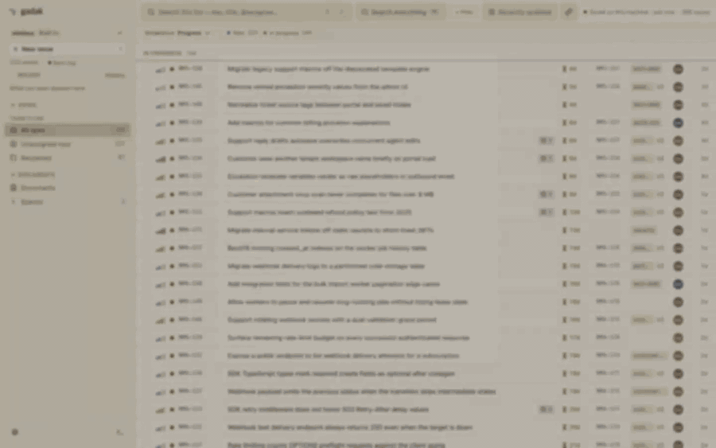

<p align="center">
  
  
</p>

<p align="center">
  <a href="https://github.com/midagedev/gadak/releases"></a>
  <a href="https://github.com/midagedev/gadak/actions/workflows/ci.yml"></a>
  <a href="LICENSE"></a>
</p>

<p align="center"><b>Follow the thread.</b></p>

<p align="center"><sub><a href="README.md">English</a> · 한국어 — 영문이 원본이며, 이 문서는 영문과 함께 갱신됩니다.</sub></p>

내 Jira를 로컬 SQLite 파일 하나로 만듭니다. "어느 에픽이 막혀 있지?"가
물을 수 없는 질문이 아니라 쿼리 한 줄이 됩니다.

gadak은 Jira *그리고* Confluence를 이슈, 코멘트, 히스토리, 위키 문서까지 이
컴퓨터의 SQLite 파일 하나로 미러링합니다. 전부 한 인덱스에 들어가고, 검색은
네트워크 없이 끝납니다. [데스크톱 앱](docs/DESKTOP.md)이나 브라우저 탭에서
트리아지하고, 코딩 에이전트에게는 SQL로 묻고 같은 창에 답을 띄우게 하세요.
바이너리 하나면 되고, gadak 계정은 없습니다.

**미러는 버려도 되는 캐시입니다.** 이 프로젝트가 내일 멈춰도 디렉터리 하나를
지우면 끝이고, 잃는 것은 없습니다. 원본은 Jira에 있습니다.

<p align="center">
  <a href="https://gadak.dev/demo/"><b>▶&nbsp; 라이브 데모 열기</b></a>
  &nbsp;—&nbsp; 이슈 534개, 지금 바로 브라우저에서.
  <br>
  <a href="CHANGELOG.ko.md">체인지로그</a>
  &nbsp;—&nbsp; 무엇이 나왔는지.
</p>

## 설치

macOS 앱, CLI 포함:

```bash
brew install --cask midagedev/tap/gadak
```

CLI만 설치하고 같은 UI를 `gadak serve`로 브라우저 탭에서 열려면:

```bash
brew install midagedev/tap/gadak-cli
```

Jira에 연결한 뒤 `gadak serve`가 출력하는 주소(`http://gadak.localhost:7777`)를
엽니다:

```bash
gadak init && gadak sync && gadak serve
```

Jira 사이트에는 [API 토큰](https://id.atlassian.com/manage-profile/security/api-tokens)
하나가 필요하고, 그 토큰이 같은 사이트의 Jira와 Confluence에 함께 쓰입니다.
**무엇을 미러링할지는 직접 고릅니다.** Jira는 `--projects`로, 위키는
`--spaces`로 좁히고, 위키는 스페이스를 지정하기 전까지 꺼져 있습니다. Atlassian
계정이 없다면 `gadak init --local`로 내장 트래커 워크스페이스를 시작하고, 나중에
`gadak --workspace <새> migrate --from <기존>`으로 동기화된 미러를 그 위로
옮길 수 있습니다. `--to linear`를 붙이면 Linear 팀으로 갑니다.

**Windows:** 데스크톱 앱은 [Microsoft Store](https://apps.microsoft.com/detail/9NZW91TXH36G)에 있습니다.
Store가 서명해 주므로 SmartScreen도 Smart App Control도 막지 않습니다. CLI는
[최신 릴리스](https://github.com/midagedev/gadak/releases/latest)에서
`gadak_<version>_windows_amd64.zip`(또는 `arm64`)을 받아 풀고 `gadak.exe`를
`PATH`에 두세요. 릴리스의 데스크톱 zip(`Gadak-<version>-windows-x64.zip`)은
여전히 서명이 없습니다. SmartScreen이 막는 것은 바이러스 판정이 아니라 서명이
없어서입니다([이유](docs/WINDOWS-SIGNING.md)). 막히면 Store에서 설치하고, Smart
App Control은 끄지 마세요.

화면은 영어·한국어·일본어로 뜹니다. 브라우저나 OS 언어를 따르고, 설정에서
바꿀 수 있습니다.

서명된 dmg, 리눅스 tarball, 다른 컴퓨터와 페어링(`gadak --workspace laptop init
--pairing-code-stdin`), Docker, 업그레이드는 [`docs/INSTALL.md`](docs/INSTALL.md)에
있습니다.

## 핵심

```bash
gadak sql "select epic_key, count(*) from issues_full where resolved_at is null
           and epic_key <> '' group by epic_key order by 2 desc"
```

JQL에는 `GROUP BY`가 없습니다. 데이터가 파일이 되기 전까지 "어느 에픽이 실제로
막혀 있나"는 어려운 질문이 아니라 **물을 수 없는** 질문입니다. 나머지 레시피는
[`docs/RECIPES.md`](docs/RECIPES.md)에 있고, [Datasette Lite가 데모 스냅샷에서
이 쿼리를 브라우저 안에서 실행해
줍니다](<https://lite.datasette.io/?url=https%3A%2F%2Fraw.githubusercontent.com%2Fmidagedev%2Fgadak%2Fmain%2Fexamples%2Fdemo.db#/demo?sql=select+epic_key%2C+count(*)+from+issues_full+where+resolved_at+is+null+and+epic_key+%3C%3E+''+group+by+epic_key+order+by+2+desc>).
설치할 것은 없습니다.

2026-08-26에 실제 Cloud 사이트(이슈 3,296개)에서 측정한 값입니다. 중앙값이고
CLI 기동 시간을 포함합니다:

| 질문 | REST API | `gadak` | |
| --- | ---: | ---: | ---: |
| 단순 필터 100건 | 583 ms | 19 ms | 31× |
| 이슈 하나 + 전체 히스토리 | 710 ms | 28 ms | 25× |
| 자유 텍스트 검색 | 543 ms | 41 ms | 13× |
| **에픽별 열린 이슈 (`GROUP BY`)** | 4,761 ms, API 8페이지를 받아 클라이언트에서 집계 | 22 ms, 쿼리 한 번 | **214×** |
| 변경 이력을 걸치는 집계 | JQL로는 표현 불가, 순회하면 약 28분 | 14 ms | — |

페이지 크기를 넘어서면 JQL의 답은 느린 정도가 아니라 아예 물을 수 없는 것이
됩니다. API는 행은 주지만 집계는 주지 않습니다. 측정 방법과 재측정 이력,
그리고 gadak이 더 느린 행(첫 전체 동기화, 조용한 사이트의 watch 틱, 동기화
주기만큼의 지연)은 [`docs/BENCHMARKS.md`](docs/BENCHMARKS.md)에 있습니다.

<details>
<summary>▶ 종이 리스트 20초 투어 (GIF)</summary>

<p align="center">
  
  <br>
  <sub>창을 20초 동안 담았습니다. <a href="e2e/demo/web-demo.spec.ts">e2e/demo/web-demo.spec.ts</a>가 데모 스냅샷에서 생성했습니다.</sub>
</p>

</details>

> **상태: 0.20, 아직 0.x입니다.** 동기화, 읽기 API, 쓰기 통과(write-through),
> 데스크톱, 웹, CLI, MCP가 실제 사이트에 대해 검증되어 있습니다.
> [`CHANGELOG.ko.md`](CHANGELOG.ko.md).

## 에이전트를 위해

gadak이 존재하는 이유의 절반입니다. 레퍼런스는 **[docs/MIRROR.md](docs/MIRROR.md)**,
호스트별 설정은 [`docs/AGENT_SETUP.md`](docs/AGENT_SETUP.md)에 있습니다.

```bash
gadak skill install
```

스키마와 쿼리 패턴이 스킬 하나로 들어가고, 별도 프로세스는 없습니다. 셸이
없는 호스트(Claude Desktop)에서는 같은 미러가 MCP 서버가 됩니다:

```bash
gadak mcp install claude
```

<p align="center">
  
  <br>
  <sub>앱 창 안에서 셸이 열립니다(⌘K → Terminal, 또는 Ctrl+`). <code>gadak claim</code>이 셸을 이슈에 묶어 탭 이름이 이슈 키가 되고, 그 안에서 시작한 라이브 Claude Code 세션이 옆의 보드를 움직입니다. 한국어 한 문장이 리스트가 되고, 다음 문장이 대시보드를 그립니다. 프롬프트 두 줄 외에는 대본이 없고, 에이전트가 작업하는 구간은 빨리 감았습니다. <a href="e2e/demo/terminal-claude-demo.spec.ts">e2e/demo/terminal-claude-demo.spec.ts</a>를 <a href="e2e/demo/record-terminal-claude.sh">record-terminal-claude.sh</a>로 녹화했습니다.</sub>
</p>

규칙 둘이 가치의 대부분을 만듭니다. 필터는 `status_category`와
`priority_rank`로 걸고, 표시 이름으로는 걸지 마세요. Jira가 계정 언어마다 그
이름을 번역하기 때문에 `priority = High`는 한국어 계정에서 소리 없이 0행을
돌려줍니다. 그리고 SQL이 답하고 창이 보여 줍니다. `gadak sql --no-header "…" |
gadak views open --keys -`가 에이전트의 답을 내 화면에 띄우고, `gadak views
open --jql '…'`은 붙여 넣은 JQL을 칩으로 내려놓습니다. 쓰기(`create`, `edit`,
`comment`, `transition`, `claim`, `link`, 위키의 `page` 동사)는 origin을 거친
뒤 미러가 갱신되고, 에이전트가 쓴 것에는 에이전트의 이름이 남습니다.

에이전트가 그 위에 만든 것들, 즉 대시보드, 팀 테마, 런처, 라이브 MCP 세션은
녹화본 모음으로 따로 두었습니다: [`docs/SHOWCASE.md`](docs/SHOWCASE.md).

**미러를 읽는 에이전트는 읽은 것을 자기가 쓰는 모델로 보냅니다.** gadak
자신은 아무것도 보내지 않습니다([`SECURITY.md`](SECURITY.md)). 에이전트가
봐도 되는 범위로 미러를 좁히세요. gadak이 네트워크를 *실제로* 쓰는
지점(동기화, 쓰기, 페어링)은 [`docs/NETWORK.md`](docs/NETWORK.md)가 연결
하나하나와 그것을 끄는 방법까지 짚어 줍니다.

## 무엇을 커버하나

origin 셋에 동사는 한 벌입니다. Atlassian Cloud, Linear(워크스페이스 설정의
`"linear"` 블록과 `gadak sync --source linear`), 그리고 앱과 함께 다니는 내장
트래커입니다. 읽기, 쓰기, 계층, 위키, 첨부, 히스토리, 보드 레이아웃은 셋
모두에서 되고, 각 origin이 무엇을 거절하는지는 셀마다 근거 코드를 인용한 표
하나에 들어 있습니다: [`docs/SUPPORT_MATRIX.md`](docs/SUPPORT_MATRIX.md). 어느
origin에도 없는 것이 셋 있습니다. UI로서의 스프린트, Jira 대시보드, Jira
알림함입니다. 그 일은 Jira에 남습니다.

## 나머지

**맞는 곳 / 안 맞는 곳.** 매일 겪는 검색 지연, 트래커*와* 위키를 함께 보는
에이전트, 오프라인 읽기에는 맞습니다. 스프린트 계획, 관리자 작업, UI의 페이지
편집기, 그리고 1분의 지연도 허용되지 않는 일은 Jira에 남기세요.
[`docs/CONCEPT.md`](docs/CONCEPT.md#good-fit-bad-fit).

**동작 원리.** 바이너리 하나, SQLite 파일 하나. 증분 동기화에 정합성 보정
패스가 붙습니다. [`docs/ARCHITECTURE.md`](docs/ARCHITECTURE.md). 왜 확장
프로그램이나 Forge 앱이 아닌지는
[`docs/decisions/0003-local-process.md`](docs/decisions/0003-local-process.md)에
있습니다.

**비교.** jira-cli는 명령마다 라이브 API를 호출합니다. Rovo MCP도 두 소스를
함께 검색하지만 호스팅형입니다. 집계가 안 되고, 오프라인에서 안 되며, 호출마다
토큰이 나갑니다. [`docs/FAQ.md`](docs/FAQ.md#how-it-compares).

**내 것으로 만들기.** 설정, 확장 데이터, SQL. 포크 없이 두 축으로:
[`docs/EXTENDING.md`](docs/EXTENDING.md).

## 문서

- [`CHANGELOG.ko.md`](CHANGELOG.ko.md) — 무엇이 나왔는지
- [`docs/INSTALL.md`](docs/INSTALL.md) · [`docs/DESKTOP.md`](docs/DESKTOP.md) — 설치, 첫 실행, 데스크톱 앱
- [`docs/SHOWCASE.md`](docs/SHOWCASE.md) — 창, 런처, 그리고 둘을 움직이는 에이전트의 녹화본
- [`docs/MIRROR.md`](docs/MIRROR.md) · [`docs/MCP.md`](docs/MCP.md) · [`docs/AGENT_SETUP.md`](docs/AGENT_SETUP.md) — SQL, CLI, REST, MCP, 호스트별 설정
- [`docs/RECIPES.md`](docs/RECIPES.md) · [`docs/DASHBOARDS.md`](docs/DASHBOARDS.md) — JQL이 못 묻는 질문을 SQL로, 에이전트가 만드는 대시보드
- [`SECURITY.md`](SECURITY.md) · [`docs/FAQ.md`](docs/FAQ.md) · [`MAINTENANCE.md`](docs/MAINTENANCE.md) — 위협 모델, 사이트 부하, 누가 유지하는가
- [`docs/README.md`](docs/README.md) — 나머지 문서

## 누가 만드나

지금은 한 사람이 만듭니다. 그 사실을 저울에 올리되, 반대편도 함께 올려
주세요. 미러는 내 Jira의 버려도 되는 캐시이고, 0.x가 약속하는 것은
[data-model.md](specs/000-product/data-model.md)의 세 가지(`issues_full`과
RECIPES 쿼리들, `gadak sql`의 stdout, `gadak views open --keys -`)뿐이며,
라이선스는 Apache-2.0이고, 파일은 무엇으로든 읽히는 평범한 SQLite입니다.
어려운 질문은 [`docs/FAQ.md`](docs/FAQ.md)에 모아 두었습니다. 믿지 않아도
되는 것들은 항목마다 확인 명령과 함께 [`PROMISES.md`](docs/PROMISES.md)에
있습니다.

## 기여와 피드백

[`CONTRIBUTING.md`](.github/CONTRIBUTING.md)를 보고,
[`docs/project/GOOD_FIRST_ISSUES.md`](docs/project/GOOD_FIRST_ISSUES.md)에서
시작하세요. 버그 리포트에는 Jira 배포 유형(Cloud), gadak 커밋, 실행한 명령이
필요합니다. 실제 이슈 데이터, 토큰, 사이트 URL은 공개 이슈에 절대 붙여 넣지
마세요. 커밋의 `GDK-nnn` 키는 [공개 백로그](https://gadak.dev/backlog/)로
이어집니다. 등록은 [GitHub 이슈](https://github.com/midagedev/gadak/issues)로
하면 메인테이너가 백로그로 미러합니다. 에이전트와 함께 gadak을 쓰다 걸리는 게
있다면, 무엇을 물었고 에이전트가 무엇을 했는지 적어 이슈를 열어 주세요.

## 라이선스

Apache-2.0. `LICENSE`와 `NOTICE`를 보세요.
