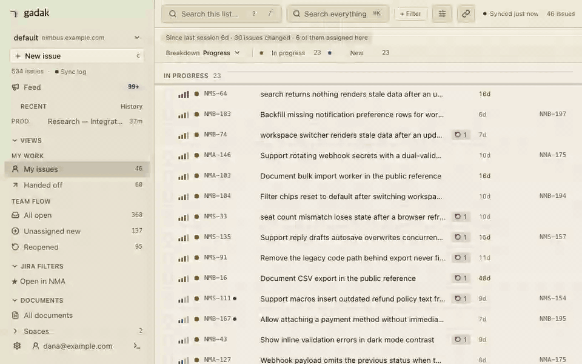
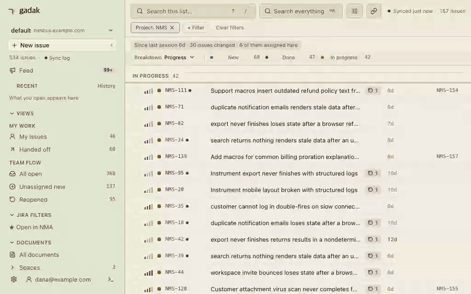

<p align="center">
  
  
</p>

<p align="center">
  <a href="https://github.com/midagedev/gadak/releases"></a>
  <a href="https://github.com/midagedev/gadak/actions/workflows/ci.yml"></a>
  <a href="LICENSE"></a>
</p>

<p align="center"><b>Follow the thread.</b></p>

<p align="center"><sub><a href="README.md">English</a> · 한국어 — 영문이 원본이며, 이 문서는 v0.14 기준 번역입니다.</sub></p>

내 Jira가 로컬 SQLite 파일 하나가 됩니다 — "어느 에픽이 막혀 있지?"가
물을 수 없는 질문이 아니라 쿼리 한 줄이 됩니다.

gadak은 Jira *그리고* Confluence를 로컬 SQLite 파일 하나로 미러링합니다 —
이슈, 코멘트, 히스토리, 위키 문서가 한 인덱스에 들어가고, 검색은 네트워크
없이 로컬에서 끝납니다. 그 작업이 내 머신에 사는 창이 이 창입니다:
[macOS 앱](docs/DESKTOP.md)이나 브라우저 탭에서 트리아지하고, 코딩
에이전트가 SQL로 묻고 같은 창에 답을 띄우게 하세요. 바이너리 하나,
앱 하나, gadak 계정은 없습니다.

**미러는 버려도 되는 캐시입니다.** 이 프로젝트가 내일 멈춰도 디렉터리
하나를 지우면 끝 — 잃는 것이 없습니다. 원본은 언제나 Jira입니다.

<p align="center">
  <a href="https://midagedev.github.io/gadak/"><b>▶&nbsp; 라이브 데모 열기</b></a>
  &nbsp;—&nbsp; 이슈 534개, 지금 바로 브라우저에서.
</p>

```bash
gadak sql "select epic_key, count(*) from issues_full where resolved_at is null
           and epic_key <> '' group by epic_key order by 2 desc"
```

이 마지막 쿼리가 핵심입니다: JQL에는 `GROUP BY`가 없습니다. "어느 에픽이
실제로 막혀 있나"는 어려운 질문이 아니라 **물을 수 없는** 질문입니다 —
데이터가 파일이 되기 전까지는. 나머지 레시피는
[`docs/RECIPES.md`](docs/RECIPES.md)에 있습니다.

실제 Cloud 사이트(이슈 2,853개)에서 실측한 값입니다 (중앙값, CLI 기동 포함 —
[방법론과 gadak이 지는 행](docs/BENCHMARKS.md)):

| 질문 | REST API | `gadak` | |
| --- | ---: | ---: | ---: |
| 단순 필터 100건 | 706 ms | 17 ms | 42× |
| 이슈 하나 + 전체 히스토리 | 1,055 ms | 54 ms | 20× |
| 에픽별 미해결 수 (`GROUP BY`) | 3,924 ms · API 7페이지 | 24 ms · 쿼리 1개 | 162× |
| 변경 이력을 걸치는 모든 질문 | ≈ 20분 (전 changelog 순회) | 쿼리 1개 | — |

반대편도: 첫 full sync는 몇 분이 걸리고, watch 틱마다 ~6.6초를 쓰고,
미러는 동기화 주기만큼 Jira보다 늦습니다.

<details>
<summary>▶ 종이 리스트 90초 투어 (GIF, 7 MB)</summary>

<p align="center">
  
  <br>
  <sub><a href="e2e/demo/web-demo.spec.ts">e2e/demo/web-demo.spec.ts</a>가 데모 스냅샷에 대해 생성.</sub>
</p>

</details>

[`Gadak-<version>-arm64.dmg`](https://github.com/midagedev/gadak/releases/latest)를
받아 창을 열거나, 터미널에서:

```bash
brew install midagedev/tap/gadak        # 앱 — 번들된 CLI도 PATH에 올라갑니다
# 또는 CLI만 (macOS + Linux):
brew install midagedev/tap/gadak-cli
gadak init && gadak sync    # Jira (그리고 Confluence) -> ~/.gadak/gadak.db
gadak serve                # http://gadak.localhost:7777
```

> **상태: 0.14, 아직 0.x입니다.** 동기화, 읽기 API, 쓰기 통과(write-through),
> 데스크톱, 웹, CLI, MCP가 실제 사이트에 대해 검증되어 있습니다. 정직한
> 재고 목록: [`docs/STATE_OF_PLAY.md`](docs/STATE_OF_PLAY.md).

## 왜 만들었나

Jira 검색은 네트워크 왕복이고, 위키는 두 번째 검색입니다. "우리가 뭘 이미
고쳤고, 뭘 결정했지?"라고 묻는 에이전트는 REST API 두 개를 페이징합니다.
원인은 같습니다: 데이터가 파일이 아니라서.
[`docs/CONCEPT.md`](docs/CONCEPT.md) · [`docs/PAIN_POINTS.md`](docs/PAIN_POINTS.md).

⌘K는 하나의 인덱스입니다 — 제목, 본문, 코멘트, 이슈와 문서 전부.
리스트에 걸린 칩은 적용되지 않습니다. 코멘트에만 있는 단어로도 그 행이
찾아지는 이유입니다.

<p align="center">
  
  <br>
  <sub><a href="e2e/demo/search-demo.spec.ts">e2e/demo/search-demo.spec.ts</a>가 데모 스냅샷에 대해 생성.</sub>
</p>

## 표면은 둘, 저장소는 하나

| | 용도 | 모습 |
| --- | --- | --- |
| **앱 + 웹 UI** | 종일 트리아지 | [macOS 앱](docs/DESKTOP.md)(포트 없음) 또는 `gadak serve`. `j`/`k`로 이동, `x`로 선택, `s`/`a`/`l`/`c`로 리스트에서 바로 상태·담당자·라벨·코멘트 변경 |
| **CLI + SQL** | 에이전트, 스크립트 | `gadak issue`, `gadak search`(FTS, `--jql`, Jira URL), `gadak sql`, 그리고 파일 그 자체 |

쓰기는 Jira로 통과된 뒤 미러가 갱신됩니다. 앱·웹: 코멘트, 상태 전이,
담당자, 라벨, 우선순위, 제목. CLI는 현재: 코멘트, 상태 전이, 담당자.
위키 미러는 읽기 전용입니다. 계층 구조, `item_refs`, 첨부:
[`docs/CONCEPT.md`](docs/CONCEPT.md#two-surfaces).

## 에이전트를 위해

gadak이 존재하는 이유의 절반입니다. 레퍼런스: **[AGENTS.md](AGENTS.md)**.
호스트별 붙여넣기 한 번: [`docs/AGENT_SETUP.md`](docs/AGENT_SETUP.md).

```bash
gadak skill install         # 스키마 + 쿼리 패턴, 별도 프로세스 없음
# 또는, 셸이 없는 호스트(Claude Desktop)라면:
gadak mcp install claude    # 이 바이너리와 프로필을 등록에 고정
```

SQL이 답하고, 창이 보여 줍니다. 이미 JQL이 있다면 SQL을 건너뛰세요 —
절이 그대로 칩이 됩니다:

```bash
gadak sql --no-header "select key from issues_full where status_category = 'inprogress'
                       order by status_changed_at asc limit 5" | gadak views open --keys -
gadak views open --jql 'project = NMA AND priority = High AND resolution is EMPTY'
```

<p align="center">
  
  <br>
  <sub><code>gadak views open</code>은 일회성 해시를 쓰고, 실행 중인 앱 또는 serve 탭이 그것을 적용합니다. <a href="e2e/demo/agent-demo.spec.ts">e2e/demo/agent-demo.spec.ts</a>가 생성.</sub>
</p>

셸이 없는 호스트(Claude Desktop)에서는 같은 미러가 MCP 서버가 됩니다.
Jira가 아예 답할 수 없는 것을 물어보세요 — 위키는 두 번째 검색이니까요.
"X에 대해 우리가 아는 게 뭐지?" 한 인덱스가 둘을 다 담고 있으므로, 답은
티켓과 그 티켓을 만든 설계 문서를 한 문장에 담을 수 있습니다.

<p align="center">
  
  <br>
  <sub>도구 다섯 개. 미러에도 Jira에도 쓰지 않습니다. 셸이 있는 호스트는 <code>gadak sql</code>을 쓰면 됩니다. 설정: <a href="docs/MCP.md">docs/MCP.md</a>.</sub>
</p>

`gadak views open`은 "gadak에서 열기" 동사이고, `gadak open KEY`는 Jira로
나가는 문입니다. 리스트 박스는 `gadak search --jql`과 같은 JQL 붙여넣기를
받습니다. gadak이 표현하지 못하는 절은 조용히 버려지지 않고 나열됩니다.
JQL로 여전히 물을 수 없는 것은 `gadak sql`과
[`docs/RECIPES.md`](docs/RECIPES.md)의 몫입니다. `gadak sql`은 파일을
`mode=ro`로 열고, MCP의 `gadak_query`는 SELECT가 아닌 것을 전부
거부합니다. [`gadak api`](docs/AGENT_ACCESS.md)는 미러가 모델링하지 않는
엔드포인트로의 통로입니다 — `--write` 없이는 읽기 전용, MCP에는 절대
없습니다.

**미러를 읽는 에이전트는 읽은 것을 자기가 쓰는 모델로 보냅니다.** gadak
자신은 아무것도 보내지 않습니다([`SECURITY.md`](SECURITY.md)). 에이전트가
봐도 되는 범위로 미러를 좁히세요.

## 설치

Atlassian Cloud 전용입니다. [API 토큰](https://id.atlassian.com/manage-profile/security/api-tokens)
하나로 같은 사이트의 Jira와 Confluence를 모두 커버합니다.

**1. [macOS 앱](docs/DESKTOP.md).**
[최신 릴리스](https://github.com/midagedev/gadak/releases/latest)에서
`Gadak-<version>-arm64.dmg`를 받아 Applications로 드래그하세요. 서명·공증
완료. 첫 실행이 사이트, 이메일, 토큰, 프로젝트 선택을 안내합니다. CLI는
번들 안에 있습니다 — macOS는 앱을 `PATH`에 올려 주지 않으므로:

```bash
/Applications/Gadak.app/Contents/Resources/bin/gadak install-cli
```

**2. CLI** — 리눅스에서, 또는 같은 UI를 브라우저 탭으로:

```bash
brew install midagedev/tap/gadak-cli     # macOS + Linux
gadak init && gadak sync
gadak serve      # http://gadak.localhost:7777
```

설치 스크립트, 릴리스 아카이브, 소스 빌드, Docker, 위키 미러링, 프로필,
업그레이드: **[`docs/INSTALL.md`](docs/INSTALL.md)**.

## 나머지

**내 것으로 만들기.** 포크 없이 두 축으로: [`docs/EXTENDING.md`](docs/EXTENDING.md).
설정: [`docs/CONFIGURATION.md`](docs/CONFIGURATION.md). 확장 데이터:
[`docs/PLUGINS.md`](docs/PLUGINS.md).

**동작 원리.** 바이너리 하나, SQLite 파일 하나. 증분 동기화 + 정합성
보정 패스. [`docs/ARCHITECTURE.md`](docs/ARCHITECTURE.md). 왜 확장 프로그램이나
Forge 앱이 아닌가: [`docs/decisions/0003-local-process.md`](docs/decisions/0003-local-process.md).

**맞는 곳 / 안 맞는 곳.** 매일의 검색 지연, 트래커 *와* 위키를 함께 보는
에이전트, 오프라인 읽기 — 맞습니다. 보드, 어드민, 위키 저작, 1분의
신선도가 아쉬운 일 — Jira에 남기세요.
[`docs/CONCEPT.md`](docs/CONCEPT.md#good-fit-bad-fit).

**비교.** jira-cli는 커맨드마다 라이브 API를 부릅니다. Linear는 다른
트래커입니다. Rovo MCP도 두 소스를 함께 검색하지만 호스팅형입니다 — 집계
불가, 오프라인 불가, 호출마다 토큰이 나갑니다.
[`docs/FAQ.md`](docs/FAQ.md#how-it-compares).

**다음 소스.** Confluence가 스파인이 소스 중립임을 증명했습니다. 다음
소스는 수요 순: [`docs/ROADMAP.md`](docs/ROADMAP.md#more-sources-later).

## 문서

- [`docs/INSTALL.md`](docs/INSTALL.md) · [`docs/DESKTOP.md`](docs/DESKTOP.md) — 설치, 첫 실행, macOS 앱
- [`AGENTS.md`](AGENTS.md) · [`docs/MCP.md`](docs/MCP.md) · [`docs/AGENT_SETUP.md`](docs/AGENT_SETUP.md) — SQL, CLI, REST, MCP, 호스트별 붙여넣기 한 번
- [`docs/RECIPES.md`](docs/RECIPES.md) — JQL이 못 묻는 질문들, SQL로
- [`SECURITY.md`](SECURITY.md) · [`docs/FAQ.md`](docs/FAQ.md) · [`MAINTENANCE.md`](MAINTENANCE.md) — 위협 모델, 사이트 부하, 누가 유지하는가
- [`docs/EXTENDING.md`](docs/EXTENDING.md) · [`docs/PLUGINS.md`](docs/PLUGINS.md) — 팀에 맞추기
- [`docs/STATE_OF_PLAY.md`](docs/STATE_OF_PLAY.md) · [`docs/CONCEPT.md`](docs/CONCEPT.md) · [`docs/PAIN_POINTS.md`](docs/PAIN_POINTS.md)
- [`docs/ARCHITECTURE.md`](docs/ARCHITECTURE.md) · [`docs/UX_PRINCIPLES.md`](docs/UX_PRINCIPLES.md)
- [`docs/decisions/`](docs/decisions/) · [`specs/000-product/`](specs/000-product/) — 왜 그런가, 그리고 계약들

## 누가 만드나

현재는 한 사람입니다. 그 사실을 저울에 올리세요 — 그리고 반대편도:
미러는 내 Jira의 버려도 되는 캐시이고, 스키마의 약속 범위는
[문서화되어](specs/000-product/data-model.md) 있으며, 라이선스는
Apache-2.0이고, 파일은 무엇으로든 읽히는 평범한 SQLite입니다. 어려운
질문들: [`docs/FAQ.md`](docs/FAQ.md).

## 기여와 피드백

[`CONTRIBUTING.md`](CONTRIBUTING.md) — 시작은
[`docs/GOOD_FIRST_ISSUES.md`](docs/GOOD_FIRST_ISSUES.md)에서. 버그 리포트에는
Jira 배포 유형(Cloud), gadak 커밋, 실행한 명령이 필요합니다. 실제 이슈
데이터, 토큰, 사이트 URL은 공개 이슈에 절대 붙여넣지 마세요.

에이전트와 함께 gadak을 쓰다 걸리는 게 있나요?
[이슈를 열고](https://github.com/midagedev/gadak/issues) 무엇을 물었고
에이전트가 무엇을 했는지 적어 주세요.

## 라이선스

Apache-2.0. `LICENSE`와 `NOTICE`를 보세요.
