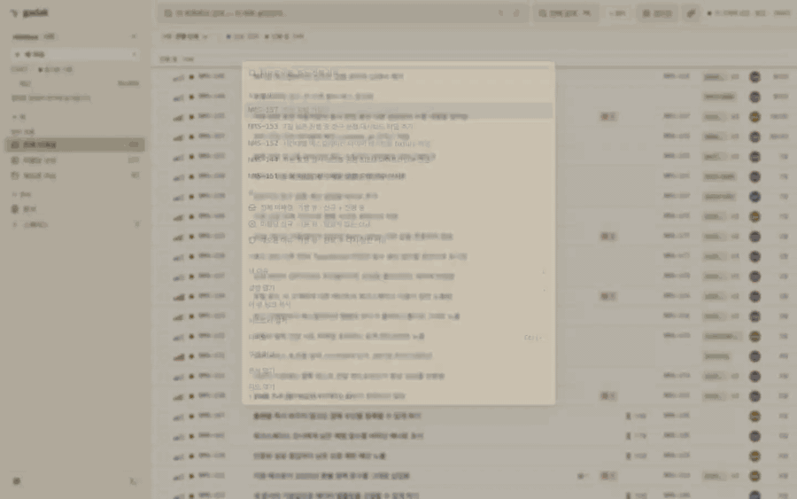

<p align="center">
  
  
</p>

<p align="center">
  <a href="https://github.com/midagedev/gadak/releases"></a>
  <a href="https://github.com/midagedev/gadak/actions/workflows/ci.yml"></a>
  <a href="LICENSE"></a>
</p>

<p align="center"><b>Follow the thread.</b></p>

<p align="center"><sub><a href="README.md">English</a> · 한국어 · <a href="README.ja.md">日本語</a></sub></p>

지라를 쓰기 싫은데 어쩔 수 없이 써야 하는 분들을 위한 앱입니다. 지라 자체를
나쁘게 보지는 않습니다. 묵은 이슈들을 클로드로 뒤지다가 한참 걸리고 결국
rate limit에 걸려 중단된 적이 있는데, 그때 만들기 시작했습니다. 크롬에 지라
탭이 잔뜩 쌓여 피곤해지는 것도 겸사겸사 없애고 싶었고요.

gadak은 Jira와 Confluence(이슈·코멘트·히스토리·위키 페이지)를 이 컴퓨터의
SQLite 파일 하나로 미러링하고, 읽기는 네트워크를 타지 않습니다. 데스크톱 앱,
`gadak serve`가 여는 브라우저 탭, CLI, 셸 없는 호스트용 MCP가 같은 파일을
봅니다. 바이너리 하나, gadak 계정 없음. **미러는 버려도 되는 캐시입니다.**
디렉터리를 지워도 잃는 게 없고 원본은 여전히 Jira입니다. 쓰기는 origin이 먼저
받은 뒤 미러가 따라 갱신됩니다.

## 먼저 눌러 보기

[라이브 데모](https://gadak.dev/demo/)에 이슈 534개가 들어 있습니다. 설치도
계정도 없이 브라우저에서 열립니다.

JQL에는 `GROUP BY`가 없어서 "어느 에픽에 열린 이슈가 몰려 있나"는 API로
8페이지를 받아 클라이언트에서 세야 합니다. 파일이 되면 이렇게 됩니다:

```bash
gadak sql "select epic_key, count(*) from issues_full where resolved_at is null
           and epic_key <> '' group by epic_key order by 2 desc"
```

[Datasette Lite가 데모 스냅샷에서 같은 쿼리를 브라우저 안에서 돌려
줍니다](<https://lite.datasette.io/?url=https%3A%2F%2Fraw.githubusercontent.com%2Fmidagedev%2Fgadak%2Fmain%2Fexamples%2Fdemo.db#/demo?sql=select+epic_key%2C+count(*)+from+issues_full+where+resolved_at+is+null+and+epic_key+%3C%3E+''+group+by+epic_key+order+by+2+desc>).
나머지 쿼리는 [`docs/RECIPES.md`](docs/RECIPES.md).

## 숫자 한 장

2026-08-26, 실제 Atlassian Cloud 사이트(이슈 3,296개)에서 잰 중앙값입니다.
gadak 쪽은 CLI 프로세스 기동까지 포함한 시간입니다.

| 질문 | REST API | gadak | |
| --- | ---: | ---: | ---: |
| 단순 필터 100건 | 583 ms | 19 ms | 31× |
| 이슈 하나 + 전체 히스토리 | 710 ms | 28 ms | 25× |
| 에픽별 열린 이슈 (`GROUP BY`) | 4,761 ms | 22 ms | 214× |
| 변경 이력을 걸치는 집계 | JQL로 표현 불가, 순회하면 약 28분 | 14 ms | |
| 요청 제한 | 429 + Retry-After | 없음, 내 디스크니까 | |

gadak이 지는 행도 있습니다. 첫 전체 동기화가 그렇고, 동기화 주기만큼은 늘
낡아 있습니다. 측정 방법과 그 행들은
[`docs/BENCHMARKS.md`](docs/BENCHMARKS.md).

## 설치

macOS 앱(CLI 포함):

```bash
brew install --cask midagedev/tap/gadak
```

CLI만:

```bash
brew install midagedev/tap/gadak-cli
```

첫 실행. `gadak serve`가 찍는 주소는 `http://gadak.localhost:7777`입니다:

```bash
gadak init && gadak sync && gadak serve
```

필요한 건 Jira [API 토큰](https://id.atlassian.com/manage-profile/security/api-tokens)
하나이고, 같은 사이트의 Confluence도 그 토큰으로 갑니다. 범위는 직접
정합니다. `--projects`로 Jira를, `--spaces`로 위키를 좁히고, 스페이스를
지정하기 전까지 위키는 꺼져 있습니다. Atlassian 계정이 없으면
`gadak init --local`이 내장 트래커로 시작하고, 나중에
`gadak --workspace <새> migrate --from <기존>`으로 옮깁니다(`--to linear`도
됩니다). 다른 컴퓨터와 페어링은
`gadak --workspace laptop init --pairing-code-stdin`. 화면은 한국어로
뜹니다(브라우저·OS 언어를 따르고, 설정에서 바꿉니다). dmg, 리눅스 tarball,
Docker, 업그레이드는 [`docs/INSTALL.md`](docs/INSTALL.md).

**Windows.** 데스크톱 앱은 [Microsoft Store](https://apps.microsoft.com/detail/9NZW91TXH36G)에
있습니다. Store가 서명하니 SmartScreen도 Smart App Control도 막지 않고,
0.20.2부터 Store 설치가 `gadak`을 `PATH`에 올립니다. Store 없이 CLI만 쓰려면
[최신 릴리스](https://github.com/midagedev/gadak/releases/latest)의
`gadak_<version>_windows_amd64.zip`(또는 `arm64`)을 풉니다. 릴리스의
데스크톱 zip(`Gadak-<version>-windows-x64.zip`)은 아직 서명이 없어서
SmartScreen이 막습니다. 바이러스 판정이 아니라 서명 부재입니다
([`docs/WINDOWS-SIGNING.md`](docs/WINDOWS-SIGNING.md)). 그때는 Store로 가고,
Smart App Control은 끄지 마세요.

## 에이전트

<p align="center">
  
  <br>
  <sub>앱 창 안의 셸(⌘K → 터미널, 또는 Ctrl+`)에서 <code>gadak claim</code>이 탭을 이슈 키에 묶고, 그 안에서 시작한 Claude Code 세션이 옆의 보드를 움직입니다. 화면·트래커·프롬프트 전부 한국어 세션이고, 프롬프트 두 줄 외에는 대본이 없습니다. 에이전트가 일하는 구간은 빨리 감았습니다. <a href="e2e/demo/terminal-claude-demo.spec.ts">e2e/demo/terminal-claude-demo.spec.ts</a>를 <a href="e2e/demo/record-terminal-claude.sh">record-terminal-claude.sh</a>로 녹화했습니다.</sub>
</p>

```bash
gadak skill install
```

Claude Code에 스킬 하나로 들어가고, 별도 프로세스는 없습니다. `gadak skill
install codex`처럼 이름을 붙이면 cursor·gemini·opencode·grok에도 같은 파일이
들어갑니다. 셸이 없는 Claude Desktop에서는 `gadak mcp install claude`로 MCP
서버가 됩니다.

규칙 둘이 가치의 대부분입니다. 필터는 `status_category`와 `priority_rank`로
겁니다. Jira가 계정 언어마다 표시 이름을 번역해서 `priority = High`는 한국어
계정에서 소리 없이 0행입니다. 그리고 SQL이 답하고 창이 보여 줍니다.
`gadak sql --no-header "…" | gadak views open --keys -`가 에이전트의 답을 제
화면에 띄우고, `gadak views open --jql '…'`은 붙여 넣은 JQL을 칩으로
내려놓습니다.

쓰기(`create`, `edit`, `comment`, `transition`, `claim`, `link`, 위키 `page`)는
origin을 거친 뒤 미러가 갱신되고, 에이전트가 쓴 것에는 에이전트 이름이
남습니다. 미러를 읽는 에이전트는 읽은 것을 자기 모델로 보냅니다. gadak 자신은
아무것도 보내지 않으니([`SECURITY.md`](SECURITY.md)) 에이전트가 봐도 되는
범위로 미러를 좁히세요. 연결 하나하나와 끄는 스위치는
[`docs/NETWORK.md`](docs/NETWORK.md), 레퍼런스는
[`docs/MIRROR.md`](docs/MIRROR.md).

## 만들지 않기로 한 것

0.21부터 미러가 이미 갖고 있던 히스토리로 "자리를 비운 사이 뭐가 바뀌었나"를
계산합니다. 그 신호마다 원하지 않는 기능이 한 걸음 거리에 있었습니다.

- **점수 없음.** `gadak retro`는 이번 주 닫힌 이슈 수와 사이클 타임을 찍지만
  사람별 열이 없고 순위를 매기지 않습니다.
- **알림 없음.** 세션 줄, 재개 카드, 나이 표시는 다음에 시선이 갈 자리에서
  기다립니다. 할 말이 없는 아침에는 뜨지 않습니다.
- **고정 SLA 없음.** 정체 기준은 최근 90일간 팀이 완료한 이슈의 사이클 타임
  p85입니다. 완료가 11건이 되기 전까지만 72시간으로 물러납니다.
- **밖으로 나가는 것 없음.** retro도 학습된 기준도 디스크의 파일 두 개에서
  계산됩니다. 보낼 계정 자체가 없습니다.

어느 origin에도 없는 것이 셋 있습니다. UI로서의 스프린트, Jira 대시보드, Jira
알림함. 스프린트 계획이나 1분의 지연도 안 되는 일과 함께 Jira에 남깁니다.
origin은 Atlassian Cloud, Linear(`gadak sync --source linear`), 내장 트래커
셋이고 동사는 한 벌입니다. 각 origin이 무엇을 거절하는지는 셀마다 코드를
인용한 [`docs/SUPPORT_MATRIX.md`](docs/SUPPORT_MATRIX.md)에 있습니다.

## 상태

**상태: 0.21, 아직 0.x입니다.** 동기화, 읽기 API, 쓰기 통과, 데스크톱, 웹,
CLI, MCP가 실제 사이트에서 검증돼 있습니다. 지금은 한 사람이 만듭니다. 0.x가
약속하는 것은 [data-model.md](specs/000-product/data-model.md)의 셋뿐입니다.
`issues_full`과 RECIPES 쿼리, `gadak sql`의 stdout 형식, `gadak views open
--keys -`의 의미. 자격증명은 SQLite·로그·스냅샷 어디에도 들어가지 않습니다.
믿지 않아도 되는 것은 항목마다 확인 명령과 함께
[`docs/PROMISES.md`](docs/PROMISES.md)에, 무엇이 나왔는지는
[`CHANGELOG.ko.md`](CHANGELOG.ko.md)에. 라이선스는 Apache-2.0.

## 한 줄 남겨 주세요

gadak에는 텔레메트리가 없어서 누가 쓰는지 저는 숫자로 알 수 없습니다. 버그
제보와 UI 지적은 받고 있고 릴리스마다 그 덕을 봤습니다. 아직 없는 것은 자기
미러의 숫자를 들고 하는 한 줄입니다. "이슈 N개 넣었더니 이렇게 됐다" 정도면
되고, 느려졌다거나 틀렸다는 쪽이면 더 좋습니다.

[GitHub 이슈](https://github.com/midagedev/gadak/issues)로 주시면 백로그에
미러하고, 커밋의 `GDK-nnn` 키는 [공개 백로그](https://gadak.dev/backlog/)로
이어집니다. 공개 이슈에 실제 이슈 데이터나 토큰, 사이트 URL은 붙이지 마세요.
버그 리포트에 필요한 건 Jira 배포 유형(Cloud) · gadak 커밋 · 실행한
명령입니다. 코드로 오시려면 [`CONTRIBUTING.md`](.github/CONTRIBUTING.md)와
[`docs/project/GOOD_FIRST_ISSUES.md`](docs/project/GOOD_FIRST_ISSUES.md).

## 문서

- [`CHANGELOG.ko.md`](CHANGELOG.ko.md) · 무엇이 나왔는지
- [`docs/INSTALL.md`](docs/INSTALL.md) · [`docs/DESKTOP.md`](docs/DESKTOP.md) · 설치와 데스크톱 앱
- [`docs/SHOWCASE.md`](docs/SHOWCASE.md) · 에이전트가 만든 대시보드·런처 녹화
- [`docs/MIRROR.md`](docs/MIRROR.md) · [`docs/MCP.md`](docs/MCP.md) · [`docs/AGENT_SETUP.md`](docs/AGENT_SETUP.md) · SQL, CLI, REST, MCP, 호스트별 한 번 붙이기
- [`docs/RECIPES.md`](docs/RECIPES.md) · [`docs/DASHBOARDS.md`](docs/DASHBOARDS.md) · JQL이 못 묻는 질문
- [`SECURITY.md`](SECURITY.md) · [`docs/FAQ.md`](docs/FAQ.md) · [`docs/MAINTENANCE.md`](docs/MAINTENANCE.md) · 위협 모델과 누가 유지하는가
- [`docs/ARCHITECTURE.md`](docs/ARCHITECTURE.md) · [`docs/EXTENDING.md`](docs/EXTENDING.md) · 동작 원리, 포크 없이 내 것으로
- [`docs/project/THEORY.md`](docs/project/THEORY.md) · 다음 기능이 왜 그것들인지(영문)
- [`docs/README.md`](docs/README.md) · 나머지 문서
