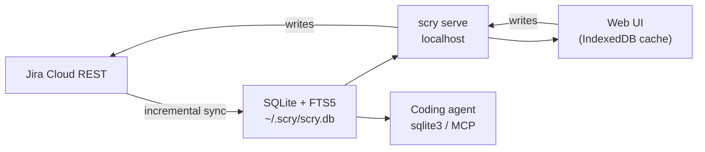

# scry

A local-first mirror of your issue tracker. One binary, one SQLite file: a
browser UI that filters 10,000 issues in milliseconds, and a database your
coding agent can query with plain SQL.

Jira is the first source. `scry` is not a Jira client that calls Jira on every
keystroke — it pulls your issues down once, keeps them fresh in the background,
and serves everything from local disk.

```bash
scry sync     # Jira -> ~/.scry/scry.db
scry serve    # http://localhost:7777
sqlite3 ~/.scry/scry.db "select key, status, reopen_count from issues where reopen_count > 0"
```

> **Status: working, pre-release.** Sync, the read API, write-through, settings,
> the plugin boundary, and i18n are implemented and verified end to end against a
> public demo site; a Playwright suite runs in CI against the bundled snapshot.
> What remains before a public release is packaging polish (snapshot tooling,
> benchmarks, Docker, release process). `docs/STATE_OF_PLAY.md` is the honest
> inventory; `specs/000-product/tasks.md` has task-level test evidence.

## Why

Two problems, one cause.

**Jira is slow to search.** Every filter change is a network round trip against
a multi-tenant service. Teams that live in the issue tracker feel this dozens of
times an hour. Once the data is on local disk, filtering is a memory operation:
type a character, see the result.

**Agents cannot read your tracker well.** A coding agent asked "what did we
already fix in the billing flow?" has to page through a REST API, guess at JQL,
and burn context on JSON. Give it a SQLite file instead and it writes one query
with a join and an FTS match. No API design, no MCP tool schema, no rate limit.

Both fall out of the same move: mirror the data locally and let the UI and the
agent read the same store.

## What You Get

| Surface | What it is for |
| --- | --- |
| Local mirror | Full issue snapshot in SQLite with FTS5 over summary, description, and comments. Incremental sync keeps it current. |
| Web UI | Keyboard-driven list, saved views, grouping, instant filters, full detail panel with ADF rendering, comments, history, and attachments. |
| Write-through | Status transitions, comments with mentions and attachments, assignee changes, field edits, and issue creation go straight to Jira and refresh the mirror. |
| Agent access | The SQLite file is the interface, with a CLI (`issue`, `search`, `comment`, `transition`, `assign`, `sql`) over it for the common moves. `AGENTS.md` is the reference. An MCP server is planned for clients without shell access. |
| Zero-setup demo | `scry demo` opens the UI against a bundled snapshot, no Jira account needed. |

## How It Works



Everything runs on your machine. There is no scry service, no account, and no
telemetry. The only outbound traffic is to your own Jira site.

### Why not a browser-only app?

Jira Cloud deliberately does not send CORS headers on its REST API, so a static
page cannot call it directly. The options that avoid a local process are a
browser extension or an Atlassian Forge app; both were considered and rejected
because neither can hand a coding agent a queryable local database, which is
half the point. See `docs/decisions/0003-local-process.md`.

## Quick Start

Requirements: Go 1.25+, Node.js 20+, and a Jira Cloud API token from
<https://id.atlassian.com/manage-profile/security/api-tokens>.

```bash
npm ci
npm run build            # builds the web UI into dist/app
go build -o scry ./cmd/scry

./scry init              # prompts for site URL, email, API token, and projects
./scry sync              # first full sync
./scry serve --sync      # http://localhost:7777, keeps the mirror fresh
```

Credentials live in `~/.scry/config.json` with `0600` permissions and are never
written to the database or the repository. To point one machine at two sites
(say, work and a demo), use profiles: `scry --profile demo init` keeps a second
credential and mirror under `~/.scry/profiles/demo/`.

### Try it without a Jira account

```bash
./scry demo
```

Opens the UI against `examples/demo.db`, a snapshot of a public demo site with
fictional projects. Useful for evaluating the UI and for deterministic tests.

### Run with Docker

```bash
docker build -t scry . && docker run --rm -p 7777:7777 -v scry-data:/data scry
```

The image serves the UI on `0.0.0.0:7777` with `--allow-remote` (the process has
no auth — only bind it on a trusted network). Config and `scry.db` live under
`/data` (`SCRY_HOME`).

### Point your agent at it

Three layers, and an agent can use all of them from a shell.

```bash
# SQL, for anything relational or aggregated. `scry sql` is the read-only path
# for agents on a command allowlist; sqlite3 works just as well.
scry sql "select key, status, reopen_count from issues
          where reopen_count > 0 order by reopened_at desc limit 20"

# Full-text across descriptions and comments
scry sql "select i.key, it.title from items_fts f
          join items it on it.rowid = f.rowid
          join issues i on i.item_id = it.id
          where items_fts match 'idempotency AND webhook' limit 20"

# One issue whole, or one write straight through to Jira
scry issue NMB-140
scry search "flaky upload" --limit 5
scry comment NMB-140 -m "Reproduced on staging."
scry transition NMB-140 "In Review"
scry assign NMB-140 dana@example.com
```

Reads never touch the network; writes go to Jira and re-read the issue into the
mirror. `AGENTS.md` is the reference an agent should be pointed at — SQL
cookbook, CLI reference, REST examples, and how to check staleness. The schema is
documented in `specs/000-product/data-model.md` and treated as a public contract.

## Good Fit / Bad Fit

| Use scry when... | Use Jira directly when... |
| --- | --- |
| You search and triage the same projects every day and the latency hurts. | You need a full Jira feature set: boards, sprints, reports, automation, permissions. |
| You want an agent to reason over your tracker's history. | You need administration, workflow editing, or anything that changes project configuration. |
| You want offline reading of everything you have access to. | You need real-time collaboration where a minute of staleness matters. |
| Your tracker holds tens of thousands of issues and Jira's UI struggles. | Your team is small enough that Jira already feels instant. |

## Scope

scry mirrors and writes back a documented subset. Anything outside that subset
is unsupported until it has tests and documentation — see
`docs/COMPATIBILITY.md` once the server lands.

- **In scope:** issue fields, descriptions, comments, attachments, changelog,
  issue links, status transitions, assignee, field edits, issue creation,
  full-text search, saved views, watches.
- **Out of scope:** boards and sprint mechanics, project administration,
  workflow configuration, permission schemes, Jira Service Management queues,
  and anything requiring Jira's own UI.
- **Not a sync engine:** Jira is the system of record. The mirror is
  disposable; delete the database and re-sync.

## Multiple Sources

The storage schema and search layer are source-neutral so a second source can be
added without reshaping the database. Confluence is the intended next connector:
same local index, same instant search, same agent access. Only Jira is
implemented today, and no source-specific work is merged until the neutral
layer stays neutral.

## Documentation

- `docs/STATE_OF_PLAY.md`: what exists today, what does not, and where to start
- `docs/CONCEPT.md`: the product idea and the loop it optimizes
- `docs/ARCHITECTURE.md`: components, module boundaries, and data flow
- `docs/AGENT_ACCESS.md`: how agents are meant to read the mirror
- `docs/EXTRACTION.md`: what this codebase was extracted from and what was cut
- `docs/ROADMAP.md`: what is coming and in what order
- `specs/000-product/`: spec, plan, tasks, gates, data model, and contracts

## Contributing

See `CONTRIBUTING.md`. Issue reports should include your Jira deployment type
(Cloud), the scry commit, and the command you ran. Never paste real issue data,
tokens, or site URLs into a public issue.

## License

Apache-2.0. See `LICENSE` and `NOTICE`.
