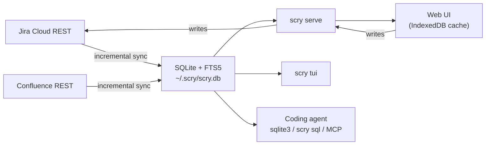

# scry

<p>
  <a href="https://github.com/midagedev/scry/releases"></a>
  <a href="https://github.com/midagedev/scry/actions/workflows/ci.yml"></a>
  <a href="LICENSE"></a>
</p>

**Give your coding agent your team's memory.** scry mirrors Jira *and
Confluence* into one local SQLite file — issues, comments, history, wiki pages
— indexed together, queryable with plain SQL, searchable in milliseconds. You
get a keyboard-driven web UI and a TUI over the same file; your agent gets the
whole thing through one query interface. One binary, no server, no account.

Why now: every developer suddenly has a coding agent, and agents burn context
paging REST APIs and guessing at JQL. Worse, half of what an agent needs is not
in the tracker at all — it is in the wiki next door. A local file that holds
both answers "what do we know about X?" with one full-text query, joins across
sources, and never spends a token on pagination.

**Try it in 30 seconds, no Jira account, no token:**

```bash
git clone https://github.com/midagedev/scry && cd scry
npm ci && npm run build && go build -o scry ./cmd/scry
./scry demo   # a fictional company in your browser: 534 issues + 71 wiki pages
```

Or open the [zero-install hosted demo](https://midagedev.github.io/scry/) in a
browser (static snapshot of the same backlog; read-only — no binary, no
account). Enable GitHub Pages once if the link 404s; see below.

<p align="center">
  
  <br>
  <sub>Every clip in this README is generated from a script against the committed demo snapshot —
  this one from <a href="e2e/demo/web-demo.spec.ts">e2e/demo/web-demo.spec.ts</a>. What you see is what CI checks.</sub>
</p>

```bash
scry init && scry sync    # Jira (and Confluence) -> ~/.scry/scry.db
scry serve                # http://localhost:7777
scry tui                  # same mirror, in your terminal (D toggles docs)
scry sql "select key, summary from issues_full where reopen_count > 1"
```

> **Status: working, pre-release.** Sync (both sources), the read API,
> write-through, the web UI, the TUI, the CLI, settings, the plugin boundary,
> and i18n are implemented and verified end to end against a live Atlassian
> site. `docs/STATE_OF_PLAY.md` is the honest inventory.

## Why

Three complaints about living in a tracker and a wiki, one root cause.

**Search is slow, and it is two searches.** Every filter change is a network
round trip against a multi-tenant service — and the answer to "what do we know
about idempotency?" is split between Jira search and Confluence search, which
do not talk to each other. Once both are on local disk there is one FTS index:
type a word, get the issues *and* the pages, instantly.

**Agents cannot read your team's context well.** A coding agent asked "what
did we already fix in the billing flow, and what did we decide in the design
doc?" has to page through two REST APIs, guess at JQL and CQL, and burn its
context on JSON envelopes. Give it a SQLite file instead and it writes one
query with a join and an FTS match. No tool schema, no pagination, no rate
limit.

**You cannot see your own team's shape.** "Which issues came back after we
closed them, and why?" is a join over the changelog. "Which epic is actually
stuck?" is a rollup over the hierarchy. In Jira neither is a question you can
ask; here they are `where reopen_count > 0` and a group-by on `epic_key`.

All three fall out of the same move: mirror the data locally, then let the UI,
the terminal, and the agent read the same store.

## Three surfaces, one store

| | For | Looks like |
| --- | --- | --- |
| **Web UI** | all-day triage, mouse and keyboard | a list you triage without the mouse (`j/k` walk, `x` multi-select, `s`/`a`/`c` status·assignee·comment in place), epic grouping and rollups, saved views, ⌘K palette, a freshness chip that shows the mirror's age and pulls it on click, full issue detail (rich text, comments, history, attachments), a DOCS tree of your wiki spaces with a breadcrumbed document view |
| **TUI** | people who live in the terminal | [`scry tui`](docs/TUI.md) — list, filter with live match highlight, `group_by=epic`, Ctrl+K palette, write actions, and `D` for the same wiki tree, all over the same mirror |
| **CLI + SQL** | agents, scripts, one-off questions | `scry issue`, `scry search` (issues and pages), `scry sql`, plus the file itself |

<p align="center">
  
  <br>
  <sub>Generated from <a href="tools/tapes/tui.tape">tools/tapes/tui.tape</a> (VHS).</sub>
</p>

Writes go through to Jira and then refresh the mirror, so the list is correct
a moment later without a full sync. Comment, transition, and assign work on
all three surfaces; field edits work in the web UI and the TUI (values always
come from what Jira allows, never free text). Issue creation is web-only
today. The wiki mirror is read-only on purpose — Confluence stays the place
where documents are written.

Hierarchy is first-class: `epic_key` is derived honestly (the nearest epic
*ancestor*, so a sub-task groups under its epic, not its story), group-by-epic
headers show the epic's actual title, an epic's detail rolls up its children
(`12 done / 14`), and both breadcrumbs — issue and document — are clickable.

Attachments are local too. The first view of an image caches its bytes next to
the mirror and every later view is a disk read, so a screenshot-heavy issue
opens at the speed of the rest of the app — and keeps rendering offline.

## For agents

This is half the reason scry exists, so it has its own reference:
**[AGENTS.md](AGENTS.md)** — and
[`docs/AGENT_SETUP.md`](docs/AGENT_SETUP.md) is one paste per agent
(Claude Code, Cursor, Codex, MCP). Hooking one up is one line:

```bash
scry mcp install claude    # pins this binary and profile into the registration
```

<p align="center">
  
  <br>
  <sub>A real agent session — one-line MCP registration, then a live cross-source answer.
  Generated from <a href="tools/tapes/agent.tape">tools/tapes/agent.tape</a> (VHS, unscripted model output).</sub>
</p>

The interface is the database. Anything that can run a shell command can use
it at full power:

```bash
# What keeps coming back, and when did it last happen?
scry sql "select key, summary, reopen_count, reopened_at from issues_full
          where reopen_count > 0 order by reopened_at desc limit 20"

# Full-text across issues AND wiki pages — one index, one query
scry search "idempotency webhook"

# What does the wiki know that the tracker doesn't?
scry sql "select it.key, it.title, p.space_key from items_fts f
          join items it on it.rowid = f.rowid
          join pages p on p.item_id = it.id
          where items_fts match 'incident AND billing' limit 20"

# One issue whole, or one write straight through to Jira
scry issue NMB-140 --json
scry comment NMB-140 -m "Reproduced on staging."
scry transition NMB-140 "In Review"
```

Read and write commands that emit structured output (`init`, `status`,
`issue`, `search`, `comment`, `transition`, `assign`, `fields`, `sql`) take
`--json`; `scry search --json` includes a `pages` array, and the MCP server's
`scry_search` returns the same. `issue`, `search`, `comment`, `transition`,
`assign`, and `fields` also warn on stderr when the last sync failed or is
over an hour old; stdout stays clean enough to pipe. `scry sql` opens the
database with SQLite `mode=ro` (MCP's `scry_query` additionally rejects
non-SELECT statements), so an agent on a narrow command allowlist can be given
mirror access without being given arbitrary `sqlite3`.

The schema in `specs/000-product/data-model.md` is a public contract. Filter
on `status_category` and ids, never on display names — Jira translates those
per account, which is the one mistake that silently returns nothing.

## Install

Atlassian Cloud only. You need an API token from
<https://id.atlassian.com/manage-profile/security/api-tokens> — one token
covers both Jira and Confluence on the same site.

### 1. Homebrew

```bash
brew install midagedev/tap/scry
```

macOS and Linux, from [`midagedev/homebrew-tap`][tap]. A formula rather than a
cask on purpose: the released binaries are not notarized, and Homebrew marks
cask downloads with `com.apple.quarantine`, which Gatekeeper then blocks.

[tap]: https://github.com/midagedev/homebrew-tap

### 2. Install script

```bash
curl -fsSL https://raw.githubusercontent.com/midagedev/scry/main/scripts/install.sh | sh
```

Downloads the latest GitHub Release for your OS/arch, verifies `checksums.txt`
(sha256), and installs to `~/.local/bin/scry` (override with `SCRY_INSTALL_DIR`).
Upgrades in place if a binary is already there.

### 3. Release binary

Download the archive for your OS/arch from
[GitHub Releases](https://github.com/midagedev/scry/releases), verify against
`checksums.txt`, unpack, and put `scry` on your `PATH`.

### 4. Build from source

Requirements: Go 1.25+, Node.js 20+.

```bash
npm ci && npm run build       # build the web UI into dist/app
go build -o scry ./cmd/scry   # embeds it — the binary is the whole install
# or: make build  → bin/scry
```

### First run

```bash
scry serve                    # http://localhost:7777
```

The first run walks you through it in the browser: paste your site, email, and
token, pick projects from your site's own list, and watch the first sync fill
the mirror. If you would rather stay in the terminal, `scry init && scry sync`
does the same thing. `scry serve` keeps the mirror fresh in the background
whenever a credential is configured (`--no-sync` opts out). To survive reboot:

```bash
scry install-service   # launchd (macOS) or systemd --user (Linux)
```

**Mirroring the wiki too** is one config key — the same site, email, and token
already cover it. Add to `~/.scry/config.json`:

```json
"confluence": { "spaces": ["ENG", "PROD"] }
```

Empty `spaces` means every space the account can see. `scry sync` then pulls
pages (current version, comments, labels) alongside issues —
`--source jira|confluence|all` narrows a run. Pages land in the same FTS
index, the sidebar grows a DOCS tree, and search answers across both.

### Staying current

scry checks GitHub Releases for a newer version once a day (anonymous, cached,
`updateCheck: false` opts out) and says so in the web sidebar and the TUI —
but three things still catch people, learned the hard way:

1. **A running `scry serve` keeps its old code.** Upgrading the binary does
   not touch a process that is already up — restart it (or re-run
   `scry install-service`, which restarts the unit) after an upgrade.
2. **A stale Homebrew tap pins you silently.** If `brew info midagedev/tap/scry`
   shows an old "stable" after `brew update`, reset the tap:
   `brew untap midagedev/tap && brew tap midagedev/tap && brew upgrade scry`.
3. **Check what `scry` actually resolves to.** `which -a scry` — a leftover
   `go install` build in `~/go/bin` earlier in `PATH` will shadow the brew
   binary forever, versions be damned.

`scry --version` against the [releases page](https://github.com/midagedev/scry/releases)
settles any doubt.

Your API token lives in `~/.scry/config.json` at `0600` and never touches the
database, the repository, or a log line. There is no scry account, no server,
and no telemetry — outbound traffic is your own Atlassian site, plus an
optional daily anonymous version check against GitHub Releases
(`updateCheck: false` turns it off). The full data-flow diagram, threat
model, and where each claim is enforced in code: **[SECURITY.md](SECURITY.md)**.

Pointing one machine at two sites (work and a demo, say) is what profiles are
for: `scry --profile demo init` keeps a separate credential and mirror under
`~/.scry/profiles/demo/`. One `scry serve` then serves every profile: each one
mounts under `/w/<name>/` (full API, reads and writes, opened on first
request), and when there is more than one, the web sidebar grows a WORKSPACES
switcher. Same loopback listener, same single user — the workspace list never
exposes credentials. Background sync and notifications stay on the primary
profile; workspaces sync when you use them.

### Zero-install hosted demo

A static build of the web UI plus a frozen copy of the demo snapshot, for GitHub
Pages (or any static host). No binary, no Jira account, no trust decision.

```bash
make hosted-demo          # → dist/hosted/  (UI + bootstrap/detail/attachments)
make hosted-demo-test     # Playwright smoke (boot, search, detail, image)
```

Local preview (base path `/scry/` matches a project Pages site):

```bash
mkdir -p dist/pages/scry && cp -R dist/hosted/. dist/pages/scry/
npx serve dist/pages -l 4173
# open http://127.0.0.1:4173/scry/
```

**Human checklist to publish on GitHub Pages** (workflow is already in the repo):

1. Repo → **Settings → Pages → Build and deployment → Source: GitHub Actions**.
2. Merge to `main` (or run **Hosted demo (GitHub Pages)** via workflow_dispatch).
3. Wait for the deploy job; the site is `https://<owner>.github.io/scry/`.

Limits of the hosted snapshot: read-only (writes return `501 demo_read_only`);
server full-text search (`search/`) is unavailable (client-side typing search
still works over the issue pool); no live sync or identity. The wiki mirror
needs the binary demo — the static snapshot carries issues only.

### About the demo data

`scry demo` serves `examples/demo.db` — a fictional SaaS company: 534 issues
(15 of them epics parenting 163 issues) across three projects, plus 71 wiki
pages in two spaces, some in Korean because search should survive CJK. It is
also what the test suite and the GIFs above run against, so what you see is
what CI checks.

### Run it in a container

```bash
docker build -t scry . && docker run --rm -p 7777:7777 -v scry-data:/data scry
```

The process has no authentication by design, so it refuses to bind a
non-loopback address without `--allow-remote` (the image passes it). Only put
it on a network you trust. Config and `scry.db` live under `/data`.

## Making it yours

Two axes, no forking required — see **[docs/EXTENDING.md](docs/EXTENDING.md)**.

**Configuration** covers most of it, from the settings dialog or
`~/.scry/config.json`: map your custom fields (severity, environment, whatever
your site calls them), classify issues into teams by label or component, choose
which fields are inline-editable, set the staleness threshold and sync
intervals, toggle features. Most keys apply without restart; sync intervals
need a restart of `scry serve`. Full key table:
[`docs/CONFIGURATION.md`](docs/CONFIGURATION.md).

**The plugin boundary** covers the rest. The core contains zero GitHub, CD, or
test-management code on purpose. Anything else you want beside an issue — linked
pull requests, deploy status, QA context — arrives by writing rows into the
`enrichments` table and bumping a version counter, from any language on any
schedule. The server merges them; the UI surfaces them. Working examples live in
[`examples/plugins/`](examples/plugins/), and the contract is
[`docs/PLUGINS.md`](docs/PLUGINS.md).

## How it works



Sync is incremental with an overlap on the watermark, plus a reconcile pass so
deletions do not linger. Confluence needs one extra trick the API forces:
comment edits do not bump a page's version, so every incremental pass re-reads
comments for changed pages separately. Derived fields the sources do not
provide — reopen count and the reason it came back, last status change,
resolution date, clone origin, the honest `epic_key` — are computed during
sync and keyed on `statusCategory` and ids, never on a localized name.

The storage spine is source-neutral (`items` + per-kind projections + one FTS
index), which is not a slogan: Confluence merged without reshaping the
database, and the same spine is where the next source lands. See
[`docs/decisions/0006-confluence-connector.md`](docs/decisions/0006-confluence-connector.md).

### Why not a browser extension or a Forge app?

Jira Cloud deliberately sends no CORS headers on its REST API, so a static page
cannot call it. Both alternatives that avoid a local process were considered and
rejected because neither can hand a coding agent a queryable local database,
which is half the point. See `docs/decisions/0003-local-process.md`.

## Good fit / bad fit

| Use scry when… | Use Jira/Confluence directly when… |
| --- | --- |
| You search and triage the same projects every day and the latency hurts. | You need boards, sprints, reports, automation, permissions. |
| You want an agent to reason over your tracker's history *and* your wiki. | You need administration, workflow editing, or document authoring. |
| You want offline reading of everything you have access to. | A minute of staleness matters. |
| Your tracker holds tens of thousands of issues and Jira's UI struggles. | Your team is small enough that Jira already feels instant. |

**In scope:** issue fields, descriptions, comments, attachments, changelog,
links, epic hierarchy, status transitions, assignee, wiki pages (bodies,
comments, labels), full-text search across all of it, saved views, watches;
field edits and issue creation on the web UI.
**Out of scope:** boards and sprint mechanics, project administration, workflow
configuration, permission schemes, writing to the wiki, and anything requiring
Jira's own UI.
**Not a sync engine:** Jira and Confluence are the systems of record. The
mirror is disposable — delete it and re-sync.

## How it compares

- **[jira-cli](https://github.com/ankitpokhrel/jira-cli)** talks to Jira's REST
  API per command, so every listing is a network round trip and JQL is the query
  language. scry queries a local mirror: millisecond filters, SQL joins over the
  changelog, offline reads — plus a web UI and TUI over the same file. If all you
  want is "create an issue from the terminal", jira-cli is lighter.
- **Linear** is a different tracker. If your team can move, move. scry is for the
  (much larger) group whose org keeps Jira: it gives you Linear-ish speed and
  keyboard flow without asking anyone for permission — it is a mirror, not a
  migration.
- **Atlassian's Rovo MCP server** gives agents official, hosted access to the
  same data — worth using if it fits. The architectural difference: a network
  MCP cannot join issues to wiki pages, aggregate, or work offline, every call
  costs tokens and rate budget, and it answers only the questions its tools
  anticipated. A local SQLite file has none of those limits, and derived
  history (reopen counts and reasons, honest epic ancestry) exists only in the
  mirror.
- **Jira's own UI** stays the source of record and the place for boards,
  sprints, and admin. scry does not replace it; it replaces waiting on it.

## More sources later

Confluence was the proof: the second connector merged against the same spine,
the same FTS index, and the same read contracts without reshaping the database
(decision 0006). The pattern — mirror, project, index — is what the next
source rides too. Candidates are ranked by user demand, not by roadmap
romance; see [`docs/ROADMAP.md`](docs/ROADMAP.md) for what is actually next.

## Documentation

- [`AGENTS.md`](AGENTS.md) — the agent reference: SQL, CLI, REST
- [`docs/AGENT_SETUP.md`](docs/AGENT_SETUP.md) — one paste per agent (Claude Code, Cursor, Codex, MCP)
- [`docs/RECIPES.md`](docs/RECIPES.md) — 13 questions JQL cannot ask, as ready-to-run SQL
- [`docs/EXTENDING.md`](docs/EXTENDING.md) — fitting scry to your team
- [`docs/STATE_OF_PLAY.md`](docs/STATE_OF_PLAY.md) — what exists, what does not
- [`docs/CONCEPT.md`](docs/CONCEPT.md) — the product idea and the loop it optimizes
- [`docs/PAIN_POINTS.md`](docs/PAIN_POINTS.md) — the Jira complaints scry answers, with sources
- [`docs/ARCHITECTURE.md`](docs/ARCHITECTURE.md) — components and data flow
- [`docs/TUI.md`](docs/TUI.md) — terminal UI keys, and CJK font guidance
- [`docs/PLUGINS.md`](docs/PLUGINS.md) — the enrichment contract
- [`docs/decisions/`](docs/decisions/) — why it is shaped this way
- [`specs/000-product/`](specs/000-product/) — spec, data model, API and sync contracts

## Contributing and feedback

See [`CONTRIBUTING.md`](CONTRIBUTING.md) — and
[`docs/GOOD_FIRST_ISSUES.md`](docs/GOOD_FIRST_ISSUES.md) if you want a place
to start. Bug reports should include your Jira deployment type (Cloud), the
scry commit, and the command you ran. Never paste real issue data, tokens, or
site URLs into a public issue.

Using scry with an agent and hitting friction? That is exactly the feedback we
want — [open an issue](https://github.com/midagedev/scry/issues) with the
question you asked and what the agent did.

## License

Apache-2.0. See `LICENSE` and `NOTICE`.
