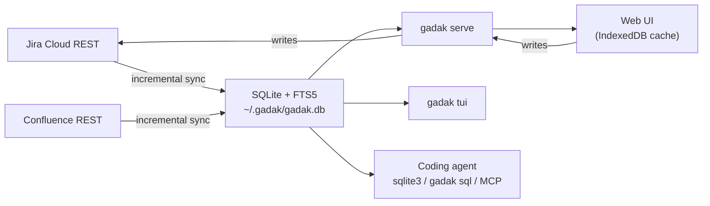

<p align="center">
  
  
</p>

<p align="center">
  <a href="https://github.com/midagedev/gadak/releases"></a>
  <a href="https://github.com/midagedev/gadak/actions/workflows/ci.yml"></a>
  <a href="LICENSE"></a>
</p>

<p align="center"><b>Ask your Jira the questions Jira can't answer.</b></p>

gadak mirrors Jira *and* Confluence into one local SQLite file — issues,
comments, history, wiki pages — indexed together and searchable in
milliseconds. Ask it yourself from a keyboard-driven web UI or a TUI; let your
coding agent ask in plain SQL. One binary, no server, no account.

**The mirror is a cache you can throw away.** If this project stops tomorrow,
you delete a directory and have lost nothing: Jira stays the source of truth,
and nothing you do here is stored anywhere else.

<p align="center">
  <a href="https://midagedev.github.io/gadak/"><b>▶&nbsp; Open the live demo</b></a>
  &nbsp;—&nbsp; 534 issues + 71 wiki pages, in your browser, right now.
</p>

<p align="center">
  
  <br>
  <sub>Every clip in this README is generated from a script against the committed demo snapshot —
  this one from <a href="e2e/demo/web-demo.spec.ts">e2e/demo/web-demo.spec.ts</a>. What you see is what CI checks.</sub>
</p>

```bash
brew install midagedev/tap/gadak

gadak init && gadak sync    # Jira (and Confluence) -> ~/.gadak/gadak.db
gadak serve                # http://gadak.localhost:7777
gadak tui                  # same mirror, in your terminal (D toggles docs)
gadak sql "select key, summary from issues_full where reopen_count > 1"
```

That last query is the point. `reopen_count` is not a Jira field — gadak derives
it from the changelog while it syncs, along with `reopen_reason` and the epic a
sub-task ultimately rolls up to. Your site cannot answer "what keeps coming
back?" at all; a local mirror answers it in a line.
[`docs/RECIPES.md`](docs/RECIPES.md) has thirteen more, each verified against
the demo snapshot.

> **Status: working, pre-release.** Sync (both sources), the read API,
> write-through, the web UI, the TUI, the CLI, settings, the plugin boundary,
> and i18n are implemented and verified end to end against a live Atlassian
> site. `docs/STATE_OF_PLAY.md` is the honest inventory.

## Why

Every developer suddenly has a coding agent, and agents burn context paging
REST APIs and guessing at JQL. Worse, half of what an agent needs is not in
the tracker at all — it is in the wiki next door. A local file that holds both
answers "what do we know about X?" with one full-text query, joins across
sources, and never spends a token on pagination.

Beyond the agent, three complaints about living in a tracker and a wiki, one
root cause.

**Search is slow, and it is two searches.** Every filter change is a network
round trip against a multi-tenant service — and the answer to "what do we know
about idempotency?" is split between Jira search and Confluence search, which
do not talk to each other. Once both are on local disk there is one FTS index:
type a word, get the issues *and* the pages, instantly.

**Agents cannot read your team's context well.** A coding agent asked "what
did we already fix in the billing flow, and what did we decide in the design
doc?" has to page through two REST APIs, guess at JQL and CQL, and burn its
context on JSON envelopes. Give it a SQLite file instead and it writes one
query with a join and an FTS match. No tool schema, no pagination, no rate
limit.

**You cannot see your own team's shape.** "Which issues came back after we
closed them, and why?" is a join over the changelog. "Which epic is actually
stuck?" is a rollup over the hierarchy. In Jira neither is a question you can
ask; here they are `where reopen_count > 0` and a group-by on `epic_key`.

All three fall out of the same move: mirror the data locally, then let the UI,
the terminal, and the agent read the same store.

## Three surfaces, one store

| | For | Looks like |
| --- | --- | --- |
| **Web UI** | all-day triage — a browser tab (`gadak serve`) or its own macOS window ([desktop app](docs/DESKTOP.md), no port at all) | a list you triage without the mouse (`j/k` walk, `x` multi-select, `s`/`a`/`c` status·assignee·comment in place), epic grouping and rollups, saved views, a ⌘K palette that finds issues *and* wiki pages, `/` to narrow whichever screen you are on, a freshness chip that shows the mirror's age and pulls it on click, full issue detail (rich text, comments, history, attachments), and wiki documents as a first-class citizen: recency-first lists with label chips, a filter that marks its matches, deep-linkable pages (`?doc=`), and cross-references both ways — the documents an issue's text mentions on the issue, the issues a page mentions on the page |
| **TUI** | people who live in the terminal | [`gadak tui`](docs/TUI.md) — list, filter with live match highlight, `group_by=epic`, Ctrl+K palette, write actions, and `D` for the same wiki views with the same cross-references, all over the same mirror |
| **CLI + SQL** | agents, scripts, one-off questions | `gadak issue`, `gadak search` (issues and pages), `gadak sql`, plus the file itself |

<p align="center">
  
  <br>
  <sub>Generated from <a href="tools/tapes/tui.tape">tools/tapes/tui.tape</a> (VHS).</sub>
</p>

Writes go through to Jira and then refresh the mirror, so the list is correct
a moment later without a full sync. Comment, transition, and assign work on
all three surfaces; field edits work in the web UI and the TUI (values always
come from what Jira allows, never free text). Issue creation is web-only
today. The wiki mirror is read-only on purpose — Confluence stays the place
where documents are written.

Hierarchy is first-class: `epic_key` is derived honestly (the nearest epic
*ancestor*, so a sub-task groups under its epic, not its story), group-by-epic
headers show the epic's actual title, an epic's detail rolls up its children
(`12 done / 14`), and both breadcrumbs — issue and document — are clickable.

So is the seam between the sources. Jira and Confluence never tell each other
what mentions what, but the text does: gadak extracts issue keys from page
bodies and wiki links from issue text into an `item_refs` table while it
syncs. That is why an issue can list the design docs that cite it and a page
can list the tickets it references — a join neither product can make, and the
receipt that both really live in one database.

Attachments are local too. The first view of an image caches its bytes next to
the mirror and every later view is a disk read, so a screenshot-heavy issue
opens at the speed of the rest of the app — and keeps rendering offline.

## For agents

This is half the reason gadak exists, so it has its own reference:
**[AGENTS.md](AGENTS.md)** — schema tour, query patterns, and the mistakes
that silently return nothing. [`docs/AGENT_SETUP.md`](docs/AGENT_SETUP.md) is
one paste per agent (Claude Code, Cursor, Codex, MCP). Hooking one up is one
line:

```bash
gadak mcp install claude    # pins this binary and profile into the registration
```

<p align="center">
  
  <br>
  <sub>A real agent session — one-line MCP registration, then a live cross-source answer.
  Generated from <a href="tools/tapes/agent.tape">tools/tapes/agent.tape</a> (VHS, unscripted model output).</sub>
</p>

The interface is the database, so anything that can run a shell command has
full power:

```bash
# What keeps coming back? (reopen_count is derived here — Jira has no such field)
gadak sql "select key, summary, reopen_count from issues_full
          where reopen_count > 0 order by reopened_at desc limit 20"

# Full-text across issues AND wiki pages — one index, one query
gadak search "idempotency webhook"

# One issue whole, or a write straight through to Jira
gadak issue NMB-140 --json
gadak comment NMB-140 -m "Reproduced on staging."
```

Reads are safe by construction: `gadak sql` opens the database `mode=ro`, and
MCP's `gadak_query` additionally rejects anything that is not a SELECT — so an
agent can be given the mirror without being given arbitrary `sqlite3`. When
the mirror does not model an endpoint at all, [`gadak api`](docs/AGENT_ACCESS.md)
passes the request through to your site: read-only unless you add `--write`,
never on MCP.

Everything can hold the file at once — WAL with one writer (the sync loop),
readers everywhere else — so `serve`, the TUI, and an agent coexist by design.

One caveat we would rather you read here than discover later: **an agent that
reads your mirror sends what it reads to whatever model it talks to.** gadak
itself sends nothing anywhere ([`SECURITY.md`](SECURITY.md)), but the agent
will — scope the mirror to what the agent should see (project and space
allowlists, or a separate profile).

## Install

Atlassian Cloud only, and you need an
[API token](https://id.atlassian.com/manage-profile/security/api-tokens) — one
token covers Jira and Confluence on the same site.

**You install one thing.** There is a single binary and a single app, and the
app has the binary inside it:

```bash
brew install midagedev/tap/gadak     # macOS + Linux — the CLI, the web UI, the TUI
```

or download `Gadak-<version>-arm64.dmg` from the
[latest release](https://github.com/midagedev/gadak/releases/latest) for the
[macOS app](docs/DESKTOP.md) — signed, notarized, sets itself up in its own
window with no terminal at any point.

If you took the app and later want an agent on the same mirror, the CLI is
already on your disk; macOS just does not put an app bundle on your `PATH`.
One command does:

```bash
/Applications/Gadak.app/Contents/Resources/bin/gadak install-cli
```

Then first run:

```bash
gadak serve      # http://gadak.localhost:7777 — setup happens in the browser
```

Other routes (install script, release archive, source build, Docker), wiki
mirroring, profiles for two sites, and the upgrade gotchas all live in
**[`docs/INSTALL.md`](docs/INSTALL.md)**.

## Making it yours

Two axes, no forking required — see **[docs/EXTENDING.md](docs/EXTENDING.md)**.

**Configuration** covers most of it, from the settings dialog or
`~/.gadak/config.json`: map your custom fields (severity, environment, whatever
your site calls them), classify issues into teams by label or component, choose
which fields are inline-editable, set the staleness threshold and sync
intervals, toggle features. Most keys apply without restart; sync intervals
need a restart of `gadak serve`. Full key table:
[`docs/CONFIGURATION.md`](docs/CONFIGURATION.md).

**The plugin boundary** covers the rest. The core contains zero GitHub, CD, or
test-management code on purpose. Anything else you want beside an issue — linked
pull requests, deploy status, QA context — arrives by writing rows into the
`enrichments` table and bumping a version counter, from any language on any
schedule. The server merges them; the UI surfaces them. Working examples live in
[`examples/plugins/`](examples/plugins/), and the contract is
[`docs/PLUGINS.md`](docs/PLUGINS.md).

## How it works



Sync is incremental with an overlap on the watermark, plus a reconcile pass so
deletions do not linger. Confluence needs one extra trick the API forces:
comment edits do not bump a page's version, so every incremental pass re-reads
comments for changed pages separately. Derived fields the sources do not
provide — reopen count and the reason it came back, last status change,
resolution date, clone origin, the honest `epic_key` — are computed during
sync and keyed on `statusCategory` and ids, never on a localized name.

The storage spine is source-neutral (`items` + per-kind projections + one FTS
index), which is not a slogan: Confluence merged without reshaping the
database, and the same spine is where the next source lands. See
[`docs/decisions/0006-confluence-connector.md`](docs/decisions/0006-confluence-connector.md).

### Why not a browser extension or a Forge app?

Jira Cloud deliberately sends no CORS headers on its REST API, so a static page
cannot call it. Both alternatives that avoid a local process were considered and
rejected because neither can hand a coding agent a queryable local database,
which is half the point. See `docs/decisions/0003-local-process.md`.

## Good fit / bad fit

| Use gadak when… | Use Jira/Confluence directly when… |
| --- | --- |
| You search and triage the same projects every day and the latency hurts. | You need boards, sprints, reports, automation, permissions. |
| You want an agent to reason over your tracker's history *and* your wiki. | You need administration, workflow editing, or document authoring. |
| You want offline reading of everything you have access to. | A minute of staleness matters. |
| Your tracker holds tens of thousands of issues and Jira's UI struggles. | Your team is small enough that Jira already feels instant. |

**In scope:** issue fields, descriptions, comments, attachments, changelog,
links, epic hierarchy, status transitions, assignee, wiki pages (bodies,
comments, labels), full-text search across all of it, saved views, watches;
field edits and issue creation on the web UI.
**Out of scope:** boards and sprint mechanics, project administration, workflow
configuration, permission schemes, writing to the wiki, and anything requiring
Jira's own UI.
**Not a sync engine:** Jira and Confluence are the systems of record. The
mirror is disposable — delete it and re-sync.

## How it compares

- **[jira-cli](https://github.com/ankitpokhrel/jira-cli)** talks to Jira's REST
  API per command, so every listing is a network round trip and JQL is the query
  language. gadak queries a local mirror: millisecond filters, SQL joins over the
  changelog, offline reads — plus a web UI and TUI over the same file. If all you
  want is "create an issue from the terminal", jira-cli is lighter.
- **Linear** is a different tracker. If your team can move, move. gadak is for the
  (much larger) group whose org keeps Jira: it gives you Linear-ish speed and
  keyboard flow without asking anyone for permission — it is a mirror, not a
  migration.
- **Atlassian's Rovo MCP server** gives agents official, hosted access to the
  same data — worth using if it fits. The architectural difference: a network
  MCP cannot join issues to wiki pages, aggregate, or work offline, every call
  costs tokens and rate budget, and it answers only the questions its tools
  anticipated. A local SQLite file has none of those limits, and derived
  history (reopen counts and reasons, honest epic ancestry) exists only in the
  mirror.
- **Jira's own UI** stays the source of record and the place for boards,
  sprints, and admin. gadak does not replace it; it replaces waiting on it.

## More sources later

Confluence was the proof: the second connector merged against the same spine,
the same FTS index, and the same read contracts without reshaping the database
(decision 0006). The pattern — mirror, project, index — is what the next
source rides too. Candidates are ranked by user demand, not by roadmap
romance; see [`docs/ROADMAP.md`](docs/ROADMAP.md) for what is actually next.

## Documentation

- [`docs/INSTALL.md`](docs/INSTALL.md) — every way in, first run, profiles, upgrades, Docker
- [`AGENTS.md`](AGENTS.md) — the agent reference: SQL, CLI, REST
- [`SECURITY.md`](SECURITY.md) — threat model, what leaves your machine, and where each claim lives in code
- [`MAINTENANCE.md`](MAINTENANCE.md) — who maintains this, the release cadence, and what is refused
- [`docs/FAQ.md`](docs/FAQ.md) — the hard questions: site load, one-person risk, concurrency, where agent data goes
- [`docs/AGENT_SETUP.md`](docs/AGENT_SETUP.md) — one paste per agent (Claude Code, Cursor, Codex, MCP)
- [`docs/DESKTOP.md`](docs/DESKTOP.md) — the macOS app: install, first run, and where the CLI fits
- [`docs/RECIPES.md`](docs/RECIPES.md) — 13 questions JQL cannot ask, as ready-to-run SQL
- [`docs/EXTENDING.md`](docs/EXTENDING.md) — fitting gadak to your team
- [`docs/STATE_OF_PLAY.md`](docs/STATE_OF_PLAY.md) — what exists, what does not
- [`docs/CONCEPT.md`](docs/CONCEPT.md) — the product idea and the loop it optimizes
- [`docs/PAIN_POINTS.md`](docs/PAIN_POINTS.md) — the Jira complaints gadak answers, with sources
- [`docs/ARCHITECTURE.md`](docs/ARCHITECTURE.md) — components and data flow
- [`docs/TUI.md`](docs/TUI.md) — terminal UI keys, and CJK font guidance
- [`docs/UX_PRINCIPLES.md`](docs/UX_PRINCIPLES.md) — the standard UI waves are measured against, with sources
- [`docs/TUI_PRINCIPLES.md`](docs/TUI_PRINCIPLES.md) — its terminal counterpart: keys, color, width, CJK
- [`docs/PLUGINS.md`](docs/PLUGINS.md) — the enrichment contract
- [`docs/decisions/`](docs/decisions/) — why it is shaped this way
- [`specs/000-product/`](specs/000-product/) — spec, data model, API and sync contracts

## Who makes this

One person, currently. Weigh that before pointing it at a company knowledge
base — and weigh the other side too: the mirror is a disposable cache of your
own Jira, the schema is a [documented public
contract](specs/000-product/data-model.md), the license is Apache-2.0, and
the file is plain SQLite. If this project stops tomorrow, you delete a
directory and have lost nothing. The hard questions — site load, compliance,
what an agent does with the data — are answered head-on in
[`docs/FAQ.md`](docs/FAQ.md).

## Contributing and feedback

See [`CONTRIBUTING.md`](CONTRIBUTING.md) — and
[`docs/GOOD_FIRST_ISSUES.md`](docs/GOOD_FIRST_ISSUES.md) if you want a place
to start. Bug reports should include your Jira deployment type (Cloud), the
gadak commit, and the command you ran. Never paste real issue data, tokens, or
site URLs into a public issue.

Using gadak with an agent and hitting friction? That is exactly the feedback we
want — [open an issue](https://github.com/midagedev/gadak/issues) with the
question you asked and what the agent did.

## License

Apache-2.0. See `LICENSE` and `NOTICE`.
