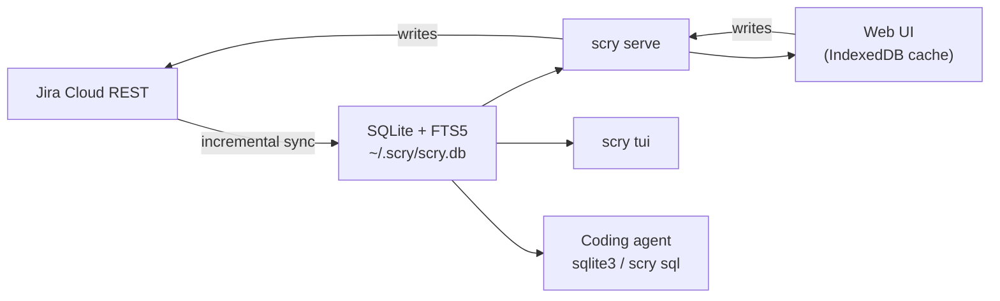

# scry

**Give your coding agent your Jira as a local SQLite file** — and get instant
search, offline reads, and a keyboard-driven UI for yourself in the same binary.
scry mirrors your issues locally; agents query them with plain SQL, you triage
them in a browser UI or a TUI that never waits on the network.

Why now: every developer suddenly has a coding agent, and agents burn context
paging a REST API and guessing at JQL. A tracker that is a local file needs
neither. Jira is the first source; the storage layer is source-neutral on
purpose.

**Try it in 30 seconds, no Jira account, no token:**

```bash
git clone https://github.com/midagedev/scry && cd scry
npm ci && npm run build && go build -o scry ./cmd/scry
./scry demo        # opens a 519-issue fictional backlog in your browser
```

Or open the [zero-install hosted demo](https://midagedev.github.io/scry/) in a
browser (static snapshot of the same 519 issues; read-only — no binary, no
account). Enable GitHub Pages once if the link 404s; see below.

<p align="center">
  
</p>

```bash
scry init && scry sync    # Jira -> ~/.scry/scry.db
scry serve                # http://localhost:7777
scry tui                  # same mirror, in your terminal
scry sql "select key, summary from issues_full where reopen_count > 1"
```

> **Status: working, pre-release.** Sync, the read API, write-through, the web UI,
> the TUI, the CLI, settings, the plugin boundary, and i18n are implemented and
> verified end to end against a live Jira site. `docs/STATE_OF_PLAY.md` is the
> honest inventory.

## Why

Three complaints about living in an issue tracker, one root cause.

**Search is slow.** Every filter change is a network round trip against a
multi-tenant service. Teams that live in the tracker feel this dozens of times an
hour. Once the data is on local disk, filtering is a memory operation: type a
character, see the result. No spinner, no debounce, no "loading issues…".

**Agents cannot read your tracker well.** A coding agent asked "what did we
already fix in the billing flow?" has to page through a REST API, guess at JQL,
and burn its context on JSON. Give it a SQLite file instead and it writes one
query with a join and an FTS match. No tool schema, no pagination, no rate limit.

**You cannot see your own team's shape.** "Which issues came back after we closed
them, and why?" is a join over the changelog. In Jira it is not a question you
can ask; here it is `where reopen_count > 0`.

All three fall out of the same move: mirror the data locally, then let the UI, the
terminal, and the agent read the same store.

## Three surfaces, one store

| | For | Looks like |
| --- | --- | --- |
| **Web UI** | all-day triage, mouse and keyboard | keyboard-driven list, saved views, ⌘K palette, full detail with rich text, comments, history, attachments |
| **TUI** | people who live in the terminal | [`scry tui`](docs/TUI.md) — list, filter with live match highlight, Ctrl+K palette, mouse support, detail, and write actions over the same mirror |
| **CLI + SQL** | agents, scripts, one-off questions | `scry issue`, `scry search`, `scry sql`, plus the file itself |

<p align="center">
  
</p>

Writes go through to Jira and then refresh the mirror, so the list is correct a
moment later without a full sync. Comment, transition, and assign work on all
three surfaces; field edits work in the web UI and the TUI (values always come
from what Jira allows, never free text). Issue creation is web-only today.

Attachments are local too. The first view of an image caches its bytes next to
the mirror and every later view is a disk read, so a screenshot-heavy issue opens
at the speed of the rest of the app — and keeps rendering offline.

## Install

Jira Cloud only. You need an API token from
<https://id.atlassian.com/manage-profile/security/api-tokens>.

### 1. Homebrew

```bash
brew install midagedev/tap/scry
```

macOS and Linux, from [`midagedev/homebrew-tap`][tap]. A formula rather than a
cask on purpose: the released binaries are not notarized, and Homebrew marks
cask downloads with `com.apple.quarantine`, which Gatekeeper then blocks.

[tap]: https://github.com/midagedev/homebrew-tap

### 2. Install script

```bash
curl -fsSL https://raw.githubusercontent.com/midagedev/scry/main/scripts/install.sh | sh
```

Downloads the latest GitHub Release for your OS/arch, verifies `checksums.txt`
(sha256), and installs to `~/.local/bin/scry` (override with `SCRY_INSTALL_DIR`).
Upgrades in place if a binary is already there.

### 3. Release binary

Download the archive for your OS/arch from
[GitHub Releases](https://github.com/midagedev/scry/releases), verify against
`checksums.txt`, unpack, and put `scry` on your `PATH`.

### 4. Build from source

Requirements: Go 1.25+, Node.js 20+.

```bash
npm ci && npm run build       # build the web UI into dist/app
go build -o scry ./cmd/scry   # embeds it — the binary is the whole install
# or: make build  → bin/scry
```

### First run

```bash
scry serve                    # http://localhost:7777
```

The first run walks you through it in the browser: paste your site, email, and
token, pick projects from your site's own list, and watch the first sync fill the
mirror. If you would rather stay in the terminal, `scry init && scry sync`
does the same thing. `scry serve` keeps the mirror fresh in the background
whenever a credential is configured (`--no-sync` opts out). To survive reboot:

```bash
scry install-service   # launchd (macOS) or systemd --user (Linux)
```

Your API token lives in `~/.scry/config.json` at `0600` and never touches the
database, the repository, or a log line. There is no scry account, no server, and
no telemetry — outbound traffic is your own Jira site, plus an optional daily
anonymous version check against GitHub Releases (`updateCheck: false` turns it off).

Pointing one machine at two sites (work and a demo, say) is what profiles are
for: `scry --profile demo init` keeps a separate credential and mirror under
`~/.scry/profiles/demo/`. One `scry serve` then serves every profile: each one
mounts under `/w/<name>/` (full API, reads and writes, opened on first
request), and when there is more than one, the web sidebar grows a WORKSPACES
switcher. Same loopback listener, same single user — the workspace list never
exposes credentials. Background sync and notifications stay on the primary
profile; workspaces sync when you use them.

### Zero-install hosted demo

A static build of the web UI plus a frozen copy of the demo snapshot, for GitHub
Pages (or any static host). No binary, no Jira account, no trust decision.

```bash
make hosted-demo          # → dist/hosted/  (UI + bootstrap/detail/attachments)
make hosted-demo-test     # Playwright smoke (boot, search, detail, image)
```

Local preview (base path `/scry/` matches a project Pages site):

```bash
mkdir -p dist/pages/scry && cp -R dist/hosted/. dist/pages/scry/
npx serve dist/pages -l 4173
# open http://127.0.0.1:4173/scry/
```

**Human checklist to publish on GitHub Pages** (workflow is already in the repo):

1. Repo → **Settings → Pages → Build and deployment → Source: GitHub Actions**.
2. Merge to `main` (or run **Hosted demo (GitHub Pages)** via workflow_dispatch).
3. Wait for the deploy job; the site is `https://<owner>.github.io/scry/`.

Limits of the hosted snapshot: read-only (writes return `501 demo_read_only`);
server full-text search (`search/`) is unavailable (client-side typing search
still works over the 519-issue pool); no live sync or identity.

### About the demo data

`scry demo` serves `examples/demo.db` — 519 issues on fictional projects. It is
also what the test suite and the GIFs above run against, so what you see is what
CI checks.

### Run it in a container

```bash
docker build -t scry . && docker run --rm -p 7777:7777 -v scry-data:/data scry
```

The process has no authentication by design, so it refuses to bind a non-loopback
address without `--allow-remote` (the image passes it). Only put it on a network
you trust. Config and `scry.db` live under `/data`.

## For agents

This is half the reason scry exists, so it has its own reference: **[AGENTS.md](AGENTS.md)**.

<p align="center">
  
</p>

The interface is the database. Anything that can run a shell command can use it
at full power:

```bash
# What keeps coming back, and when did it last happen?
scry sql "select key, summary, reopen_count, reopened_at from issues_full
          where reopen_count > 0 order by reopened_at desc limit 20"

# Full-text across descriptions and comments
scry sql "select i.key, it.title from items_fts f
          join items it on it.rowid = f.rowid
          join issues i on i.item_id = it.id
          where items_fts match 'idempotency AND webhook' limit 20"

# One issue whole, or one write straight through to Jira
scry issue NMB-140 --json
scry comment NMB-140 -m "Reproduced on staging."
scry transition NMB-140 "In Review"
```

Read and write commands that emit structured output (`init`, `status`, `issue`,
`search`, `comment`, `transition`, `assign`, `fields`, `sql`) take `--json`.
`issue`, `search`, `comment`, `transition`, `assign`, and `fields` also warn on
stderr when the last sync failed or is over an hour old; stdout stays clean
enough to pipe. `scry sql` opens the database with SQLite `mode=ro` (MCP's
`scry_query` additionally rejects non-SELECT statements), so an agent on a
narrow command allowlist can be given mirror access without being given
arbitrary `sqlite3`.

The schema in `specs/000-product/data-model.md` is a public contract. Filter on
`status_category` and ids, never on display names — Jira translates those per
account, which is the one mistake that silently returns nothing.

## Making it yours

Two axes, no forking required — see **[docs/EXTENDING.md](docs/EXTENDING.md)**.

**Configuration** covers most of it, from the settings dialog or
`~/.scry/config.json`: map your custom fields (severity, environment, whatever
your site calls them), classify issues into teams by label or component, choose
which fields are inline-editable, set the staleness threshold and sync
intervals, toggle features. Most keys apply without restart; sync intervals
need a restart of `scry serve`. Full key table:
[`docs/CONFIGURATION.md`](docs/CONFIGURATION.md).

**The plugin boundary** covers the rest. The core contains zero GitHub, CD, or
test-management code on purpose. Anything else you want beside an issue — linked
pull requests, deploy status, QA context — arrives by writing rows into the
`enrichments` table and bumping a version counter, from any language on any
schedule. The server merges them; the UI surfaces them. Working examples live in
[`examples/plugins/`](examples/plugins/), and the contract is
[`docs/PLUGINS.md`](docs/PLUGINS.md).

## How it works



Sync is incremental with a two-minute overlap on the watermark, plus a reconcile
pass so deletions do not linger. Derived fields the source does not provide —
reopen count and the reason it came back, last status change, resolution date,
clone origin — are computed during sync and keyed on `statusCategory`, never on a
localized status name.

### Why not a browser extension or a Forge app?

Jira Cloud deliberately sends no CORS headers on its REST API, so a static page
cannot call it. Both alternatives that avoid a local process were considered and
rejected because neither can hand a coding agent a queryable local database,
which is half the point. See `docs/decisions/0003-local-process.md`.

## Good fit / bad fit

| Use scry when… | Use Jira directly when… |
| --- | --- |
| You search and triage the same projects every day and the latency hurts. | You need boards, sprints, reports, automation, permissions. |
| You want an agent to reason over your tracker's history. | You need administration or workflow editing. |
| You want offline reading of everything you have access to. | A minute of staleness matters. |
| Your tracker holds tens of thousands of issues and Jira's UI struggles. | Your team is small enough that Jira already feels instant. |

**In scope:** issue fields, descriptions, comments, attachments, changelog, links,
status transitions, assignee, full-text search, saved views, watches; field edits
and issue creation on the web UI.
**Out of scope:** boards and sprint mechanics, project administration, workflow
configuration, permission schemes, and anything requiring Jira's own UI.
**Not a sync engine:** Jira is the system of record. The mirror is disposable —
delete it and re-sync.

## How it compares

- **[jira-cli](https://github.com/ankitpokhrel/jira-cli)** talks to Jira's REST
  API per command, so every listing is a network round trip and JQL is the query
  language. scry queries a local mirror: millisecond filters, SQL joins over the
  changelog, offline reads — plus a web UI and TUI over the same file. If all you
  want is "create an issue from the terminal", jira-cli is lighter.
- **Linear** is a different tracker. If your team can move, move. scry is for the
  (much larger) group whose org keeps Jira: it gives you Linear-ish speed and
  keyboard flow without asking anyone for permission — it is a mirror, not a
  migration.
- **Atlassian's Rovo MCP server** gives agents official, hosted access to the
  same data — worth using if it fits. The architectural difference: a network
  MCP cannot join, aggregate, or work offline, every call costs tokens and rate
  budget, and it answers only the questions its tools anticipated. A local
  SQLite file has none of those limits, and derived history (reopen counts and
  reasons) exists only in the mirror.
- **Jira's own UI** stays the source of record and the place for boards,
  sprints, and admin. scry does not replace it; it replaces waiting on it.

## More sources later

The storage schema and search layer are source-neutral so a second connector does
not reshape the database. Confluence is the intended next one: same local index,
same instant search, same agent access. Only Jira is implemented today, and no
source-specific work merges until the neutral layer stays neutral.

## Documentation

- [`AGENTS.md`](AGENTS.md) — the agent reference: SQL, CLI, REST
- [`docs/AGENT_SETUP.md`](docs/AGENT_SETUP.md) — one paste per agent (Claude Code, Cursor, Codex, MCP)
- [`docs/RECIPES.md`](docs/RECIPES.md) — 13 questions JQL cannot ask, as ready-to-run SQL
- [`docs/EXTENDING.md`](docs/EXTENDING.md) — fitting scry to your team
- [`docs/STATE_OF_PLAY.md`](docs/STATE_OF_PLAY.md) — what exists, what does not
- [`docs/CONCEPT.md`](docs/CONCEPT.md) — the product idea and the loop it optimizes
- [`docs/PAIN_POINTS.md`](docs/PAIN_POINTS.md) — the Jira complaints scry answers, with sources
- [`docs/ARCHITECTURE.md`](docs/ARCHITECTURE.md) — components and data flow
- [`docs/TUI.md`](docs/TUI.md) — terminal UI keys, and CJK font guidance
- [`docs/PLUGINS.md`](docs/PLUGINS.md) — the enrichment contract
- [`docs/decisions/`](docs/decisions/) — why it is shaped this way
- [`specs/000-product/`](specs/000-product/) — spec, data model, API and sync contracts

## Contributing

See [`CONTRIBUTING.md`](CONTRIBUTING.md). Bug reports should include your Jira
deployment type (Cloud), the scry commit, and the command you ran. Never paste
real issue data, tokens, or site URLs into a public issue.

## License

Apache-2.0. See `LICENSE` and `NOTICE`.
