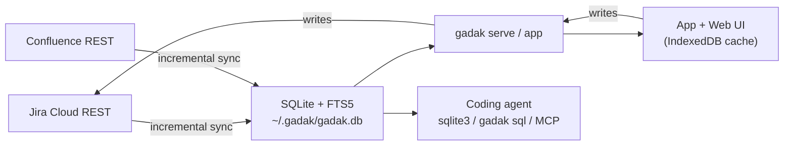

<p align="center">
  
  
</p>

<p align="center">
  <a href="https://github.com/midagedev/gadak/releases"></a>
  <a href="https://github.com/midagedev/gadak/actions/workflows/ci.yml"></a>
  <a href="LICENSE"></a>
</p>

<p align="center"><b>Follow the thread.</b></p>

gadak mirrors Jira *and* Confluence into one local SQLite file — issues,
comments, history, wiki pages — indexed together and searchable in
milliseconds. This window is where that work lives on your machine: triage
it in the [macOS app](docs/DESKTOP.md) or a browser tab, or let a coding
agent ask in plain SQL and point the same window at the answer. One binary,
one app, no gadak account.

**The mirror is a cache you can throw away.** If this project stops tomorrow,
you delete a directory and have lost nothing: Jira stays the source of truth,
and nothing you do here is stored anywhere else.

<p align="center">
  <a href="https://midagedev.github.io/gadak/"><b>▶&nbsp; Open the live demo</b></a>
  &nbsp;—&nbsp; 534 issues, in your browser, right now.
</p>

<p align="center">
  
  <br>
  <sub>Search, an issue (title, priority, labels), documents, epics — the paper UI.
  Generated from <a href="e2e/demo/web-demo.spec.ts">e2e/demo/web-demo.spec.ts</a> against the demo snapshot.</sub>
</p>

Download [`Gadak-<version>-arm64.dmg`](https://github.com/midagedev/gadak/releases/latest)
and open the window — or, from a terminal:

```bash
brew install midagedev/tap/gadak

gadak init && gadak sync    # Jira (and Confluence) -> ~/.gadak/gadak.db
gadak serve                # http://gadak.localhost:7777
gadak sql "select key, summary from issues_full where reopen_count > 1"
```

That last query is the point. `reopen_count` is not a Jira field — gadak derives
it from the changelog while it syncs, along with `reopen_reason` and the epic a
sub-task ultimately rolls up to. Your site cannot answer "what keeps coming
back?" at all; a local mirror answers it in a line.
[`docs/RECIPES.md`](docs/RECIPES.md) has the rest, each verified against
the demo snapshot.

> **Status: 0.13, still 0.x.** Sync (both sources), the read API, write-through,
> the desktop app, the web UI, the CLI, settings, the plugin boundary, and i18n
> are implemented and verified end to end against a live Atlassian site.
> `docs/STATE_OF_PLAY.md` is the honest inventory.

## Why

Every developer suddenly has a coding agent, and agents burn context paging
REST APIs and guessing at JQL. Worse, half of what an agent needs is not in
the tracker at all — it is in the wiki next door. A local file that holds both
answers "what do we know about X?" with one full-text query, joins across
sources, and never spends a token on pagination.

Beyond the agent, three complaints about living in a tracker and a wiki, one
root cause.

**Search is slow, and it is two searches.** Every filter change is a network
round trip against a multi-tenant service — and the answer to "what do we know
about idempotency?" is split between Jira search and Confluence search, which
do not talk to each other. Once both are on local disk there is one FTS index.
**Search ⌘K** in the toolbar queries it across every issue (title, body,
comments) and every document (title, body), ignoring the chips on the list,
and labels the field that matched with a snippet. The box above the list only
narrows this view.

<p align="center">
  
  <br>
  <sub>⌘K searches every issue and document, ignoring the list filters. The box above the list only narrows this view.</sub>
</p>

**Agents cannot read your team's context well.** A coding agent asked "what
did we already fix in the billing flow, and what did we decide in the design
doc?" has to page through two REST APIs, guess at JQL and CQL, and burn its
context on JSON envelopes. Give it a SQLite file instead and it writes one
query with a join and an FTS match. When the answer is a set you should look
at, it points the window (`gadak views open`) instead of pasting a table.

**You cannot see your own team's shape.** "Which issues came back after we
closed them, and why?" is a join over the changelog. "Which epic is actually
stuck?" is a rollup over the hierarchy. In Jira neither is a question you can
ask; here they are `where reopen_count > 0` and a group-by on `epic_key`.

All three fall out of the same move: mirror the data locally, then let the UI
and the agent read the same store.

## Two surfaces, one store

| | For | Looks like |
| --- | --- | --- |
| **App + Web UI** | all-day triage | the [macOS app](docs/DESKTOP.md) — no port, no local server — or the same UI in a browser tab (`gadak serve`). `j`/`k` walk the list, `x` selects, `s`/`a`/`l`/`c` change status, assignee, labels, or leave a comment without leaving the list. Click an issue to rename it, change priority, or edit labels. Paste a Jira filter URL or JQL into the list box and the chips apply; **Copy JQL** is the way back. Sync also pulls the filters you own or have starred into the sidebar. Documents are first-class: recency lists, deep links (`?doc=`), and cross-references both ways. Modeled issue and wiki links open the native panel; the key in the header is the way out to Jira. Anything the mirror does not model — a board, a workflow screen, a Confluence draft — opens in the app's in-app tab (a system tab under `serve`); close it and the mirror re-reads. |
| **CLI + SQL** | agents, scripts, one-off questions | `gadak issue`, `gadak search` (FTS, or `--jql` / a Jira URL), `gadak sql`, plus the file itself |

Writes go through to Jira and then refresh the mirror, so the list is correct
a moment later without a full sync. Comment, transition, assign, labels,
priority, and the title work from the app and the web UI; the CLI covers
comment, transition, and assign today. Field edits and issue creation stay
on that surface (values always come from what Jira allows, never free text).
The wiki mirror itself is read-only on purpose — Confluence stays the place
where documents are written.

Hierarchy is first-class: `epic_key` is derived honestly (the nearest epic
*ancestor*, so a sub-task groups under its epic, not its story), group-by-epic
headers show the epic's actual title, an epic's detail rolls up its children
(`12 done / 14`), and both breadcrumbs — issue and document — are clickable.

So is the seam between the sources. Jira and Confluence never tell each other
what mentions what, but the text does: gadak extracts issue keys from page
bodies and wiki links from issue text into an `item_refs` table while it
syncs. That is why an issue can list the design docs that cite it and a page
can list the tickets it references — a join neither product can make, and the
receipt that both really live in one database.

Attachments are local too. The first view of an image caches its bytes next to
the mirror and every later view is a disk read, so a screenshot-heavy issue
opens at the speed of the rest of the app — and keeps rendering offline.

## For agents

This is half the reason gadak exists, so it has its own reference:
**[AGENTS.md](AGENTS.md)** — schema tour, query patterns, and the mistakes
that silently return nothing. [`docs/AGENT_SETUP.md`](docs/AGENT_SETUP.md) is
one paste per agent (Claude Code, Cursor, Codex, MCP). Claude Code, if it
already has a shell:

```bash
gadak skill install         # schema + query patterns, no extra process
# or, for hosts without a shell (Claude Desktop):
gadak mcp install claude    # pins this binary and profile into the registration
```

Then ask something Jira cannot:

> what keeps coming back in billing, and did we write it down?

The session runs the mirror, not the REST API — SQL answers; views present:

```bash
gadak sql "select key, summary, reopen_count from issues_full
          where reopen_count > 0 and summary like '%billing%'
          order by reopened_at desc"
gadak search "billing incident"

# Put that set on the running window (app or `gadak serve` tab)
gadak sql "select key from issues_full where reopen_count > 1" \
  | tail -n +2 | gadak views open --keys -
```

`gadak views open` is the "open in gadak" verb. `gadak open NMB-140` is the
other one: it leaves for Jira (`/browse/KEY` in the system browser). The
names collide; the verbs do not.

<p align="center">
  
  <br>
  <sub>The window follows the agent. <code>gadak views open</code> writes a one-shot hash; the running app or serve tab applies it.
  Generated from <a href="e2e/demo/agent-demo.spec.ts">e2e/demo/agent-demo.spec.ts</a> against the demo snapshot.</sub>
</p>

The interface is the database, so anything that can run a shell command has
full power:

```bash
# The same JQL as a Jira dashboard or filter URL — paste the query or the URL
gadak search --jql 'project = NMA AND statusCategory = "In Progress"'
gadak search 'https://your-site.atlassian.net/issues/?jql=project%20%3D%20NMA'
gadak views open --jql 'project = NMA AND statusCategory = "In Progress"'
gadak views open "NMA in progress"

# Full-text across issues AND wiki pages — one index, one query
gadak search "idempotency webhook"

# One issue whole, or a write straight through to Jira
gadak issue NMB-140 --json
gadak comment NMB-140 -m "Reproduced on staging."
```

The list box takes the same paste: a `jql=` URL or a clause list becomes
chips, and **Copy JQL** on the filter bar is the way back into Jira.
Clauses gadak cannot express (sprint, WAS, OR across fields) are listed, never
dropped on the floor. What JQL still cannot ask — reopen history, joins,
aggregates — stays in `gadak sql` and [`docs/RECIPES.md`](docs/RECIPES.md).

Reads are safe by construction: `gadak sql` opens the database `mode=ro`, and
MCP's `gadak_query` additionally rejects anything that is not a SELECT — so an
agent can be given the mirror without being given arbitrary `sqlite3`. MCP is
five tools (`gadak_query`, `gadak_search`, `gadak_issue`, `gadak_status`,
`gadak_show`) and does not write to the mirror or to Jira.
`gadak_show` is how a host without a shell (Claude Desktop) presents: it
writes a local ui-focus file so the running app shows the set. SQL answers;
show presents. When the mirror does not model an endpoint at all,
[`gadak api`](docs/AGENT_ACCESS.md) passes the request through to your site:
read-only unless you add `--write`, never on MCP.

Everything can hold the file at once — WAL with one writer (the sync loop),
readers everywhere else — so `serve` and an agent coexist by design.

One caveat we would rather you read here than discover later: **an agent that
reads your mirror sends what it reads to whatever model it talks to.** gadak
itself sends nothing anywhere ([`SECURITY.md`](SECURITY.md)), but the agent
will — scope the mirror to what the agent should see (project and space
allowlists, or a separate profile).

## Install

Atlassian Cloud only, and you need an
[API token](https://id.atlassian.com/manage-profile/security/api-tokens) — one
token covers Jira and Confluence on the same site.

**1. The [macOS app](docs/DESKTOP.md).** Download
`Gadak-<version>-arm64.dmg` from the
[latest release](https://github.com/midagedev/gadak/releases/latest), drag
Gadak.app to Applications, open it. Signed and notarized. First launch walks
through site, email, token, and projects in the window — no port, no
terminal. The CLI is already inside the bundle; macOS just does not put an
app on your `PATH`. When you want an agent on the same mirror:

```bash
/Applications/Gadak.app/Contents/Resources/bin/gadak install-cli
```

**2. The CLI**, if you are on Linux or you want the same UI in a browser tab:

```bash
brew install midagedev/tap/gadak     # macOS + Linux
gadak init && gadak sync
gadak serve      # http://gadak.localhost:7777
```

Other routes (install script, release archive, source build, Docker), wiki
mirroring, profiles for two sites, and the upgrade gotchas all live in
**[`docs/INSTALL.md`](docs/INSTALL.md)**.

## Making it yours

Two axes, no forking required — see **[docs/EXTENDING.md](docs/EXTENDING.md)**.

**Configuration** covers most of it, from the settings dialog or
`~/.gadak/config.json`: map your custom fields (severity, environment, whatever
your site calls them), classify issues into teams by label or component, choose
which fields are inline-editable, pick the Jira projects and Confluence spaces
the mirror holds, set the staleness threshold and sync intervals, toggle
features. The space list *is* the scope: drop a space and the next Confluence
pass removes it from the mirror; add one and that space is fetched from the
start. Most keys apply without restart; sync intervals need a restart of
`gadak serve`. Key table:
[`docs/CONFIGURATION.md`](docs/CONFIGURATION.md).

**The plugin boundary** covers the rest. The core contains zero GitHub, CD, or
test-management code on purpose. Anything else you want beside an issue — linked
pull requests, deploy status, QA context — arrives by writing rows into the
`enrichments` table and bumping a version counter, from any language on any
schedule. The server merges them; the UI surfaces them. Working examples live in
[`examples/plugins/`](examples/plugins/), and the contract is
[`docs/PLUGINS.md`](docs/PLUGINS.md).

## How it works



Sync is incremental with an overlap on the watermark, plus a reconcile pass so
deletions do not linger. Confluence needs one extra trick the API forces:
comment edits do not bump a page's version, so every incremental pass re-reads
comments for changed pages separately. Derived fields the sources do not
provide — reopen count and the reason it came back, last status change,
resolution date, clone origin, the honest `epic_key` — are computed during
sync and keyed on `statusCategory` and ids, never on a localized name.

The storage spine is source-neutral (`items` + per-kind projections + one FTS
index), which is not a slogan: Confluence merged without reshaping the
database, and the same spine is where the next source lands. See
[`docs/decisions/0006-confluence-connector.md`](docs/decisions/0006-confluence-connector.md).

### Why not a browser extension or a Forge app?

Jira Cloud deliberately sends no CORS headers on its REST API, so a static page
cannot call it. Both alternatives that avoid a local process were considered and
rejected because neither can hand a coding agent a queryable local database,
which is half the point. See [`docs/decisions/0003-local-process.md`](docs/decisions/0003-local-process.md).

## Good fit / bad fit

| Use gadak when… | Use Jira/Confluence directly when… |
| --- | --- |
| You search and triage the same projects every day and the latency hurts. | You need boards, sprints, reports, automation, permissions. |
| You want an agent to reason over your tracker's history *and* your wiki. | You need administration, workflow editing, or document authoring. |
| You want offline reading of everything you have access to. | A minute of staleness matters. |
| Your tracker holds tens of thousands of issues and Jira's UI struggles. | Your team is small enough that Jira already feels instant. |

**In scope:** issue fields, descriptions, comments, attachments, changelog,
links, epic hierarchy, status transitions, assignee, labels, priority, title,
wiki pages (bodies, comments, labels), full-text search across all of it,
saved views, watches; field edits and issue creation in the app and the web UI.
**Out of scope:** boards and sprint mechanics, project administration, workflow
configuration, permission schemes, writing to the wiki, grouping the list by
label (filter the chips instead). Those stay in Jira and Confluence; the
macOS app contains them in the same window.

## How it compares

- **[jira-cli](https://github.com/ankitpokhrel/jira-cli)** talks to Jira's REST
  API per command, so every listing is a network round trip and JQL is the query
  language. gadak queries a local mirror: millisecond filters, SQL joins over the
  changelog, offline reads — plus an app and a web UI over the same file. If all you
  want is "create an issue from the terminal", jira-cli is lighter.
- **Linear** is a different tracker. If your team can move, move. gadak is for the
  (much larger) group whose org keeps Jira: it gives you Linear-ish speed and
  keyboard flow without asking anyone for permission — it is a mirror, not a
  migration.
- **Atlassian's Rovo MCP server** gives agents official, hosted access to the
  same data — worth using if it fits. The architectural difference: a network
  MCP cannot join issues to wiki pages, aggregate, or work offline, every call
  costs tokens and rate budget, and it answers only the questions its tools
  anticipated. A local SQLite file has none of those limits, and derived
  history (reopen counts and reasons, honest epic ancestry) exists only in the
  mirror.
- **Jira's own UI** stays the source of record and the place for boards,
  sprints, and admin. gadak does not replace it; it replaces waiting on it.

## More sources later

Confluence was the proof: the second connector merged against the same spine,
the same FTS index, and the same read contracts without reshaping the database
(decision 0006). The pattern — mirror, project, index — is what the next
source rides too. Candidates are ranked by user demand, not by roadmap
romance; see [`docs/ROADMAP.md`](docs/ROADMAP.md) for what is actually next.

## Documentation

- [`docs/INSTALL.md`](docs/INSTALL.md) — every way in, first run, profiles, upgrades, Docker
- [`AGENTS.md`](AGENTS.md) — the agent reference: SQL, CLI, REST; [`docs/MCP.md`](docs/MCP.md) for the five-tool MCP surface
- [`SECURITY.md`](SECURITY.md) — threat model, what leaves your machine, and where each claim lives in code
- [`MAINTENANCE.md`](MAINTENANCE.md) — who maintains this, the release cadence, and what is refused
- [`docs/FAQ.md`](docs/FAQ.md) — the hard questions: site load, one-person risk, concurrency, where agent data goes
- [`docs/AGENT_SETUP.md`](docs/AGENT_SETUP.md) — one paste per agent (Claude Code, Cursor, Codex, MCP)
- [`docs/DESKTOP.md`](docs/DESKTOP.md) — the macOS app: install, first run, and where the CLI fits
- [`docs/RECIPES.md`](docs/RECIPES.md) — questions JQL cannot ask, as ready-to-run SQL
- [`docs/EXTENDING.md`](docs/EXTENDING.md) — fitting gadak to your team
- [`docs/STATE_OF_PLAY.md`](docs/STATE_OF_PLAY.md) — what exists, what does not
- [`docs/CONCEPT.md`](docs/CONCEPT.md) — the product idea and the loop it optimizes
- [`docs/PAIN_POINTS.md`](docs/PAIN_POINTS.md) — the Jira complaints gadak answers, with sources
- [`docs/ARCHITECTURE.md`](docs/ARCHITECTURE.md) — components and data flow
- [`docs/UX_PRINCIPLES.md`](docs/UX_PRINCIPLES.md) — the standard UI waves are measured against, with sources
- [`docs/PLUGINS.md`](docs/PLUGINS.md) — the enrichment contract
- [`docs/decisions/`](docs/decisions/) — why it is shaped this way
- [`specs/000-product/`](specs/000-product/) — spec, data model, API and sync contracts

## Who makes this

One person, currently. Weigh that before pointing it at a company knowledge
base — and weigh the other side too: the mirror is a disposable cache of your
own Jira, the schema is a [documented public
contract](specs/000-product/data-model.md), the license is Apache-2.0, and
the file is plain SQLite. If this project stops tomorrow, you delete a
directory and have lost nothing. The hard questions — site load, compliance,
what an agent does with the data — are answered head-on in
[`docs/FAQ.md`](docs/FAQ.md).

## Contributing and feedback

See [`CONTRIBUTING.md`](CONTRIBUTING.md) — and
[`docs/GOOD_FIRST_ISSUES.md`](docs/GOOD_FIRST_ISSUES.md) if you want a place
to start. Bug reports should include your Jira deployment type (Cloud), the
gadak commit, and the command you ran. Never paste real issue data, tokens, or
site URLs into a public issue.

Using gadak with an agent and hitting friction? That is exactly the feedback we
want — [open an issue](https://github.com/midagedev/gadak/issues) with the
question you asked and what the agent did.

## License

Apache-2.0. See `LICENSE` and `NOTICE`.
