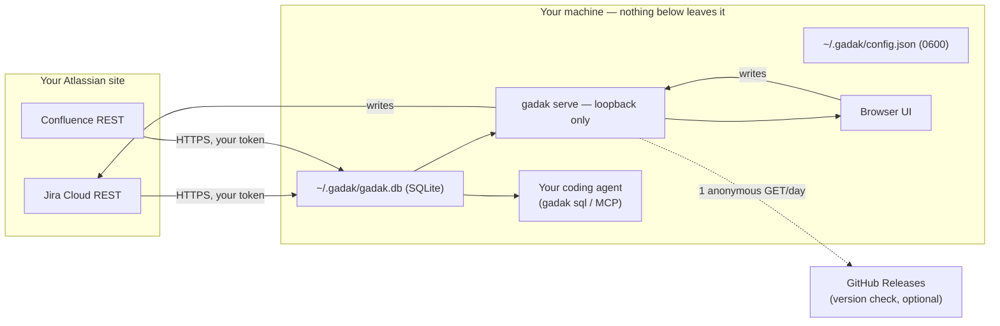

# Security

gadak mirrors your issue tracker and wiki onto your own disk and hands that
mirror to tools you run yourself. That sentence is the whole threat model, so
this document walks it end to end: what moves where, what never moves, and
where in the code each claim is enforced — check the source, not our word.

In a hurry: [`PROMISES.md`](PROMISES.md) is eight of those claims with the
command that checks each one.

## Reporting a vulnerability

Use GitHub private vulnerability reporting:

```text
https://github.com/midagedev/gadak/security/advisories/new
```

Do **not** open a public issue for a vulnerability, and never include real
credentials, real issue data, a database snapshot, or a site URL in a report.
Report privately if the issue involves:

- credential exposure — tokens reaching SQLite, logs, snapshots, or the client
- the attachment media-URL allowlist being bypassable (an XSS vector, see below)
- the loopback bind guard being bypassable
- HTML injection through rendered issue content
- a path that lets a browser page on another origin reach the local API

Public issues are fine for non-sensitive questions about the security model.

### Supported versions

Only the latest published release is supported; older tags receive no
backports, and `main` / `0.0.0-dev` builds are best effort.

### What this project does not promise

gadak is maintained by one person in evenings and weekends. Saying so up front
is more useful than a response target that gets missed:

- **No response-time commitment.** Reports are read and taken seriously; how
  fast one is triaged depends on the week. If a report is time-critical for
  you, say so in it.
- **Fixes ship in the next release, on the current line.** There is no
  backport to an older tag and no separate patch channel.
- **Severity is judged by one maintainer.** There is no committee and no
  second opinion. Disagree in the report and it will be re-read.
- **The signing certificate expires (Feb 2027).** If it lapses without a
  renewed build, macOS will refuse an already-downloaded `.app` — the fix is a
  new signed release, not something you can work around locally.

### The blast radius of `gadak api`

`gadak api` sends requests to your site with your stored credential, so its
reach is exactly your Atlassian account's permissions — no more, and no less.
Three properties are worth knowing before an agent uses it:

- **There is no audit log.** gadak counts requests (`api_usage`) but does not
  record what was called. Your Atlassian site's own audit log is the record.
- **`--write` is not reversible.** gadak has no undo and no dry-run for
  pass-through writes. A `DELETE` that reaches Jira is Jira's business from
  then on.
- **A confused agent is inside the blast radius.** Issue text is written by
  other people, and an agent acting on it can be steered. The guards are that
  absolute URLs are refused (the credential cannot be aimed off-site) and that
  anything past `GET`/`HEAD` needs an explicit `--write`. Those bound where the
  token can go; they do not bound what a legitimate-looking request can ask
  your own site to do. Give an agent `--write` deliberately.

## Data flow



Outbound traffic is exactly five destinations:

1. **Your own Atlassian site**, authenticated with your API token, for sync
   and write-through. Attachment bytes are proxied on demand and may be
   cached under the profile directory; credentials never travel with them.
2. **GitHub Releases**, at most one anonymous version-check GET per day
   to `https://api.github.com/repos/midagedev/gadak/releases/latest`
   (`internal/selfupdate/selfupdate.go` `APIBase`), cached on disk, carrying
   no identifier and no local data. That lookup feeds the sidebar
   banner; it does not download a desktop zip or swap the app. `updateCheck:
   false` turns it off; dev builds never check.
3. **Linear**, when a workspace has a Linear source: GraphQL to
   `api.linear.app` (`internal/linear/client.go`; the API key is sent bare in
   `Authorization`, not as Bearer) and, for file attach, a signed PUT to the
   `uploadUrl` Linear returns (typically `uploads.linear.app`;
   `internal/origin/linearwriter.go` — the PUT carries Linear's signed
   headers and no API key).
4. **Pairing home serve**, when this workspace is bound with
   `gadak init --pairing-code`: HTTP(S) to the advertised serve endpoint with
   `Authorization: Bearer <device token>`
   (`internal/origin/transport.go` `newRemoteOriginTransport`). The
   destination is the user's own machine (or tailnet), not a gadak-operated
   server.
5. **User-invoked gh**, only when you run `gadak dev scan`: the binary
   execs `gh pr list --json …` (`cmd/gadak/dev.go`). gadak does not call
   GitHub's HTTP API itself; `gh` uses whatever host and credential the user
   already configured. `dev link` does not exec `gh`.

There is no gadak account, no gadak server, no telemetry, and no multi-user
model — no roles, no audit log.

Don't take our word for it — the claim is one grep:

```bash
grep -rn 'http.NewRequest\|http.Get\|http.Post' --include='*.go' internal/ cmd/ desktop/
# every hit is your Atlassian site, Linear (api.linear.app / signed upload PUT),
# a pairing home serve, the GitHub Releases check, or gadak talking to itself
# on loopback (port probe, health check, cache warming). `gh` is exec, not
# net/http.
```

## The credential

- The API token lives in `~/.gadak/config.json`, written atomically with mode
  `0600` (`internal/config/config.go`, `Save`).
- It is sent only as the `Authorization` header to your own site
  (`internal/jira/client.go`, `internal/confluence/client.go`). The Jira
  client documents and enforces the rule at the top of the file: the token is
  never put in an error, a log line, or the database. `GET credential/`
  returns a hint, never the token.
- The database never stores credentials, so sharing a mirror snapshot cannot
  leak one. Two layers enforce this rather than trust it:
  - `gadak snapshot` scans every text column of the finished file (still a
    temp file) for credential-shaped strings (`internal/secretscan`) and
    refuses on a hit — the report names the table, row, and pattern, never
    the value, and `--force` cannot skip the check.
  - `gadak team export` is whitelist-only, and a reflection test forces every
    new config field to be classified shareable-or-private
    (`internal/teamconfig`).
- The workspace list endpoint serves site + project names only; a test pins
  that credentials cannot appear in the response.

## The local server

`gadak serve` has **no authentication**, on purpose: it binds loopback and
refuses any other address unless you pass `--allow-remote`
(`cmd/gadak/main.go`). The security boundary is your OS user account
— the same boundary that already protects `~/.ssh`. `--allow-remote` is not
a multi-user mode: exposing the port publishes every issue the mirror holds
to anyone who can reach it.

`gadak pairing` (standalone workspaces, GDK-433) is the answer when you want
that reach anyway — put the serve behind `tailscale serve` and mint one token
per device. Once **any active pairing token exists**, every request under
`/api/v1/origin` — the passthrough that write commands and paired devices
use — must carry it as `Authorization: Bearer <token>` (`internal/server/
origin_rest.go`). There is no loopback exemption, because a tunnel arrives
as loopback; while no active token exists the passthrough behaves exactly as
before. Be clear about the boundary: the gate covers the passthrough, not
the mirror — exposing the port still publishes every issue the mirror holds,
exactly as the previous paragraph says. The serve stores SHA-256 hashes only
(`<profile>/pairing.json`, mode `0600`, same temp-file-and-rename discipline
as `config.json`, `internal/pairing/store.go`); the plaintext token appears
once, in the `gadak pairing mint` output, and the consuming device keeps it
in `<profile>/remote-origin.json` under the same rules. `gadak init
--pairing-code` verifies the token against the serve before writing anything
locally, so a mistyped or stale offer leaves no file behind. A machine
without a stored token — including this machine's own CLI once it routes
through the serve — gets `401 pairing_rejected` until it pairs or the
token is revoked. The 401 carries a `reason` (`expired`, `revoked`, or
`unknown`); only tokens the serve itself minted get a detailed reason, so
the response is not an oracle for guessed strings.

The desktop app removes this surface entirely: it runs **no listener at
all** — the window reaches the mirror through an in-process handler
(`desktop/main.go`), so there is no port for another local process or a
hostile page to connect to.

A loopback bind alone does not stop the browser you are running, so the
server also guards against the two ways a web page can reach it
(`internal/server/browser_guard.go`, tests alongside): state-changing
methods reject any `Origin` that does not match the request host — a
malicious page cannot post comments or transitions through your browser
(CSRF) — and every request rejects `Host` values that are neither
`localhost`, `*.localhost`, nor an IP literal, so a DNS name rebound to
127.0.0.1 cannot read the mirror. CLI and MCP clients send no
Origin header and are unaffected.

## The in-app page session (desktop only)

Gadak.app can show an Atlassian page the mirror does not model by layering a
native WKWebView over the window (`desktop/embed_darwin.go`,
`desktop/browse.go`). That view is a second credential surface: it carries
WebKit's cookie session for the site, which is not the API token in
`~/.gadak/config.json`. The two are separate. The token is what sync and
write-through use; the cookie session is what the embedded page uses to
render as you.

gadak does not read, write, or store those cookies. `embedCreate` builds a
`WKWebViewConfiguration` and sets only the user-agent fragment; it does not
install a `websiteDataStore`. No `*.go` / `*.ts` / `*.svelte` file in this
repository calls a cookie API. WebKit owns the session.

The surface exists only in Gadak.app. `gadak serve` never mounts the browse
pane (`web/src/lib/browse.svelte.ts` returns immediately off desktop);
unmodeled pages there open as ordinary `target="_blank"` system-browser
tabs, whose session is the system browser's. `rm -rf ~/.gadak` still
removes the API token and the mirror; it does not clear WebKit's website
data.

## Rendered content is untrusted

Issue descriptions, comments, and wiki bodies are attacker-influenced text —
anyone who can file a ticket can put content in them. The ADF renderer
(`web/src/lib/adf.ts`) treats them as hostile:

- all text is HTML-escaped; user input never becomes a tag
- only a fixed whitelist of tags is emitted
- `href` values must be `http(s)`; anything else is not rendered as a link
- inline style values must pass a hex-color regex
- unsupported nodes fall back to escaped text, never raw HTML
- media sources must match the exact configured attachment content path shape

Changes to that file are security-relevant. Loosening the media URL check to
a prefix test or a broad regex is an XSS hole, not a simplification.

## The agent is the point — and the exposure

Giving a coding agent your tracker's history is gadak's purpose, so be precise
about what that means: **an agent that reads your mirror will send what it
reads to whatever model it talks to.** gadak does not change that math; it
only removes the REST-API friction. What gadak does control:

- `gadak sql` opens the database read-only (SQLite `mode=ro`); the MCP
  server's `gadak_query` additionally rejects non-SELECT statements
  (`internal/mcp`). An agent on a narrow allowlist gets query access without
  getting arbitrary `sqlite3`.
- Writes (comment, transition, assign) go through Jira's API with your
  token's permissions — gadak grants nothing your account doesn't have.
- `gadak api` is a raw REST escape hatch with the **same token permissions**
  as your account. It adds surface: any path the credential can reach on
  the configured site. Mitigations: absolute URLs (`https://…`, `//…`) are
  refused so the Authorization header never leaves that site; non-GET/HEAD
  requires an explicit `--write` flag (read is default); traffic still goes
  through the existing clients (retry policy, `api_usage` counters). It is
  **not** exposed on MCP — only the CLI — so a shell-less host cannot open a
  full-credential proxy. Prefer the modeled write commands when they fit.
- `gadak mcp install` pins the binary path and profile into the registration,
  so an MCP host cannot silently attach to a different mirror than the one
  you chose.

If your organization would not allow pasting an issue into the model's chat
window, do not point the agent at that mirror. That policy question is real,
and it is yours — gadak keeps the data local precisely so the decision stays
in your hands instead of a vendor's.

## Permissions and scope

The mirror sees exactly what your Atlassian account sees — gadak adds no
elevation and no service account. Confluence mirroring defaults to **global
(team) spaces only**; personal spaces sync only when named explicitly in
config. Projects and spaces are allowlists in config, so a mirror can be
scoped down to what a given machine should hold.

## The mirror on disk

`~/.gadak/gadak.db` is a plain SQLite file owned by your user, holding a copy
of data you already had read access to. It is deliberately disposable: delete
it and re-sync.

File modes enforce the user boundary: the database and its `-wal`/`-shm`
sidecars are chmodded to `0600` and every data directory to `0700` on open
(`internal/store/store.go`), matching the credential file (`0600`) and the
attachment cache (`0700`). Older installs left at `0644`/`0755` are tightened
the next time gadak opens them.

If your threat model includes other processes in your *own* account reading
your files, full-disk encryption is the remaining tool — a local password on
the file would only be obfuscation, and we would rather not pretend
otherwise.

Offboarding is one command: `rm -rf ~/.gadak` removes the mirror, the
credential, and every profile. Nothing else on the machine or in Jira knows
gadak existed.

## Release artifacts

Every release ships a `checksums.txt` (sha256) covering each archive;
`scripts/install.sh` verifies it before installing. macOS binaries are signed
with a Developer ID Application certificate and notarized by Apple, with a
secure timestamp so already-published releases stay verifiable after the
certificate expires. Verify one yourself:

```bash
codesign --verify --strict --verbose=2 ./gadak   # signature and requirement
spctl --assess --type open --context context:primary-signature -vv ./gadak
# → accepted, source=Notarized Developer ID
```

(Do not use `spctl --assess --type execute` here: that assessment is for app
bundles, and on a bare CLI binary it prints `rejected (the code is valid but
does not seem to be an app)` even when the signature and notarization are
fine — the `origin=` line it prints still shows the Developer ID.)

Linux and Windows binaries are not signed; verify those with `checksums.txt`.
