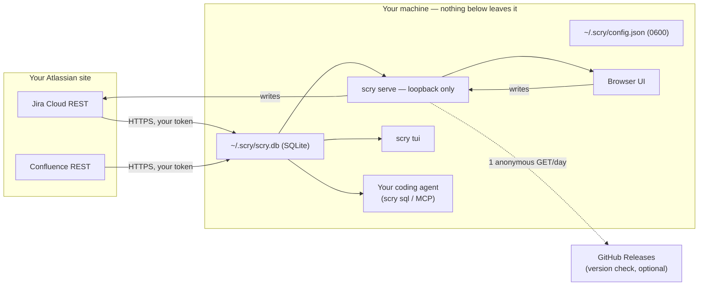

# Security

scry mirrors your issue tracker and wiki onto your own disk and hands that
mirror to tools you run yourself. That sentence is the whole threat model, so
this document walks it end to end: what moves where, what never moves, and
where in the code each claim is enforced — check the source, not our word.

## Reporting a vulnerability

Use GitHub private vulnerability reporting:

```text
https://github.com/midagedev/scry/security/advisories/new
```

Do **not** open a public issue for a vulnerability, and never include real
credentials, real issue data, a database snapshot, or a site URL in a report.
Report privately if the issue involves:

- credential exposure — tokens reaching SQLite, logs, snapshots, or the client
- the attachment media-URL allowlist being bypassable (an XSS vector, see below)
- the loopback bind guard being bypassable
- HTML injection through rendered issue content
- a path that lets a browser page on another origin reach the local API

Public issues are fine for non-sensitive questions about the security model.

### Supported versions

Only the latest published release is supported; older tags receive no
backports, and `main` / `0.0.0-dev` builds are best effort.

## Data flow



Outbound traffic is exactly two destinations:

1. **Your own Atlassian site**, authenticated with your API token, for sync
   and write-through. Attachment bytes are proxied on demand and may be
   cached under the profile directory; credentials never travel with them.
2. **GitHub Releases**, at most one anonymous version-check GET per day,
   cached on disk, carrying no identifier and no local data
   (`internal/selfupdate/selfupdate.go`). `updateCheck: false` turns it off;
   dev builds never check.

There is no scry account, no scry server, no telemetry, and no multi-user
model — no roles, no audit log.

## The credential

- The API token lives in `~/.scry/config.json`, written atomically with mode
  `0600` (`internal/config/config.go`, `Save`).
- It is sent only as the `Authorization` header to your own site
  (`internal/jira/client.go`, `internal/confluence/client.go`). The Jira
  client documents and enforces the rule at the top of the file: the token is
  never put in an error, a log line, or the database. `GET credential/`
  returns a hint, never the token.
- The database never stores credentials, so sharing a mirror snapshot cannot
  leak one. Two layers enforce this rather than trust it:
  - `scry snapshot` scans every text column of the finished file (still a
    temp file) for credential-shaped strings (`internal/secretscan`) and
    refuses on a hit — the report names the table, row, and pattern, never
    the value, and `--force` cannot skip the check.
  - `scry team export` is whitelist-only, and a reflection test forces every
    new config field to be classified shareable-or-private
    (`internal/teamconfig`).
- The workspace list endpoint serves site + project names only; a test pins
  that credentials cannot appear in the response.

## The local server

`scry serve` has **no authentication**, on purpose: it binds loopback and
refuses any other address unless you pass `--allow-remote`
(`internal/server/server.go`). The security boundary is your OS user account
— the same boundary that already protects `~/.ssh`. `--allow-remote` is not
a multi-user mode: exposing the port publishes every issue the mirror holds
to anyone who can reach it.

## Rendered content is untrusted

Issue descriptions, comments, and wiki bodies are attacker-influenced text —
anyone who can file a ticket can put content in them. The ADF renderer
(`web/src/lib/adf.ts`) treats them as hostile:

- all text is HTML-escaped; user input never becomes a tag
- only a fixed whitelist of tags is emitted
- `href` values must be `http(s)`; anything else is not rendered as a link
- inline style values must pass a hex-color regex
- unsupported nodes fall back to escaped text, never raw HTML
- media sources must match the exact configured attachment content path shape

Changes to that file are security-relevant. Loosening the media URL check to
a prefix test or a broad regex is an XSS hole, not a simplification.

## The agent is the point — and the exposure

Giving a coding agent your tracker's history is scry's purpose, so be precise
about what that means: **an agent that reads your mirror will send what it
reads to whatever model it talks to.** scry does not change that math; it
only removes the REST-API friction. What scry does control:

- `scry sql` opens the database read-only (SQLite `mode=ro`); the MCP
  server's `scry_query` additionally rejects non-SELECT statements
  (`internal/mcp`). An agent on a narrow allowlist gets query access without
  getting arbitrary `sqlite3`.
- Writes (comment, transition, assign) go through Jira's API with your
  token's permissions — scry grants nothing your account doesn't have.
- `scry mcp install` pins the binary path and profile into the registration,
  so an MCP host cannot silently attach to a different mirror than the one
  you chose.

If your organization would not allow pasting an issue into the model's chat
window, do not point the agent at that mirror. That policy question is real,
and it is yours — scry keeps the data local precisely so the decision stays
in your hands instead of a vendor's.

## Permissions and scope

The mirror sees exactly what your Atlassian account sees — scry adds no
elevation and no service account. Confluence mirroring defaults to **global
(team) spaces only**; personal spaces sync only when named explicitly in
config. Projects and spaces are allowlists in config, so a mirror can be
scoped down to what a given machine should hold.

## The mirror on disk

`~/.scry/scry.db` is a plain SQLite file owned by your user, holding a copy
of data you already had read access to. It is deliberately disposable: delete
it and re-sync. If your threat model includes other processes in your own
account reading your files, full-disk encryption plus OS user separation is
the right tool — a local password on the file would only be obfuscation, and
we would rather not pretend otherwise.

## Release artifacts

Every release ships a `checksums.txt` (sha256) covering each archive;
`scripts/install.sh` verifies it before installing. macOS binaries are signed
with a Developer ID Application certificate and notarized by Apple, with a
secure timestamp so already-published releases stay verifiable after the
certificate expires. Verify one yourself:

```bash
codesign --verify --strict --verbose=2 ./scry   # signature and requirement
spctl --assess --type open --context context:primary-signature -vv ./scry
# → accepted, source=Notarized Developer ID
```

(Do not use `spctl --assess --type execute` here: that assessment is for app
bundles, and on a bare CLI binary it prints `rejected (the code is valid but
does not seem to be an app)` even when the signature and notarization are
fine — the `origin=` line it prints still shows the Developer ID.)

Linux and Windows binaries are not signed; verify those with `checksums.txt`.
