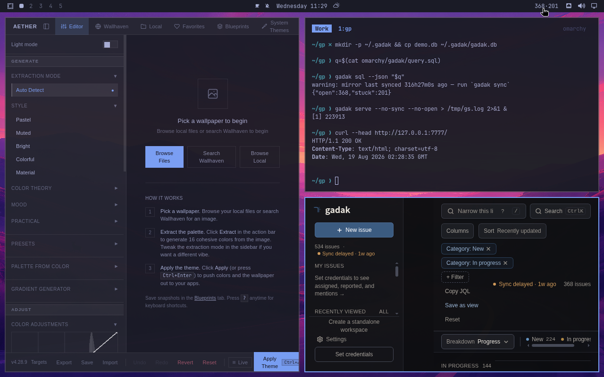

# Omarchy shell plugin

A bar widget for [omarchy-shell](https://omarchy.org/manual/shell-plugins/)
that answers one question offline: how much of the local gadak mirror is
open, and how much of that has been sitting in the same status for more
than seven days.

This is not a “my assigned tickets” widget. A standalone workspace has no
account (`gadak init --standalone` clears `AccountID`), and the competing
community plugins (`tmn73.jira`, Linear, Todoist, ClickUp, `37signals.basecamp`)
all need a cloud token and a live network. This one runs `gadak sql --json`
against the on-disk mirror and nothing else.

**Run once on a real Omarchy guest, 2026-08-19** (Arch + Hyprland VM;
`docs/runbooks/omarchy-vm.md`). `install.sh`, `omarchy-plugin-validate`,
`omarchy-webapp-install`, bar placement, the `no-gadak` / `not-synced` / `ok`
badges, and click-to-open were all exercised there, and the badge's numbers
matched `gadak sql --json` on the guest and the same query against
`examples/demo.db` on the developer machine. Not staged: the `sql-err` state,
the first-poll placeholder, and tooltip text. **It is not a CI path** — the
gate below is still the offline one (manifest, grep contracts, the real query
against `examples/demo.db`), and a guest run stays manual.

<p align="center">
  
  <br>
  <sub>That guest run. The bar badge is <code>gadak sql</code>'s own numbers. This capture used to sit in the top-level README; it lives here now, beside the thing it shows.</sub>
</p>

## What the widget shows

Two numbers in a short bar label, `open·stuck`:

| number | meaning |
| --- | --- |
| **open** | rows in `issues_full` whose `status_category` is not `done` |
| **stuck** | those same rows whose `status_changed_at` is older than 7 days |

`status_category` is one of `new`, `inprogress`, `done`. Do not rewrite the
query to filter on a status display name — that is empty on a Korean-language
account (`AGENTS.md`, `CLAUDE.md`). `time-in-status` is not a stored column;
age is `julianday('now') - julianday(status_changed_at)`. NULL
`status_changed_at` is not counted as stuck.

The query lives in one file: [`gadak/query.sql`](gadak/query.sql).
`BarWidget.qml` runs that file through `gadak sql --json`. `verify.sh`
runs the same file. There is no second copy of the SQL.

`--json` is NDJSON (one object per line, `cmd/gadak/sql.go`). A stale-mirror
warning goes to stderr; the widget parses stdout only.

### Degrade states (never an empty badge)

| condition | badge | tooltip |
| --- | --- | --- |
| `gadak` not on `PATH` | `no gadak` | install the Linux tarball from GitHub Releases |
| `gadak` exits with `no mirror at … — run gadak sync` (`cmd/gadak/sql.go`) | `not synced` | run `gadak sync` |
| non-zero exit, or stdout is not NDJSON with `open`/`stuck` | `sql err` | the command failed |
| first poll still in flight | `…` | reading |
| success | `12·3` | `12 open · 3 stuck >7d` |

Left click opens `http://127.0.0.1:7777`. That is the default `--addr` of
`gadak serve` (`cmd/gadak/serve.go:41`). Right click re-runs the query.

`gadak://` is not the click target. `gadak views open` prints a
`gadak://view/…` deeplink (`cmd/gadak/views.go` `deepLinkURL`) that needs
the macOS app bundle to register the scheme. Nothing on this desktop does.
The bind is still `127.0.0.1:7777`; `gadak.localhost:7777` is only a
display URL when the resolver maps that name to loopback
(`cmd/gadak/main.go` `prettyOpenURL`).

The plugin makes no outbound network call. Telemetry is forbidden
(`SECURITY.md`).

## Data contract

Read **only** with `gadak sql --json`. The mirror file is a disposable
cache whose schema is not a 0.x promise (`specs/000-product/data-model.md`).
Opening it from QML would break on a migration and can read a half-written
file mid-sync. The three 0.x promises are `issues_full` + the RECIPES
queries, the `gadak sql` stdout format, and `views open --keys -`.

## Install

The published route (the distribution mirror
[`midagedev/omarchy-gadak`](https://github.com/midagedev/omarchy-gadak) —
its root is the manifest, which is what `omarchy plugin add` clones):

```bash
omarchy plugin add https://github.com/midagedev/omarchy-gadak.git --enable
```

Not yet exercised on a real guest — the copy route below is the verified
one until it is. Or, from a clone of this repository:

```bash
bash contrib/omarchy/install.sh
```

The script:

- refuses with one line if `/etc/os-release` `ID` is not `omarchy`
  (`docs/runbooks/omarchy-vm.md`)
- copies `gadak/` to `~/.config/omarchy/plugins/io.github.midagedev.gadak/`
  (a copy, not a symlink — `omarchy-plugin-validate` rejects symlinks
  inside a plugin folder)
- runs `omarchy-plugin-validate` when that CLI exists
- `omarchy-shell shell rescanPlugins` then `omarchy-plugin-enable`
- offers `omarchy-webapp-install gadak http://127.0.0.1:7777 web-browser`
  (three arguments; fewer opens an interactive `gum` prompt —
  `bin/omarchy-webapp-install`)
- prints `gadak install-service` as the way to keep `serve` up (systemd
  **user** unit on Linux; `cmd/gadak/service.go`). It does not install
  that unit itself.

`omarchy-plugin-clone` clones a **built-in** plugin into
`~/.config/omarchy/plugins/<user>.<id>/`. It is the wrong verb here.
`omarchy-plugin-add` clones a git URL whose root is a `manifest.json`;
this plugin is a subdirectory of the gadak repo, so add cannot see it —
that is what the mirror repo is for.

## Distribution mirror

`gadak/` here is the **source of truth**; the mirror repo is publish-only.
After a payload change lands on main, a maintainer runs
`bash contrib/omarchy/sync-mirror.sh` — it clones the mirror, copies
`manifest.json` / `BarWidget.qml` / `query.sql` / `LICENSE`, and pushes only
when the diff is non-empty. Never edit the mirror directly, and never point
issues there (the mirror README routes people back here). Listing on
[omarchyplugins.com](https://omarchyplugins.com) is a separate step and
waits until `omarchy plugin add` has been exercised on a real guest.

If `gadak` is missing, the script prints the install options that exist
today and still copies the plugin (the badge will say `no gadak`):

- **not** an AUR package — new AUR registration is closed
  (`docs/INSTALL.md`)
- Linux tarball from
  <https://github.com/midagedev/gadak/releases/latest>:
  `gadak_<version>_linux_amd64.tar.gz` / `linux_arm64` plus
  `checksums.txt` (`README.md`)
- `brew install midagedev/tap/gadak-cli`
- in-repo `contrib/aur/gadak-bin` + `makepkg -si` (fetches that tarball)

Idempotent: a second run overwrites the copy, skips enable if already
enabled, skips the desktop file if it exists.

```bash
bash contrib/omarchy/uninstall.sh
```

Disables and removes the plugin (`omarchy-plugin-remove --yes`) and the
`gadak.desktop` web app. It does not remove the gadak binary or an
`install-service` unit.

The hyphenated CLIs (`omarchy-plugin-enable`, `-validate`, `-remove`,
`-list`) live in `basecamp/omarchy` `bin/` on branch `quattro`.
`omarchy plugin …` is the documented dispatcher for the same scripts
(`omarchy:alias` headers). This recipe calls the hyphenated names.

Plugins run **unsandboxed** inside `omarchy-shell`. Read the plugin
before you enable it
([Omarchy manual](https://omarchy.org/manual/shell-plugins/)).

## Offline gate

```bash
bash contrib/omarchy/verify.sh
```

Runs on macOS and Linux with no Omarchy present. Builds this repo's
`gadak`, points a temp `GADAK_HOME` at a copy of `examples/demo.db`,
and executes `gadak/query.sql`. CI:
[`.github/workflows/omarchy.yml`](../../.github/workflows/omarchy.yml)
(`actions/setup-go` + this script, path-scoped like the Scoop and AUR
workflows). `qmllint` is skipped with a printed reason when the tool
is absent.

## Community directory (later, not this round)

Listing at [omarchyplugins.com](https://omarchyplugins.com) /
[HANCORE-linux/omarchy-plugin-marketplace](https://github.com/HANCORE-linux/omarchy-plugin-marketplace)
is a lead step after this directory exists. Submission is an issue form
plus maintainer review. The marketplace states that it does **not**
security-audit plugins; they run as unsandboxed code. A listing also
wants a standalone public git repo with `manifest.json` at the root,
which this in-repo path is not.
