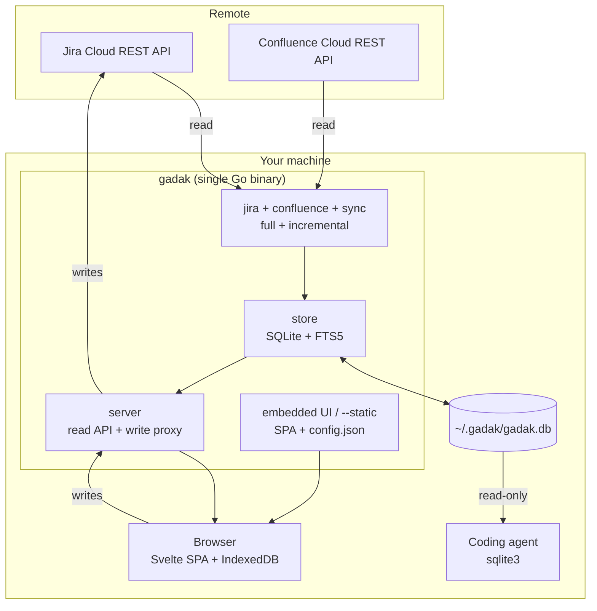

# Architecture

## Shape

One binary, one database, one origin.



Confluence is a peer source (`internal/confluence`, `decisions/0006-confluence-connector.md`):
the wiki mirror is read-only, so writes in this picture still go only to Jira.

The single-origin property is not incidental. Because the UI and the API are
served from the same localhost origin, the server never emits a CORS header —
there is no cross-origin client to allow — and a guard enforces the boundary
in the other direction: cross-origin writes and DNS-rebinding reads are
rejected before the mux (`internal/server/browser_guard.go`, see
`SECURITY.md`). A browser-only build could achieve neither
(`decisions/0003-local-process.md`).

## Module boundaries

`internal/` is a spine, not a package inventory. A listing here would rot
the same way a command inventory in `cmd/gadak/main.go` did. The arrows:

- **Sources** (`internal/jira`, `internal/confluence`) talk HTTP to Atlassian
  and produce store records. They do not write SQL.
- **`internal/store`** owns the SQLite schema, migrations, queries, FTS, and
  derived fields. It does not import `internal/jira`. Shared ADF flattening
  lives in `internal/adf` (plain `json.RawMessage`, no Jira types).
- **`internal/sync`** drives those clients into the store (full / incremental
  / reconcile). It is not an HTTP server and does not talk to the browser.
- **`internal/server`** is the HTTP contract the UI speaks
  (`specs/000-product/contracts/api.md`). Production handlers call the store;
  they do not embed SQL text. Write-through and the attachment proxy do call
  Jira (and therefore know some REST paths).
- **`cmd/gadak`** is the CLI and the process that wires `gadak serve`. It
  constructs `server.Handler` and the mux; it must not *implement* the issue
  API. Origin glue that still lives here: `/healthz`, `/config.json`,
  `/w/<name>/` mounts, and the SPA file server (`serve.go`, `workspaces.go`).
- **`internal/config`** owns `config.json` and credential file permissions.
  It does not import `net/http`.
- **`web/`** is the browser app. It talks HTTP only.

Everything else under `internal/` attaches to that spine. Do not treat this
section as a directory listing.

The rule that matters: **`internal/store` does not import `internal/jira`, and
`internal/jira` never writes SQL.** The jira package produces neutral records;
the store persists them. That boundary is what makes a second source a new
package rather than a rewrite (Constitution Article 6).

## Three layers of caching, on purpose

1. **SQLite** is the durable mirror. Survives restarts. Queried by agents.
2. **IndexedDB** in the browser holds the last `IssueLite` set so the UI paints
   before any network call completes. This is why cold start feels instant.
3. **The in-memory pool** in the Svelte stores is what filtering actually runs
   against. Filter, group, sort, and substring search never leave memory.

The consequence is a strict rule: a keystroke may not trigger a network request.
Server-side search exists only to reach text the client does not hold (comment
bodies, long descriptions), and it is invoked on Enter, not per character.

## Data flow: reading

```
gadak sync         Jira REST -> neutral records -> upsert -> derived fields -> FTS rebuild -> version++
                  Confluence REST -> same spine; incremental CQL plus a comments-only
                  pass (comment edits do not bump a page's version)
browser boot      IndexedDB -> paint -> GET bootstrap (If-None-Match) -> 304 or replace pool
every 15s         GET delta?since=<cursor> -> upsert/delete in pool and IndexedDB
open an issue     GET <key>/detail/ -> assembled from SQLite, cached per key in the client
type in search    in-memory filter; Enter adds GET search/ for body and comment text
```

Sync is incremental with an overlap on the watermark, plus a reconcile pass so
deletions do not linger. The storage spine is source-neutral (`items` + per-kind
projections + one FTS index): Confluence merged without reshaping the database,
and the same spine is where the next source lands
(`decisions/0006-confluence-connector.md`).

## Data flow: writing

```
UI action -> POST/PATCH/PUT to gadak
          -> gadak calls Jira with the user's credential
          -> on success: re-read that issue from Jira, upsert into SQLite, version++
          -> respond with the refreshed IssueLite
          -> client patches its pool and IndexedDB in place
```

No queue, no optimistic local commit that could diverge, no reconciliation
logic. A failed write returns Jira's own error and the UI rolls back its
optimistic state.

## Derived fields

Computed during sync, from the changelog, per issue. They exist because the
questions people and agents actually ask ("what regressed", "what is stuck") are
not answerable from Jira's current-state fields alone, and computing them per
query would be slow and duplicated across callers.

The sources do not provide: `reopen_count` and `reopen_reason`,
`status_changed_at`, `resolved_at`, `cloned_from`, and the honest `epic_key`
(nearest epic ancestor). Every rule that could depend on an installation's
vocabulary keys on `statusCategory` and ids, never on a localized name. See
`../specs/000-product/data-model.md` for the rules and `EXTRACTION.md` for what
changed from the internal original.

## Frontend structure

The browser app lives under `web/src/{lib,stores,components}`. A file or
folder listing here would rot — those trees grow. Open the directories.

`stores/filters.svelte.ts` is the performance-critical file: it holds the
in-memory filter/group/sort engine (`filterIssues`, `visibleIssues`) that must
stay under the interaction-latency budget measured against the 10k-issue
fixture (`e2e/perf/`). Matching keys on ids and `status_category`. Only the
field schema it reads is Jira-shaped.

## What is deliberately absent

- **No ORM.** Hand-written SQL against a schema that is documented, and
  promised where agents build on it (`specs/000-product/data-model.md`).
- **No always-on daemon required.** `gadak serve` runs the sync loop in-process
  when a credential is configured. `gadak install-service` is optional and writes
  a user-level launchd/systemd unit so that process survives reboot.
- **Embedded UI, `--static` override.** Default is `go:embed` of `dist/app`
  (`embed.go`). `--static` serves a directory from disk (dev rebuilds without
  recompiling the binary).
- **No in-process source-plugin loader.** A new source is a new package and a
  rebuild. Enrichments are out-of-process (`docs/PLUGINS.md`,
  `examples/plugins/`). The connector boundary is the store's data contract
  (`store.Batch` and friends in `internal/store/records.go`), not a Go
  interface — with two concrete connectors that contract is cheaper to hold
  than an interface designed from one example (decision 0006).
