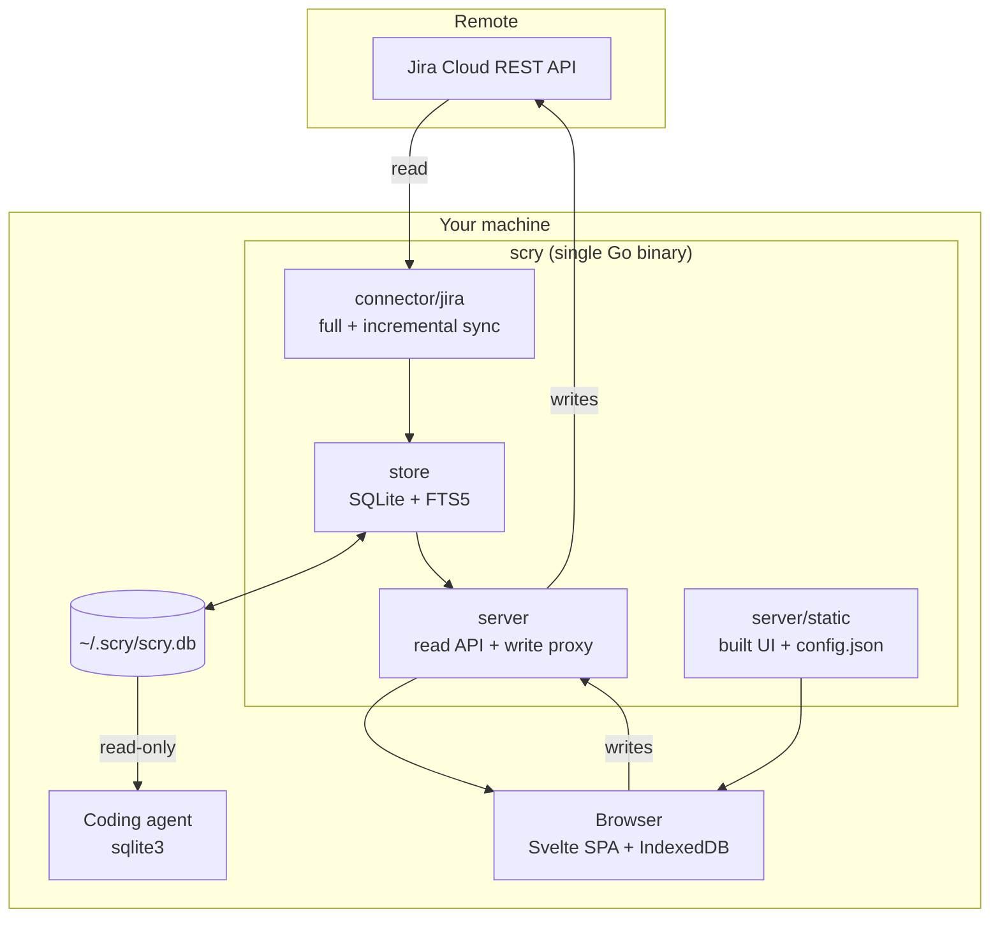

# Architecture

## Shape

One binary, one database, one origin.



The single-origin property is not incidental. Because the UI and the API are
served from the same localhost origin, no CORS handling exists anywhere in the
codebase — which is exactly what a browser-only build could not achieve
(`decisions/0003-local-process.md`).

## Module boundaries

| Package | Owns | Must not know about |
| --- | --- | --- |
| `cmd/scry` | CLI surface, flag parsing, wiring | Jira, SQL |
| `internal/config` | Config file, credential file permissions, client config document | HTTP handlers |
| `internal/store` | Schema, migrations, queries, FTS, transactions | Jira field names, HTTP |
| `internal/connector` | Connector interface and shared sync scaffolding | Jira specifics |
| `internal/connector/jira` | Jira REST client, field mapping, ADF flattening, derived fields | HTTP handlers, SQL text |
| `internal/server` | Routing, the API contract, static serving, attachment proxy | SQL text, Jira REST paths |
| `web/` | Everything the browser does | Anything server-side |

The rule that matters: **`internal/store` never imports anything Jira-shaped, and
`internal/connector/jira` never writes SQL.** The connector produces neutral
records; the store persists them. That boundary is what makes a second connector
a new package rather than a rewrite (Constitution Article 6).

## Three layers of caching, on purpose

1. **SQLite** is the durable mirror. Survives restarts. Queried by agents.
2. **IndexedDB** in the browser holds the last `IssueLite` set so the UI paints
   before any network call completes. This is why cold start feels instant.
3. **The in-memory pool** in the Svelte stores is what filtering actually runs
   against. Filter, group, sort, and substring search never leave memory.

The consequence is a strict rule: a keystroke may not trigger a network request.
Server-side search exists only to reach text the client does not hold (comment
bodies, long descriptions), and it is invoked on Enter, not per character.

## Data flow: reading

```
scry sync         Jira REST -> neutral records -> upsert -> derived fields -> FTS rebuild -> version++
browser boot      IndexedDB -> paint -> GET bootstrap (If-None-Match) -> 304 or replace pool
every 15s         GET delta?since=<cursor> -> upsert/delete in pool and IndexedDB
open an issue     GET <key>/detail/ -> assembled from SQLite, cached per key in the client
type in search    in-memory filter; Enter adds GET search/ for body and comment text
```

## Data flow: writing

```
UI action -> POST/PATCH/PUT to scry
          -> scry calls Jira with the user's credential
          -> on success: re-read that issue from Jira, upsert into SQLite, version++
          -> respond with the refreshed IssueLite
          -> client patches its pool and IndexedDB in place
```

No queue, no optimistic local commit that could diverge, no reconciliation
logic. A failed write returns Jira's own error and the UI rolls back its
optimistic state.

## Derived fields

Computed during sync, from the changelog, per issue. They exist because the
questions people and agents actually ask ("what regressed", "what is stuck") are
not answerable from Jira's current-state fields alone, and computing them per
query would be slow and duplicated across callers.

Every rule that could depend on an installation's vocabulary keys on
`statusCategory` instead of a status name. See `../specs/000-product/data-model.md`
for the rules and `EXTRACTION.md` for what changed from the internal original.

## Frontend structure

```
web/src/
  lib/         config, API client, IndexedDB, ADF renderer, view config, router,
               Korean chosung search, formatting
  stores/      issues (pool + sync), filters (the filter/group/sort engine),
               me (identity, watches, favorites), views, write (write orchestration)
  components/  list/ (virtualized rows, filter bar, menus)
               detail/ (ADF, comments, history, attachments, links)
               write/ (composer, transitions, pickers, dialogs)
               shell/ (layout, auth gate) · personal/ · presence/ · sidebar/
```

`stores/filters.svelte.ts` is the performance-critical file: it holds the filter
engine that must stay under the latency budget at ten thousand issues. Its logic
is source-neutral; only the field schema it reads is Jira-shaped.

## What is deliberately absent

- **No ORM.** Hand-written SQL against a schema that is itself a public contract.
- **No background daemon.** `scry serve --sync` runs the loop in-process; there
  is nothing to install into systemd or launchd.
- **No embedded UI assets in v0.1.** The binary serves `dist/app` from disk.
  Embedding via `embed.FS` is a packaging decision for the release, not an
  architectural one.
- **No plugin system.** The connector interface is a Go interface, not a runtime
  plugin surface. A new source is a new package and a rebuild.
