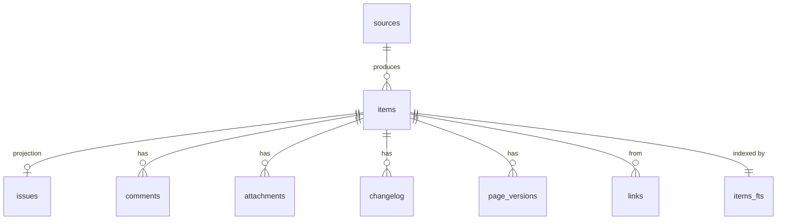

# Data Model

Agents and scripts query this schema directly, so it is versioned, migrated
forward, and documented here.

**How much of it is a contract, while the version is 0.x.** Three things are
promised:

1. The `issues_full` view, and the queries printed in
   [`docs/RECIPES.md`](../../docs/RECIPES.md). Those keep working across minor
   versions, and a column either of them names is never repurposed or silently
   retyped.
2. `gadak sql` stdout: default is one header row plus TSV data rows;
   `--no-header` omits the header (TSV and `--csv`); `--json` is one object
   per row. stdout never carries banners or progress logs (those go to
   stderr).
3. `gadak views open --keys -` reads keys from stdin, splits on commas or
   whitespace, and keeps first-seen order.

Everything else — base tables, indexes, internal columns, the FTS
shadow tables — is documented so you can read it, not promised so you can build
on it. It changed fifteen times in the first month and will change again.

This is deliberately narrower than the earlier wording, which promised the
whole schema. A contract that a solo maintainer cannot honour is worse than a
small one that holds: it is easier to widen a promise later than to take one
back from someone who already built on it. If you need a guarantee on a column
outside the three above, open an issue and say what you are building — that is
how it earns its way in.

**When a migration goes wrong**, the mirror is disposable and the recovery is
one line — `rm ~/.gadak/gadak.db && gadak sync`. Nothing here is a source of
truth; your Atlassian site is. Losing the mirror costs you the time to re-sync
and nothing else: personal state (saved views, watches, favorites, feed read
receipts) and local history live in `local.db`, the sibling file, which the
delete leaves alone.

Default location: `~/.gadak/gadak.db`. `GADAK_HOME` replaces `~/.gadak`; `--profile` / `GADAK_PROFILE` selects `<home>/profiles/<name>/gadak.db`.

## Conventions

- Times are ISO-8601 UTC strings (`2026-08-04T09:15:00Z`). SQLite has no date
  type and string comparison sorts correctly for this format. Timestamps the
  source provides are stored verbatim; the ones gadak writes itself (`synced_at`,
  `deleted_items.deleted_at`) carry milliseconds (`2026-08-04T09:15:00.482Z`)
  because they are also `delta` cursors, and a whole-second cursor drops rows
  written in the second it was taken.
- JSON-valued columns hold arrays or objects and are documented as such. They
  exist so an agent can `json_each` them without a second table when the
  relation is not worth normalizing.
- `NULL` means unknown or absent. Empty string means "known to be empty".
- All identifiers from the source are stored verbatim, never re-keyed.

## Source neutrality

`items` is the source-neutral spine: anything with a title, body, author, and
timestamp fits it. `issues` holds the Jira-specific projection. `pages` holds
the Confluence projection (decision 0006). A second connector reuses `items`,
`items_fts`, `sync_state`, and the whole search path unchanged.



## `sources`

One row per configured connector instance.

| Column | Type | Notes |
| --- | --- | --- |
| `id` | TEXT PK | Stable slug, e.g. `jira` |
| `kind` | TEXT | `jira` in v0.1 |
| `base_url` | TEXT | Site origin, used to build deep links |
| `synced_at` | TEXT | Last successful sync completion |

## `items`

The neutral spine. One row per mirrored object regardless of source.

| Column | Type | Notes |
| --- | --- | --- |
| `id` | TEXT PK | `<source_id>:<external_id>`. The built-in tracker (issuetap) issues the same numeric ids a real site uses, so those rows are stored as `standalone-<source_id>:<external_id>` (`standalone-jira:10001`, `standalone-confluence:20001`). `source_id` stays `jira` / `confluence`; ids are opaque (GDK-241, GDK-344). |
| `source_id` | TEXT | FK to `sources.id` |
| `kind` | TEXT | `issue` in v0.1; `page` reserved for Confluence |
| `external_id` | TEXT | Source's own id |
| `key` | TEXT | Human-facing key, e.g. `NMB-142`. Unique per source |
| `title` | TEXT | Summary / page title |
| `body_text` | TEXT | Flattened plain text of the body, used for FTS |
| `author` | TEXT | Display name of the creator |
| `author_id` | TEXT | Source account id |
| `url` | TEXT | Absolute deep link |
| `created_at` | TEXT | From the source |
| `updated_at` | TEXT | From the source |
| `synced_at` | TEXT | When this row was last written |

Indexes: `(source_id, key)` unique, `(kind, updated_at)`, `(updated_at)`,
`(synced_at)` — the last one is what `delta` scans.

`source_id` references `sources(id)` and every child table
(`issues`, `comments`, `attachments`, `changelog`, `links`) references
`items(id)` with `ON DELETE CASCADE`, so deleting an item is one statement and
cannot leave orphans. This is why `foreign_keys=ON` is not optional.

## `issues` (view since v41) and `issues_raw`

The Jira projection. Since v41 (GDK-1258) the physical table is
`issues_raw` — internal, written by sync, never a documented query surface —
and `issues` is the items-joined view that used to be `issues_full`:
`summary` + every `issues_raw` column + `description_text`. The intuitive
query (`SELECT key, summary, status FROM issues`) is correct by
construction; before v41 it was the single most common agent miss
(GDK-974). `issues_full` remains as a compatibility alias because it is one
of the three 0.x promises above.

The columns below are the storage columns (`issues_raw`, and therefore also
part of the `issues` view). Joined to `items` on `item_id`.

| Column | Type | Notes |
| --- | --- | --- |
| `item_id` | TEXT PK | FK to `items.id` |
| `key` | TEXT | Duplicated from `items` so agents can query one table |
| `project_key` | TEXT | e.g. `NMB` |
| `issue_type` | TEXT | Localized display name as returned by the source |
| `issue_type_id` | TEXT | **Use this for logic**; names are localized |
| `status` | TEXT | Localized display name |
| `status_id` | TEXT | **Use this for logic** |
| `status_category` | TEXT | `new` \| `inprogress` \| `done`. Stable across sites |
| `priority` | TEXT | Display name |
| `priority_id` | TEXT | Stable source id (v22). Empty (`''`) until a sync rewrites the row. **Use this (or `priority_rank`) for logic**; names are localized |
| `priority_rank` | INTEGER | Derived: 1 = most urgent, 0 = unset |
| `assignee` | TEXT | Display name |
| `assignee_id` | TEXT | Account id |
| `assignee_email` | TEXT | Empty when the site hides emails |
| `reporter` | TEXT | Display name |
| `reporter_id` | TEXT | Account id |
| `reporter_email` | TEXT | Empty when the site hides emails |
| `parent_key` | TEXT | Direct parent issue key (an epic for a story, a story for a sub-task) |
| `hierarchy_level` | INTEGER | Source tree rank (v11) — Jira: epic 1, standard 0, sub-task −1. Backfilled from `raw` |
| `epic_key` | TEXT | Derived (v11): key of the nearest `hierarchy_level = 1` ancestor via `parent_key`, recomputed after every upsert batch. NULL when no epic ancestor |
| `labels` | TEXT (JSON array) | |
| `components` | TEXT (JSON array) | |
| `fix_versions` | TEXT (JSON array) | Display names, same order as `fix_version_ids`. **Do not join on these** — names rename. The 0.x RECIPES `json_each(fix_versions)` query still keys on a name |
| `fix_version_ids` | TEXT (JSON array) | Same-order source ids (v31, GDK-532). NULL until the next sync rewrites the row (no backfill). **Use this to join `versions.id`** |
| `affects_versions` | TEXT (JSON array) | |
| `environment_text` | TEXT | Flattened |
| `duedate` | TEXT | Date only |
| `resolution` | TEXT | Display name, NULL while unresolved |
| `resolution_id` | TEXT | Stable source id (v27). Empty (`''`) until a sync rewrites the row. **Use this for logic**; names are localized |
| `sprint_id` | INTEGER | Projected sprint id (v30, GDK-518). NULL when the site has no sprint field, the issue is in none, or a value was not an object. **Use this (or `sprint_state`) for logic**; do not key on `sprint_name` |
| `sprint_name` | TEXT | Display name of the projected sprint. NULL with `sprint_id` |
| `sprint_state` | TEXT | `active` \| `future` \| `closed` of the projected sprint. NULL with `sprint_id` |
| `security_level_id` | TEXT | Origin issue security level id (v32). NULL when unrestricted, the origin sent no security object, or the row predates the next sync (no backfill). **Use this for logic**; names localize |
| `security_level` | TEXT | Display name of that level. NULL with `security_level_id` |
| `created_at` | TEXT | Mirrored from `items` for single-table queries |
| `updated_at` | TEXT | Mirrored from `items` |
| `status_changed_at` | TEXT | Derived: last status transition |
| `resolved_at` | TEXT | Derived: last transition into a `done` category |
| `reopen_count` | INTEGER | Derived: `done` -> not-`done` transitions |
| `reopened_at` | TEXT | Derived: most recent reopen |
| `assignee_changed_at` | TEXT | Derived |
| `comment_count` | INTEGER | Derived |
| `description_adf` | TEXT (JSON) | Raw ADF, rendered by the UI |
| `description_text` | TEXT | Flattened plain text, same flattening as `environment_text`. View column on `issues`/`issues_full` (`items.body_text`; NULL → `''`). Not stored on `issues_raw` |
| `custom` | TEXT (JSON object) | Mapped custom fields, keyed by config alias |
| `raw` | TEXT (JSON) | Full source payload. Escape hatch; not a contract |
| `reopen_reason` | TEXT | Derived (v3): first comment at/after the last reopen. Heuristic; `''` when none |
| `cloned_from` | TEXT | Derived (v3): key of the clone origin. `''` when not a clone |

Indexes: `(project_key, status_category)`, `(assignee_id)`, `(updated_at)`,
`(status_category, updated_at)`, `(reopen_count)`, `(key)` — the last one serves
detail lookups, which arrive by key — and `issues_sprint` on `sprint_id`
`WHERE sprint_id IS NOT NULL` (v30).

An issue can sit in several sprints (closed history plus the current one).
The three columns hold **one** of them: `active` over `future` over `closed`,
and the larger id when the state ties. Sync discovers the field from
`GET /field` (`schema.custom` ending in `com.pyxis.greenhopper.jira:gh-sprint`);
there is no hardcoded customfield id and no board catalog table. The next
sync fills existing rows; the migration does not backfill.

## `versions` (v31)

The project version catalog (`GET /project/{key}/versions` on a Jira-shaped
origin). Rows live and die with sync: full sync and the reconcile pass
upsert the catalog for each project in scope (`cfg.Projects` when set,
otherwise distinct `issues.project_key` already in the mirror) and delete
ids that project no longer advertises. Incremental ticks do not fetch it.
A catalog GET failure is a warning; the issue pass still commits.

Join issues on **id**, never on name:

```sql
FROM issues_full i, json_each(i.fix_version_ids) j
JOIN versions v ON v.id = j.value
```

`fix_versions` (the name array) keeps the meaning the 0.x recipes already
use. The two arrays on one issue are the same order.

| Column | Type | Notes |
| --- | --- | --- |
| `id` | TEXT PK | Origin version id. **The join key** |
| `project_key` | TEXT | Owning project. Indexed (`versions_project`) |
| `name` | TEXT | Display name; can be renamed on the origin |
| `released` | INTEGER | `1` released, `0` not |
| `archived` | INTEGER | `1` archived, `0` not |
| `release_date` | TEXT | Origin `releaseDate` (date only), NULL when the origin omitted it |

Existing rows stay empty until the next full or reconcile pass — no
backfill; the mirror is a cache.

### Derived field rules

Moved to [`docs/DERIVE.md`](../../docs/DERIVE.md) — one file for every column
gadak computes rather than mirrors, with the reasoning behind each rule and
copy-paste queries a test executes verbatim against `examples/demo.db`.

## `spaces` (v14, `homepage_id` v17)

Space display metadata for mirrored wiki pages — real Cloud space keys are
generated strings, so the UI joins here for a human name.

| Column | Type | Notes |
| --- | --- | --- |
| `source_id` | TEXT | PK part; the owning connector (`confluence`) |
| `key` | TEXT | PK part; the space key as the source knows it |
| `name` | TEXT | Display name; `''` when not yet learned |
| `kind` | TEXT | Source's space type string (`global` / `personal`) |
| `homepage_id` | TEXT | Content id of the space's root page (`expand=homepage`); `''` until learned. Breadcrumbs drop the trail segment with this id — the space label already fills that slot |

## `pages` (v9, `body_adf` v10, `labels` v13, `excerpt` v15)

The document projection (Confluence pages; decision 0006). Joined to `items` on
`item_id`; the item row carries `kind = 'page'`, the numeric page id as `key`,
and the flattened ADF body as `body_text`, so FTS and the spine queries need no
change. Comments reuse the `comments` table. Built-in-tracker page item ids use the
`standalone-confluence:` prefix (see `items.id`); the key stays the numeric
external id (GDK-344).

| Column | Type | Notes |
| --- | --- | --- |
| `item_id` | TEXT PK | FK to `items.id`, `ON DELETE CASCADE` |
| `space_key` | TEXT | Confluence space key; indexed (`idx_pages_space`) |
| `parent_id` | TEXT | Direct parent page id, `''` for top-level pages |
| `version` | INTEGER | Source version number of the mirrored copy |
| `status` | TEXT | `current` (source status; trashed pages are not mirrored) |
| `body_adf` | TEXT | Raw ADF document (v10) — what the detail view renders; `body_text` stays the FTS-only flattening |
| `labels` | TEXT (JSON array) | Page label names, alphabetical (v13). `'[]'` when none; only the first `metadata.labels` page (≤25) is collected |
| `excerpt` | TEXT | One-line body preview for document lists (v15). Derived from `body_adf` plain text: whitespace collapsed, at most 200 runes, cut at a word boundary when one exists (CJK at the rune limit). `''` when the body is empty. FTS is contentless, so this column is the only store-side plain preview; recomputed on every page upsert and backfilled on the v15 migration |

## `page_versions` (v21)

Version-history **stamps** for a mirrored wiki page. Joined to `items` on
`item_id`. **Bodies of past versions are not stored.** The current body is
`pages.body_adf`; opening an older revision is a link out to Confluence, not
bytes in the mirror. This is deliberate and matches `changelog` (field
transitions, not whole issues) and `attachments` (metadata, not file bytes):
the mirror is a disposable cache, and a body per edit would multiply it by
edits-per-page.

This table is **not** one of the three 0.x contracts listed at the top of
this file. `message` is a plain column so `gadak sql` can `WHERE message LIKE
…` today. It is not added to `items_fts` — that index is contentless FTS5
keyed per item, not per version.

| Column | Type | Notes |
| --- | --- | --- |
| `item_id` | TEXT | FK to `items.id`, `ON DELETE CASCADE`. Composite PK with `number` |
| `number` | INTEGER | Source version number. Re-collect upserts on `(item_id, number)` and never duplicates |
| `created_at` | TEXT | Source `when` stamp, stored verbatim. NULL when the listing omitted it |
| `author_id` | TEXT | Account id of the editor (`''` when the site omitted it). **Use this for logic**; `author_name` is a display name |
| `author_name` | TEXT | Display name of the editor as returned by the source |
| `message` | TEXT | Editor's "what changed" note. The reason this table exists. `''` when none |
| `minor_edit` | INTEGER | `1` when the source marked the edit minor, else `0`. Lets a UI hide minor edits |

Primary key: `(item_id, number)`. Index: `(item_id, created_at)`.

Sync refetches the listing only when no row exists for the page's current
`pages.version`. An unchanged version number cannot have grown new history.
A failed history fetch is logged and the rest of the pass continues.

## `comments`

| Column | Type | Notes |
| --- | --- | --- |
| `id` | TEXT PK | `<source_id>:<comment_id>`. Built-in-tracker mirrors use the same `standalone-<source_id>:` prefix as the parent item (GDK-241 issues, GDK-344 wiki comments). |
| `item_id` | TEXT | FK |
| `external_id` | TEXT | |
| `author` | TEXT | |
| `author_id` | TEXT | |
| `body_adf` | TEXT (JSON) | Raw, for rendering |
| `body_text` | TEXT | Flattened, for FTS |
| `created_at` | TEXT | |
| `updated_at` | TEXT | |
| `visibility_type` | TEXT NOT NULL DEFAULT `''` | Origin restriction type (`role` or `group`). Empty when unrestricted. Linear and wiki comments have no such field and stay empty. |
| `visibility_value` | TEXT NOT NULL DEFAULT `''` | Origin restriction name (Jira `visibility.value`). Empty when unrestricted. |
| `jsd_public` | INTEGER | JSM `jsdPublic`. NULL when the origin omitted the key; `0` is internal, `1` is customer-visible. Absence and `false` are distinct. |

Index: `(item_id, created_at)`.

Jira's REST API exposes comments as a flat list with no thread parent, so gadak
stores them flat. Reply affordances in the UI are a mention convention, not a
tree.

## `dev_links`

v29 (GDK-497). The development-panel pull-request links the origin holds for
an issue — Jira's dev-status on a Jira workspace (mirrored only when
`devStatus` is set in config.json; the API is Atlassian-internal), issuetap's
own store on the built-in tracker (written through `gadak dev link`). Rows live
and die with the issue rewrite, like comments. `(item_id, url)` is the
primary key — url is the idempotent key both origins use.

v33 (GDK-589) added the author/actor/branch columns. **`author` and `actor`
are different axes**: author is the pull request's author (a human's login);
actor is who wrote the link (issuetap's `X-Issuetap-Actor` — typically an
agent). Never fold one into the other.

v37 (GDK-592) added `kind` = `deployment` / `build` rows and the
`environment` column. A dev-status **answer enumerates pull requests only**
(it is built from the summary's `pullrequest` count — Cloud's detail row
vocabulary for builds/deployments was never captured), so a sync rewrite
replaces the `pullrequest` rows and never drains the others; deployment and
build rows enter the mirror only through `gadak dev deploy` / `gadak dev
build`, from the origin's 201 echo. A url-less row stores the origin's id
(`environment:<name>` / `build:<number>`) in `url` — the idempotent key both
origins use, and the PK needs it to tell two url-less rows apart.

| Column | Type | Notes |
| --- | --- | --- |
| `item_id` | TEXT | FK |
| `kind` | TEXT | `pullrequest` / `deployment` / `build` |
| `external_id` | TEXT | origin's id for the link (the build number on a build row) |
| `url` | TEXT | idempotent key; the origin's id when the row has no url |
| `title` | TEXT | |
| `status` | TEXT | PR `open`/`merged`/`declined`; deployment free-form (`successful`, …); build `successful`/`failed`/`unknown` |
| `author` | TEXT | PR author's login (Cloud `author.name`). `''` when the origin sent none |
| `actor` | TEXT | account id of who wrote the link (issuetap `X-Issuetap-Actor`). `''` on Cloud |
| `actor_name` | TEXT | display name of the link writer. `''` on Cloud |
| `branch` | TEXT | PR head ref (Cloud `source.branch`). `''` when the origin sent none |
| `environment` | TEXT | deployment target (`production`, `staging`, …). `''` on PR/build rows (v37) |
| `updated_at` | TEXT | |

## `attachments`

Metadata only. Bytes are fetched on demand and proxied, never mirrored, so the
database stays small and no file content is ever committed in a snapshot.

| Column | Type | Notes |
| --- | --- | --- |
| `id` | TEXT PK | |
| `item_id` | TEXT | FK |
| `external_id` | TEXT | Used to build the content proxy path |
| `filename` | TEXT | |
| `mime_type` | TEXT | |
| `size` | INTEGER | Bytes |
| `author` | TEXT | |
| `created_at` | TEXT | |
| `url` | TEXT | Origin content URL when the source does not share Jira's `/attachment/content/{id}` path. Empty for Jira (the proxy reconstructs it). |

## `changelog`

| Column | Type | Notes |
| --- | --- | --- |
| `id` | TEXT | PK is `(item_id, id)` since v39 — a child row's id is only unique inside its item (GDK-1179; same for `comments` and `attachments`). |
| `item_id` | TEXT | FK, PK |
| `at` | TEXT | |
| `author` | TEXT | |
| `field` | TEXT | `status`, `assignee`, `priority`, ... |
| `from_value` | TEXT | Display value |
| `from_id` | TEXT | |
| `to_value` | TEXT | |
| `to_id` | TEXT | |

Index: `(item_id, at)`, `(field, at)`.

Kept because it is the source of every derived field and the only way to answer
"when did this actually change" questions. It is also what makes reopen and
staleness analysis possible offline.

## `status_catalog` (v34)

| Column | Type | Notes |
| --- | --- | --- |
| `source_id` | TEXT | `jira` (PK with `status_id`) |
| `status_id` | TEXT | Origin-minted id |
| `category` | TEXT | `new` \| `inprogress` \| `done` |

The origin's status catalog, cached by every sync pass (the connector already
fetches it to derive fields). The changelog stores bare status ids, so any
history walk needs the id → category mapping again later; before this table the
mapping lived only in the pass's memory and an id was resolvable only while some
mirrored issue *currently* sat in that status. Origin reference data — a wipe
costs one re-sync — and not time-in-status values, which stay deliberately
absent: `gadak issue`'s wait/progress line computes them from the changelog at
read time (GDK-591).

## `users` (v36)

| Column | Type | Notes |
| --- | --- | --- |
| `source_id` | TEXT | `jira` (PK with `account_id`) |
| `account_id` | TEXT | Origin-minted account id |
| `name` | TEXT | Display name |
| `email` | TEXT | Empty when the origin hides it (the built-in tracker's agents have none) |
| `account_type` | TEXT | Origin's spelling: `agent` (built-in-tracker actors), `app` (Cloud Connect), `atlassian` / `customer` (humans) |

The origin's account catalog, cached by every sync pass from user payloads the
sync already reads — assignee, reporter, creator, comment/attachment/changelog
authors (GDK-590). Upserts merge: a later payload that omits a field keeps what
the catalog knows. Dev-panel link actors are not collected (that payload carries
no `account_type`). The bot judgement on `account_type` values lives in one
function (`jira.IsBotAccountType`: `agent` and `app` are bots) — never re-derive
it from display names, here or in any tool. Origin reference data: no backfill,
a wipe costs one re-sync.

## `issue_actors` (view, v36)

Every (issue, account) touch across `comments.author_id` ∪ `changelog.author_id`
∪ `dev_links.actor` — one row per touch, `via` naming the source (`comment` /
`changelog` / `dev_link`). What "issues this account touched" joins on when
`issues_full` alone cannot answer it (assignee/reporter columns cover only the
two named seats). The RECIPES bot query joins this view with `users` on
`account_id` — ids, never display names.

## `links`

| Column | Type | Notes |
| --- | --- | --- |
| `item_id` | TEXT | FK, the source side |
| `type` | TEXT | `Relates`, `Blocks`, `Duplicate`, ... |
| `direction` | TEXT | `inward` \| `outward` |
| `target_key` | TEXT | May reference an issue outside the mirror |

Primary key: `(item_id, type, direction, target_key)`.

## `item_refs` (v16)

Text-derived cross-references between the two kinds: page bodies that mention
issue keys, and issue bodies/comments that mention wiki page URLs. This is what
connects the wiki axis to the issue axis — Jira remote links are not collected,
so mentions in text are the only signal, extracted at upsert time and backfilled
on the v16 migration.

| Column | Type | Notes |
| --- | --- | --- |
| `item_id` | TEXT | FK to `items.id`, `ON DELETE CASCADE` — the side that contains the mention |
| `target_kind` | TEXT | `issue` \| `page` |
| `target_key` | TEXT | Issue key (`ABC-123`) or numeric page id string. May reference an item outside the mirror; readers join `items` on `key` + `kind` and surface live rows only |
| `via` | TEXT | `url` (a `/browse/…`, `/wiki/spaces/…/pages/…`, or `pageId=` link) \| `text` (a bare issue key in plain text, accepted only when its project prefix exists in the mirror) |

Primary key: `(item_id, target_kind, target_key)`; index on
`(target_kind, target_key)` for the backlink direction. Refs are recomputed
(delete + insert) inside the same transaction as every item upsert, so they
never outlive an edit that removed the mention.

## `deleted_items`

Tombstones. Jira reports nothing when an issue leaves scope, so the reconcile
pass proves absence and deletes the row — but a client that was offline at that
moment would keep showing it forever. `delta` reads its `deleted_keys` from here.

| Column | Type | Notes |
| --- | --- | --- |
| `key` | TEXT PK | The key that vanished upstream |
| `source_id` | TEXT | Which source it belonged to |
| `deleted_at` | TEXT | When the mirror dropped it; the `delta` cursor compares against this |

Index: `(deleted_at)`.

Rows expire after 90 days. A client offline longer than that needs a full
`bootstrap`, which it gets anyway from the `version` mismatch. Re-mirroring a key
clears its tombstone, so an issue that comes back stops being reported as gone.

## `enrichments`

The plugin boundary. Integrations that cannot live in this repository — a
deployment tracker, a test-management tool, an internal review bot — run as
separate processes in any language and **write to this table directly with SQL**.
The server merges what it finds into its responses; it never calls a plugin, and
there is no plugin API beyond this schema.

| Column | Type | Notes |
| --- | --- | --- |
| `key` | TEXT | Issue key, e.g. `NMB-42`. No foreign key: a plugin may run before or after the issue is mirrored |
| `kind` | TEXT | Open set. `deploy`, `qa`, `prs`, `opinion` are the kinds the UI renders today |
| `payload` | TEXT (JSON) | Shape per kind is in `docs/PLUGINS.md`. `deploy` and `qa` feed both a list field and a detail field, so they wrap two objects (`{"status":…,"detail":…}`, `{"impact":…,"context":…}`); a bare object is still accepted and feeds whichever field it matches |
| `source` | TEXT | Plugin name, informational only |
| `updated_at` | TEXT | When the plugin last wrote the row |

Primary key: `(key, kind)`, so a plugin upserts with
`ON CONFLICT(key, kind) DO UPDATE`. Index: `(kind)`, which is the server's read
path.

**A plugin must bump the version counter after writing**, or the UI will serve a
cached `bootstrap` and the new rows stay invisible until the next sync:

```sql
INSERT INTO enrichments (key, kind, payload, source, updated_at)
VALUES ('NMB-42', 'deploy', json('{"state":"prod"}'), 'my-plugin', strftime('%Y-%m-%dT%H:%M:%SZ','now'))
ON CONFLICT(key, kind) DO UPDATE SET
  payload = excluded.payload, source = excluded.source, updated_at = excluded.updated_at;

UPDATE sync_state SET version = version + 1;
```

Deleting the database and re-syncing loses enrichments, which is correct: they
are derived from a system that still has them (Constitution Article 1). Nothing a
user would mourn may live only here.

## `items_fts`

FTS5 external-content table over `items(title, body_text)` plus comment bodies.

```sql
CREATE VIRTUAL TABLE items_fts USING fts5(
  title, body_text, comments_text, cjk_bigram,
  content='',            -- contentless: rows are rebuilt on sync
  contentless_delete=1,  -- lets one row be replaced without the old values
  tokenize='unicode61 remove_diacritics 2'
);
```

`rowid` is `items.rowid`, which is what makes the documented join work. A
contentless table has no update path, so sync replaces a row by deleting and
re-inserting it; `contentless_delete=1` (SQLite 3.43+) is what allows the delete
without re-supplying the previous column values.

`unicode61` is used rather than a CJK-aware tokenizer because the fallback path
matters more than perfect segmentation: Korean substring narrowing already
happens client-side over the warm issue pool, and FTS is for body and comment
text where prefix matching is enough. CJK mid-compound matching is app-layer
(v25 / `docs/decisions/0009`): the `cjk_bigram` column carries the overlapping
2-grams of CJK runs from the title, body and comments, and the app rewrites a
CJK term of two or more runes as the AND of those bigrams — `MATCH '결제'` hits
`간편결제` with or without the rewrite. A `trigram` tokenizer was measured and
rejected: a 2-character query emits no trigram tokens, so `MATCH` silently
returns 0 rows, and it wrecks English precision (`ency` → 0.342). English is
deliberately not n-grammed — `ency` does not match `idempotency`.

## Personal state in `local.db`: `saved_views`, `watches`, `favorites`, `feed_reads`

Local personal state. These are the only rows a user would miss if the
database were deleted, so `gadak export` dumps the first three and `gadak
import` restores them (name or key conflict: the file wins). Since v26 they
live in `local.db` — the sibling file ATTACHed as schema `local` — not in the
mirror, so `rm gadak.db` can no longer delete them (GDK-105). Reach them
through the `local.` prefix (`SELECT * FROM local.saved_views`) — that is the
documented spelling. Databases upgraded from v25 carried mirror-side tables of
the same names as frozen leftovers of the v26 copy; schema v38 (GDK-824)
dropped them. While they existed an unprefixed `saved_views` resolved to
main's frozen snapshot and shadowed the local truth; after the drop an
unprefixed name falls through to `local.*`, so a missing `local.` prefix is
no longer silently wrong, but write it anyway — the prefix is the contract.

| Table | Columns |
| --- | --- |
| `local.saved_views` | `id` PK, `name`, `config` (JSON), `created_at`, `updated_at` |
| `local.watches` | `key` PK, `created_at` |
| `local.favorites` | `key` PK, `created_at` |
| `local.feed_reads` | `event_id` PK, `read_at` |

Feed read receipts record which computed feed event ids the user has marked
read; feed events themselves are never stored — the feed is computed from the
mirror at query time (status/assignee changelog, comments, attachments, issue
creates). `event_id` is a deterministic id: `cl:<item_id>:<changelog.id>`,
`cm:<item_id>:<comment.id>`, `at:<item_id>:<attachment.id>`, `cr:<issue.key>`,
or `fl:<item_id>:<at>` for grouped field changes.

## Replacing the origin

A workspace is bound to one origin, and converting a workspace on the built-in tracker to a
site replaces it. An issue key is not globally unique — `init --local`
seeds project `STD`, and a real site's project can be `STD` too — so a row
naming the old origin's `STD-1` does not become stale when the origin changes.
It rebinds to whatever the new site has at that key, which is worse than losing
it.

Every table therefore carries a classification in
`internal/store/origin_scope.go`, and a test enumerates `sqlite_master` and
fails on one that does not (the earlier hand-maintained list silently missed
four tables added by later migrations):

| Class | Conversion | Tables |
| --- | --- | --- |
| mirror | dropped | the mirror spine and everything the `sources` cascade reaches |
| derived | dropped | `local.watches`, `local.favorites`, `enrichments`, `sync_runs`, `local.feed_reads`, `field_usage`, `local.recents` — ours, but every row names a key, project, source or account id the origin minted |
| authored | kept | `local.saved_views`. Views whose stored query names a retired project are reported, never deleted |
| local | kept | `api_usage`, and `local.visits` / `local.searches`, which carry an `origin_epoch`: the timeline shows the current generation only, and retired rows stay readable with `gadak sql` |

## `source_queries` (v18)

Named queries mirrored from a connector. Jira fills this with the account's
owned and starred saved filters; a re-sync replaces that source's rows. Not
personal state: delete the database and they come back from Jira. Distinct
from `saved_views`, which are authored in gadak.

| Column | Type | Notes |
| --- | --- | --- |
| `id` | TEXT PK | `"<source_id>:<external_id>"` |
| `source_id` | TEXT | FK `sources.id` |
| `external_id` | TEXT | Filter id on the source |
| `name` | TEXT | Display name |
| `query_text` | TEXT | Original query (JQL for Jira) |
| `config` | TEXT | Compiled ViewConfig JSON (filters + display) |
| `favourite` | INTEGER | 1 if starred on the source |
| `owner` | TEXT | Display name of the owner |
| `applied` | TEXT | JSON string array of JQL clauses that compiled |
| `unsupported` | TEXT | JSON string array of clauses that did not |
| `updated_at` | TEXT | |

## `sync_state`

| Column | Type | Notes |
| --- | --- | --- |
| `source_id` | TEXT PK | |
| `watermark` | TEXT | Highest `updated` seen, the next incremental cursor. Never moves backwards |
| `version` | INTEGER | Monotonic counter, bumped by every write that changed mirrored rows. Drives the UI's ETag |
| `last_full_sync_at` | TEXT | |
| `last_error` | TEXT | NULL when the last sync succeeded |
| `schema_version` | INTEGER | Migration level, mirroring `PRAGMA user_version` |
| `first_sync_at` | TEXT | First successful sync for this source (retention instrumentation). Set once |
| `sync_count` | INTEGER | Successful sync runs. Failed runs leave it alone |
| `last_notified_at` | TEXT | OS desktop-notification watermark. Independent of `feed_reads` — delivering an alert must not mark the feed read |
| `locale` | TEXT | Origin locale the jira source's display names were fetched under (v35, GDK-597). The sync pass compares it with the configured locale and rebuilds when they differ — names are cached and incremental sync would otherwise keep the old language. NULL (pre-v35) reads as `""` = English |

The `version` counter is what lets `bootstrap` answer `304 Not Modified` without
hashing the whole mirror. It moves only when row content changed, which is what
makes an incremental run over the watermark overlap window a genuine no-op: a
re-fetched issue whose `updated` is unchanged is skipped, not rewritten.

`PRAGMA user_version` is the authoritative migration level — it is set in the
same transaction as the migration itself, so a half-applied schema is impossible.
`schema_version` here is a copy for anything reading the mirror over SQL. Opening
a database whose level is higher than the binary knows is refused, never
silently used.

## `issues` / `issues_full` (views)

`issues` is the agent view since v41: `summary` from `items.title`, every
storage column, and `description_text` (`items.body_text`, NULL → `''`), so
queries that need a title or body do not have to join the spine.
`issues_full` is its alias — the name the 0.x contract promises — and stays
column-identical.

```sql
CREATE VIEW issues AS
  SELECT it.title AS summary, i.*, COALESCE(it.body_text, '') AS description_text
  FROM issues_raw i JOIN items it ON it.id = i.item_id;
CREATE VIEW issues_full AS SELECT * FROM issues;
```

History: the view was born as `issues_full` and rebuilt whenever storage
gained a column (v12 hierarchy_level/epic_key, v23 description_text, v27
resolution_id, v30 sprint_*, v31 fix_version_ids, v32 security_level_*),
because SQLite expands `i.*` at CREATE VIEW time — an `ALTER TABLE` alone
would hide new columns from it. That rule still holds, doubled: a migration
that adds a storage column must recreate **both** views, `issues` first.

## `api_usage`

Per-UTC-day outbound Jira HTTP volume accumulated by this process. **Personal
operational data, not mirrored Jira content** — a wipe of this table loses only
local rate-limit visibility, never issue history. Counts are our own call
volume (including retries); they are not Jira's remaining point budget.

| Column | Type | Notes |
| --- | --- | --- |
| `day` | TEXT PK | UTC date, `YYYY-MM-DD` |
| `requests` | INTEGER | HTTP attempts actually sent (each retry counts) |
| `throttled` | INTEGER | 429 responses |
| `server_errors` | INTEGER | 5xx responses, excluding 429 |
| `retries` | INTEGER | Attempts re-sent after a wait |
| `wait_ms` | INTEGER | Milliseconds spent sleeping for backoff / `Retry-After` |
| `last_throttled_at` | TEXT | UTC timestamp of the most recent 429 that day, if any |

## `field_usage`

Per-project fill counts for discovered custom-field aliases, recomputed from
`issues.custom` after discovery, a full sync, or a reconcile pass. Derived
data — a wipe costs one recompute, never history. The UI uses it to offer only
the filter axes a board actually fills.

| Column | Type | Notes |
| --- | --- | --- |
| `project_key` | TEXT | Project the counts are for (PK with `alias`) |
| `alias` | TEXT | Field-spec alias (`config.fields[].alias`) |
| `filled` | INTEGER | Issues in the project with a value for the alias |
| `total` | INTEGER | Issues in the project |

## `sync_runs`

Short history of meaningful sync passes — ones that changed something, were a
full pass, or failed. The watch loop's no-op incrementals are not recorded,
and the table prunes to the newest 100 per source. Backs the sync-history
popover in the web UI (`GET sync/runs/`).

| Column | Type | Notes |
| --- | --- | --- |
| `id` | INTEGER PK | Autoincrement; newest = highest |
| `source_id` | TEXT | `jira` |
| `kind` | TEXT | `full` / `incremental`, with `+reconcile` when deletions ran |
| `started_at` / `finished_at` | TEXT | UTC RFC3339 |
| `fetched` / `changed` / `deleted` | INTEGER | Run totals |
| `error` | TEXT | NULL on success |

## Example queries

Moved to [`docs/DERIVE.md`](../../docs/DERIVE.md) — every documented SQL query
lives in that one file now, and `TestDocumentedExampleQueries` in
`internal/store` executes each `sql` fence there verbatim against a copy of
`examples/demo.db`, so an edit that no longer parses (or returns too few rows)
fails the build.
