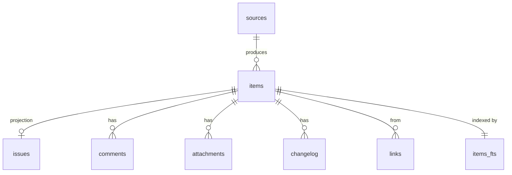

# Data Model

Agents and scripts query this schema directly, so it is versioned, migrated
forward, and documented here.

**How much of it is a contract, while the version is 0.x.** Two things are
promised: the `issues_full` view, and the queries printed in
[`docs/RECIPES.md`](../../docs/RECIPES.md). Those keep working across minor
versions, and a column either of them names is never repurposed or silently
retyped. Everything else — base tables, indexes, internal columns, the FTS
shadow tables — is documented so you can read it, not promised so you can build
on it. It changed fifteen times in the first month and will change again.

This is deliberately narrower than the earlier wording, which promised the
whole schema. A contract that a solo maintainer cannot honour is worse than a
small one that holds: it is easier to widen a promise later than to take one
back from someone who already built on it. If you need a guarantee on a column
outside the two above, open an issue and say what you are building — that is
how it earns its way in.

**When a migration goes wrong**, the mirror is disposable and the recovery is
one line — `rm -rf ~/.scry && scry sync`. Nothing here is a source of truth;
your Atlassian site is. Losing the mirror costs you the time to re-sync and
nothing else.

Default location: `~/.scry/scry.db`. Override with `--db` or `SCRY_DB`.

## Conventions

- Times are ISO-8601 UTC strings (`2026-08-04T09:15:00Z`). SQLite has no date
  type and string comparison sorts correctly for this format. Timestamps the
  source provides are stored verbatim; the ones scry writes itself (`synced_at`,
  `deleted_items.deleted_at`) carry milliseconds (`2026-08-04T09:15:00.482Z`)
  because they are also `delta` cursors, and a whole-second cursor drops rows
  written in the second it was taken.
- JSON-valued columns hold arrays or objects and are documented as such. They
  exist so an agent can `json_each` them without a second table when the
  relation is not worth normalizing.
- `NULL` means unknown or absent. Empty string means "known to be empty".
- All identifiers from the source are stored verbatim, never re-keyed.

## Source neutrality

`items` is the source-neutral spine: anything with a title, body, author, and
timestamp fits it. `issues` holds the Jira-specific projection. A second
connector (Confluence is the intended next one) adds its own projection table and
reuses `items`, `items_fts`, `sync_state`, and the whole search path unchanged.

v0.1 ships only the Jira projection. The spine exists from the start because
retrofitting it later would mean rewriting every query an agent has already
written against the shipped schema.



## `sources`

One row per configured connector instance.

| Column | Type | Notes |
| --- | --- | --- |
| `id` | TEXT PK | Stable slug, e.g. `jira` |
| `kind` | TEXT | `jira` in v0.1 |
| `base_url` | TEXT | Site origin, used to build deep links |
| `synced_at` | TEXT | Last successful sync completion |

## `items`

The neutral spine. One row per mirrored object regardless of source.

| Column | Type | Notes |
| --- | --- | --- |
| `id` | TEXT PK | `<source_id>:<external_id>` |
| `source_id` | TEXT | FK to `sources.id` |
| `kind` | TEXT | `issue` in v0.1; `page` reserved for Confluence |
| `external_id` | TEXT | Source's own id |
| `key` | TEXT | Human-facing key, e.g. `NMB-142`. Unique per source |
| `title` | TEXT | Summary / page title |
| `body_text` | TEXT | Flattened plain text of the body, used for FTS |
| `author` | TEXT | Display name of the creator |
| `author_id` | TEXT | Source account id |
| `url` | TEXT | Absolute deep link |
| `created_at` | TEXT | From the source |
| `updated_at` | TEXT | From the source |
| `synced_at` | TEXT | When this row was last written |

Indexes: `(source_id, key)` unique, `(kind, updated_at)`, `(updated_at)`,
`(synced_at)` — the last one is what `delta` scans.

`source_id` references `sources(id)` and every child table
(`issues`, `comments`, `attachments`, `changelog`, `links`) references
`items(id)` with `ON DELETE CASCADE`, so deleting an item is one statement and
cannot leave orphans. This is why `foreign_keys=ON` is not optional.

## `issues`

The Jira projection. Joined to `items` on `item_id`.

| Column | Type | Notes |
| --- | --- | --- |
| `item_id` | TEXT PK | FK to `items.id` |
| `key` | TEXT | Duplicated from `items` so agents can query one table |
| `project_key` | TEXT | e.g. `NMB` |
| `issue_type` | TEXT | Localized display name as returned by the source |
| `issue_type_id` | TEXT | **Use this for logic**; names are localized |
| `status` | TEXT | Localized display name |
| `status_id` | TEXT | **Use this for logic** |
| `status_category` | TEXT | `new` \| `inprogress` \| `done`. Stable across sites |
| `priority` | TEXT | Display name |
| `priority_rank` | INTEGER | Derived: 1 = most urgent, 0 = unset |
| `assignee` | TEXT | Display name |
| `assignee_id` | TEXT | Account id |
| `assignee_email` | TEXT | Empty when the site hides emails |
| `reporter` | TEXT | Display name |
| `reporter_id` | TEXT | Account id |
| `reporter_email` | TEXT | Empty when the site hides emails |
| `parent_key` | TEXT | Direct parent issue key (an epic for a story, a story for a sub-task) |
| `hierarchy_level` | INTEGER | Source tree rank (v11) — Jira: epic 1, standard 0, sub-task −1. Backfilled from `raw` |
| `epic_key` | TEXT | Derived (v11): key of the nearest `hierarchy_level = 1` ancestor via `parent_key`, recomputed after every upsert batch. NULL when no epic ancestor |
| `labels` | TEXT (JSON array) | |
| `components` | TEXT (JSON array) | |
| `fix_versions` | TEXT (JSON array) | |
| `affects_versions` | TEXT (JSON array) | |
| `environment_text` | TEXT | Flattened |
| `duedate` | TEXT | Date only |
| `resolution` | TEXT | Display name, NULL while unresolved |
| `created_at` | TEXT | Mirrored from `items` for single-table queries |
| `updated_at` | TEXT | Mirrored from `items` |
| `status_changed_at` | TEXT | Derived: last status transition |
| `resolved_at` | TEXT | Derived: last transition into a `done` category |
| `reopen_count` | INTEGER | Derived: `done` -> not-`done` transitions |
| `reopened_at` | TEXT | Derived: most recent reopen |
| `assignee_changed_at` | TEXT | Derived |
| `comment_count` | INTEGER | Derived |
| `description_adf` | TEXT (JSON) | Raw ADF, rendered by the UI |
| `custom` | TEXT (JSON object) | Mapped custom fields, keyed by config alias |
| `raw` | TEXT (JSON) | Full source payload. Escape hatch; not a contract |
| `reopen_reason` | TEXT | Derived (v3): first comment at/after the last reopen. Heuristic; `''` when none |
| `cloned_from` | TEXT | Derived (v3): key of the clone origin. `''` when not a clone |

Indexes: `(project_key, status_category)`, `(assignee_id)`, `(updated_at)`,
`(status_category, updated_at)`, `(reopen_count)`, `(key)` — the last one serves
detail lookups, which arrive by key.

### Derived field rules

Each rule is computed during sync from the changelog, and every rule that would
otherwise depend on site-specific naming keys on `statusCategory` instead.

| Field | Rule |
| --- | --- |
| `status_changed_at` | Timestamp of the newest changelog entry whose field is `status` |
| `resolved_at` | Timestamp of the newest transition whose target category is `done`; NULL if the current category is not `done` |
| `reopen_count` | Count of changelog transitions from a `done`-category status to a non-`done` one |
| `reopened_at` | Timestamp of the newest such transition |
| `assignee_changed_at` | Timestamp of the newest changelog entry whose field is `assignee` |
| `priority_rank` | Position in the site's priority list, 1-based; 0 when unset or unknown |
| `items.body_text` | ADF flattened to plain text, plus any custom fields configured as body text. It lives on the spine, not on `issues`, because it is what FTS indexes |
| `comment_count` | Number of rows in `comments` for the issue |
| `reopen_reason` | Body text of the earliest comment created at or after `reopened_at`, capped at 1000 bytes on a rune boundary. A heuristic: it surfaces the explanation on teams where whoever reopens says why in a comment. Empty when never reopened or no comment followed |
| `cloned_from` | Target of an inward link whose type name contains "clone" (Jira's default "Cloners" type). Caveat: link type names are site configuration created in the site's language — a non-English clone type derives nothing, and there is no language-stable id to key on. The read API also exposes `source_project`, the key's project prefix |

A status id the site's status list does not cover counts as **not** `done`. That
direction is deliberate: it can only miss a reopen, never invent one.

Deliberately absent: time-in-status. The internal system this was extracted from
carried a `working_hours_in_status` column that no code ever populated, and the
UI's "stale" view read it as always zero. Staleness is computed from
`status_changed_at` instead, with the threshold in configuration.

## `spaces` (v14, `homepage_id` v17)

Space display metadata for mirrored wiki pages — real Cloud space keys are
generated strings, so the UI joins here for a human name.

| Column | Type | Notes |
| --- | --- | --- |
| `source_id` | TEXT | PK part; the owning connector (`confluence`) |
| `key` | TEXT | PK part; the space key as the source knows it |
| `name` | TEXT | Display name; `''` when not yet learned |
| `kind` | TEXT | Source's space type string (`global` / `personal`) |
| `homepage_id` | TEXT | Content id of the space's root page (`expand=homepage`); `''` until learned. Breadcrumbs drop the trail segment with this id — the space label already fills that slot |

## `pages` (v9, `body_adf` v10, `labels` v13, `excerpt` v15)

The document projection (Confluence pages; decision 0006). Joined to `items` on
`item_id`; the item row carries `kind = 'page'`, the numeric page id as `key`,
and the flattened ADF body as `body_text`, so FTS and the spine queries need no
change. Comments reuse the `comments` table.

| Column | Type | Notes |
| --- | --- | --- |
| `item_id` | TEXT PK | FK to `items.id`, `ON DELETE CASCADE` |
| `space_key` | TEXT | Confluence space key; indexed (`idx_pages_space`) |
| `parent_id` | TEXT | Direct parent page id, `''` for top-level pages |
| `version` | INTEGER | Source version number of the mirrored copy |
| `status` | TEXT | `current` (source status; trashed pages are not mirrored) |
| `body_adf` | TEXT | Raw ADF document (v10) — what the detail view renders; `body_text` stays the FTS-only flattening |
| `labels` | TEXT (JSON array) | Page label names, alphabetical (v13). `'[]'` when none; only the first `metadata.labels` page (≤25) is collected |
| `excerpt` | TEXT | One-line body preview for document lists (v15). Derived from `body_adf` plain text: whitespace collapsed, at most 200 runes, cut at a word boundary when one exists (CJK at the rune limit). `''` when the body is empty. FTS is contentless, so this column is the only store-side plain preview; recomputed on every page upsert and backfilled on the v15 migration |

## `comments`

| Column | Type | Notes |
| --- | --- | --- |
| `id` | TEXT PK | `<source_id>:<comment_id>` |
| `item_id` | TEXT | FK |
| `external_id` | TEXT | |
| `author` | TEXT | |
| `author_id` | TEXT | |
| `body_adf` | TEXT (JSON) | Raw, for rendering |
| `body_text` | TEXT | Flattened, for FTS |
| `created_at` | TEXT | |
| `updated_at` | TEXT | |

Index: `(item_id, created_at)`.

Jira's REST API exposes comments as a flat list with no thread parent, so scry
stores them flat. Reply affordances in the UI are a mention convention, not a
tree.

## `attachments`

Metadata only. Bytes are fetched on demand and proxied, never mirrored, so the
database stays small and no file content is ever committed in a snapshot.

| Column | Type | Notes |
| --- | --- | --- |
| `id` | TEXT PK | |
| `item_id` | TEXT | FK |
| `external_id` | TEXT | Used to build the content proxy path |
| `filename` | TEXT | |
| `mime_type` | TEXT | |
| `size` | INTEGER | Bytes |
| `author` | TEXT | |
| `created_at` | TEXT | |

## `changelog`

| Column | Type | Notes |
| --- | --- | --- |
| `id` | TEXT PK | |
| `item_id` | TEXT | FK |
| `at` | TEXT | |
| `author` | TEXT | |
| `field` | TEXT | `status`, `assignee`, `priority`, ... |
| `from_value` | TEXT | Display value |
| `from_id` | TEXT | |
| `to_value` | TEXT | |
| `to_id` | TEXT | |

Index: `(item_id, at)`, `(field, at)`.

Kept because it is the source of every derived field and the only way to answer
"when did this actually change" questions. It is also what makes reopen and
staleness analysis possible offline.

## `links`

| Column | Type | Notes |
| --- | --- | --- |
| `item_id` | TEXT | FK, the source side |
| `type` | TEXT | `Relates`, `Blocks`, `Duplicate`, ... |
| `direction` | TEXT | `inward` \| `outward` |
| `target_key` | TEXT | May reference an issue outside the mirror |

Primary key: `(item_id, type, direction, target_key)`.

## `item_refs` (v16)

Text-derived cross-references between the two kinds: page bodies that mention
issue keys, and issue bodies/comments that mention wiki page URLs. This is what
connects the wiki axis to the issue axis — Jira remote links are not collected,
so mentions in text are the only signal, extracted at upsert time and backfilled
on the v16 migration.

| Column | Type | Notes |
| --- | --- | --- |
| `item_id` | TEXT | FK to `items.id`, `ON DELETE CASCADE` — the side that contains the mention |
| `target_kind` | TEXT | `issue` \| `page` |
| `target_key` | TEXT | Issue key (`ABC-123`) or numeric page id string. May reference an item outside the mirror; readers join `items` on `key` + `kind` and surface live rows only |
| `via` | TEXT | `url` (a `/browse/…`, `/wiki/spaces/…/pages/…`, or `pageId=` link) \| `text` (a bare issue key in plain text, accepted only when its project prefix exists in the mirror) |

Primary key: `(item_id, target_kind, target_key)`; index on
`(target_kind, target_key)` for the backlink direction. Refs are recomputed
(delete + insert) inside the same transaction as every item upsert, so they
never outlive an edit that removed the mention.

## `deleted_items`

Tombstones. Jira reports nothing when an issue leaves scope, so the reconcile
pass proves absence and deletes the row — but a client that was offline at that
moment would keep showing it forever. `delta` reads its `deleted_keys` from here.

| Column | Type | Notes |
| --- | --- | --- |
| `key` | TEXT PK | The key that vanished upstream |
| `source_id` | TEXT | Which source it belonged to |
| `deleted_at` | TEXT | When the mirror dropped it; the `delta` cursor compares against this |

Index: `(deleted_at)`.

Rows expire after 90 days. A client offline longer than that needs a full
`bootstrap`, which it gets anyway from the `version` mismatch. Re-mirroring a key
clears its tombstone, so an issue that comes back stops being reported as gone.

## `enrichments`

The plugin boundary. Integrations that cannot live in this repository — a
deployment tracker, a test-management tool, an internal review bot — run as
separate processes in any language and **write to this table directly with SQL**.
The server merges what it finds into its responses; it never calls a plugin, and
there is no plugin API beyond this schema.

| Column | Type | Notes |
| --- | --- | --- |
| `key` | TEXT | Issue key, e.g. `NMB-42`. No foreign key: a plugin may run before or after the issue is mirrored |
| `kind` | TEXT | Open set. `deploy`, `qa`, `prs`, `opinion` are the kinds the UI renders today |
| `payload` | TEXT (JSON) | Shape per kind is in `docs/PLUGINS.md`. `deploy` and `qa` feed both a list field and a detail field, so they wrap two objects (`{"status":…,"detail":…}`, `{"impact":…,"context":…}`); a bare object is still accepted and feeds whichever field it matches |
| `source` | TEXT | Plugin name, informational only |
| `updated_at` | TEXT | When the plugin last wrote the row |

Primary key: `(key, kind)`, so a plugin upserts with
`ON CONFLICT(key, kind) DO UPDATE`. Index: `(kind)`, which is the server's read
path.

**A plugin must bump the version counter after writing**, or the UI will serve a
cached `bootstrap` and the new rows stay invisible until the next sync:

```sql
INSERT INTO enrichments (key, kind, payload, source, updated_at)
VALUES ('NMB-42', 'deploy', json('{"state":"prod"}'), 'my-plugin', strftime('%Y-%m-%dT%H:%M:%SZ','now'))
ON CONFLICT(key, kind) DO UPDATE SET
  payload = excluded.payload, source = excluded.source, updated_at = excluded.updated_at;

UPDATE sync_state SET version = version + 1;
```

Deleting the database and re-syncing loses enrichments, which is correct: they
are derived from a system that still has them (Constitution Article 1). Nothing a
user would mourn may live only here.

## `items_fts`

FTS5 external-content table over `items(title, body_text)` plus comment bodies.

```sql
CREATE VIRTUAL TABLE items_fts USING fts5(
  title, body_text, comments_text,
  content='',            -- contentless: rows are rebuilt on sync
  contentless_delete=1,  -- lets one row be replaced without the old values
  tokenize='unicode61 remove_diacritics 2'
);
```

`rowid` is `items.rowid`, which is what makes the documented join work. A
contentless table has no update path, so sync replaces a row by deleting and
re-inserting it; `contentless_delete=1` (SQLite 3.43+) is what allows the delete
without re-supplying the previous column values.

`unicode61` is used rather than a CJK-aware tokenizer because the fallback path
matters more than perfect segmentation: Korean initial-consonant (chosung)
search and substring narrowing already happen client-side over the warm issue
pool, and FTS is for body and comment text where prefix matching is enough.
Revisit with `trigram` if body search in CJK proves weak.

## `saved_views`, `watches`, `favorites`

Local personal state. These are the only rows a user would miss if the database
were deleted, so `scry export` must be able to dump them.

| Table | Columns |
| --- | --- |
| `saved_views` | `id` PK, `name`, `config` (JSON), `created_at`, `updated_at` |
| `watches` | `key` PK, `created_at` |
| `favorites` | `key` PK, `created_at` |

## `feed_reads`

Local personal-feed read receipts. Feed events are not stored as rows: the
server computes them from the mirror at query time (status/assignee changelog,
comments, attachments, issue creates). This table only records which event ids
the user has marked read.

| Column | Type | Notes |
| --- | --- | --- |
| `event_id` | TEXT PK | Deterministic id: `cl:<changelog.id>`, `cm:<comment.id>`, `at:<attachment.id>`, `cr:<issue.key>`, or `fl:<item_id>:<at>` for grouped field changes |
| `read_at` | TEXT | When the local user marked it read |

## `sync_state`

| Column | Type | Notes |
| --- | --- | --- |
| `source_id` | TEXT PK | |
| `watermark` | TEXT | Highest `updated` seen, the next incremental cursor. Never moves backwards |
| `version` | INTEGER | Monotonic counter, bumped by every write that changed mirrored rows. Drives the UI's ETag |
| `last_full_sync_at` | TEXT | |
| `last_error` | TEXT | NULL when the last sync succeeded |
| `schema_version` | INTEGER | Migration level, mirroring `PRAGMA user_version` |
| `first_sync_at` | TEXT | First successful sync for this source (retention instrumentation). Set once |
| `sync_count` | INTEGER | Successful sync runs. Failed runs leave it alone |
| `last_notified_at` | TEXT | OS desktop-notification watermark. Independent of `feed_reads` — delivering an alert must not mark the feed read |

The `version` counter is what lets `bootstrap` answer `304 Not Modified` without
hashing the whole mirror. It moves only when row content changed, which is what
makes an incremental run over the watermark overlap window a genuine no-op: a
re-fetched issue whose `updated` is unchanged is skipped, not rewritten.

`PRAGMA user_version` is the authoritative migration level — it is set in the
same transaction as the migration itself, so a half-applied schema is impossible.
`schema_version` here is a copy for anything reading the mirror over SQL. Opening
a database whose level is higher than the binary knows is refused, never
silently used.

## `issues_full` (view)

Agent convenience view: `issues` columns plus `summary` from `items.title`, so
queries that need a title do not have to join the spine. Rebuilt in v12: the
view expands `i.*` at CREATE VIEW time, so it had to be recreated to expose
the v11 columns (`hierarchy_level`, `epic_key`).

```sql
CREATE VIEW issues_full AS
  SELECT it.title AS summary, i.*
  FROM issues i JOIN items it ON it.id = i.item_id;
```

Prefer `issues_full` when the answer needs a human-readable title. The base
`issues` table still has no title column — that lives on `items` (or this view).

## `api_usage`

Per-UTC-day outbound Jira HTTP volume accumulated by this process. **Personal
operational data, not mirrored Jira content** — a wipe of this table loses only
local rate-limit visibility, never issue history. Counts are our own call
volume (including retries); they are not Jira's remaining point budget.

| Column | Type | Notes |
| --- | --- | --- |
| `day` | TEXT PK | UTC date, `YYYY-MM-DD` |
| `requests` | INTEGER | HTTP attempts actually sent (each retry counts) |
| `throttled` | INTEGER | 429 responses |
| `server_errors` | INTEGER | 5xx responses, excluding 429 |
| `retries` | INTEGER | Attempts re-sent after a wait |
| `wait_ms` | INTEGER | Milliseconds spent sleeping for backoff / `Retry-After` |
| `last_throttled_at` | TEXT | UTC timestamp of the most recent 429 that day, if any |

## `field_usage`

Per-project fill counts for discovered custom-field aliases, recomputed from
`issues.custom` after discovery, a full sync, or a reconcile pass. Derived
data — a wipe costs one recompute, never history. The UI uses it to offer only
the filter axes a board actually fills.

| Column | Type | Notes |
| --- | --- | --- |
| `project_key` | TEXT | Project the counts are for (PK with `alias`) |
| `alias` | TEXT | Field-spec alias (`config.fields[].alias`) |
| `filled` | INTEGER | Issues in the project with a value for the alias |
| `total` | INTEGER | Issues in the project |

## `sync_runs`

Short history of meaningful sync passes — ones that changed something, were a
full pass, or failed. The watch loop's no-op incrementals are not recorded,
and the table prunes to the newest 100 per source. Backs the sync-history
popover in the web UI (`GET sync/runs/`).

| Column | Type | Notes |
| --- | --- | --- |
| `id` | INTEGER PK | Autoincrement; newest = highest |
| `source_id` | TEXT | `jira` |
| `kind` | TEXT | `full` / `incremental`, with `+reconcile` when deletions ran |
| `started_at` / `finished_at` | TEXT | UTC RFC3339 |
| `fetched` / `changed` / `deleted` | INTEGER | Run totals |
| `error` | TEXT | NULL on success |

## Example queries

These are the contract in practice. They must keep working across minor versions,
and `TestDocumentedExampleQueries` in `internal/store` runs each of them verbatim
against a fixture so an edit here that no longer parses fails the build. The join
is spelled out rather than `USING (item_id)` because the spine's primary key is
`items.id`, and `key` exists on both tables.

```sql
-- Everything reopened in the last month, worst first
SELECT key, summary, reopen_count, reopened_at
FROM issues_full
WHERE reopen_count > 0 AND reopened_at > datetime('now', '-1 month')
ORDER BY reopen_count DESC, reopened_at DESC;

-- Full-text across bodies and comments
SELECT i.key, it.title
FROM items_fts f
JOIN items it ON it.rowid = f.rowid
JOIN issues i ON i.item_id = it.id
WHERE items_fts MATCH 'idempotency AND retry'
LIMIT 20;

-- Open work per assignee in one project
SELECT COALESCE(assignee, '(unassigned)') AS who, COUNT(*) AS open
FROM issues
WHERE project_key = 'NMB' AND status_category != 'done'
GROUP BY who ORDER BY open DESC;

-- How long has each in-progress issue been sitting?
SELECT key, status, ROUND(julianday('now') - julianday(status_changed_at), 1) AS days
FROM issues
WHERE status_category = 'inprogress'
ORDER BY days DESC LIMIT 20;
```
